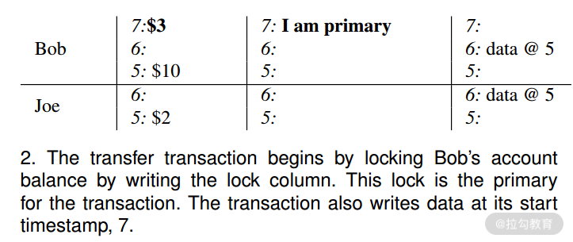
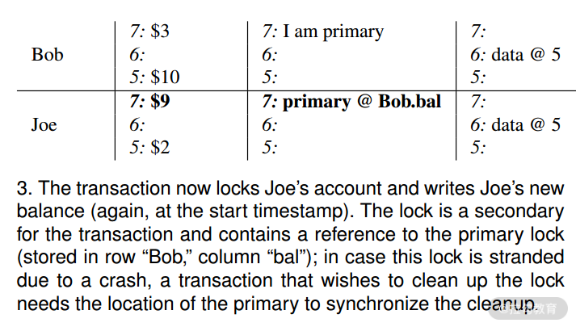
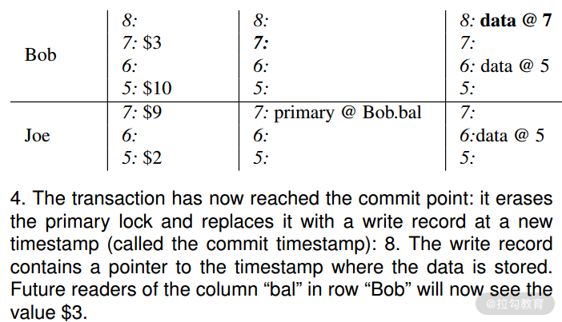
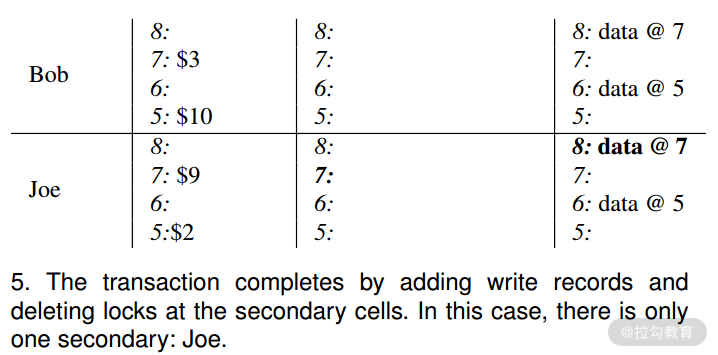

# 18 分布式事务（上）：除了 XA，还有哪些原子提交算法吗？

这一讲我认为是整个课程最为精华的部分，因为事务是区别于数据库与一般存储系统最为重要的功能。而分布式数据库的事务由于其难度极高，一直被广泛关注。可以说，不解决事务问题，一个分布式数据库会被认为是残缺的。而事务的路线之争，也向我们展示了分布式数据库发展的不同路径。

提到分布式事务，能想到的第一个概念就是原子提交。原子提交描述了这样的一类算法，它们可以使一组操作看起来是原子化的，即要么全部成功要么全部失败，而且其中一些操作是远程操作。Open/X 组织提出 XA 分布式事务标准就是原子化提交的典型代表，XA 被主流数据库广泛地实现，相当长的一段时间内竟成了分布式事务的代名词。

但是随着 Percolator 的出现，基于快照隔离的原子提交算法进入大众的视野，在 TiDB 实现 Percolator 乐观事务后，此种方案逐步达到生产可用的状态。

这一讲我们首先要介绍传统的两阶段提交和三阶段提交，其中前者是 XA 的核心概念，后者针对两阶段提交暴露的问题进行了改进。最后介绍 Percolator 实现的乐观事务与 TiDB 对其的改进。

### 两阶段提交与三阶段提交

两阶段提交非常有名，其原因主要有两点：一个是历史很悠久；二是其定义是很模糊的，它首先不是一个协议，更不是一个规范，而仅仅是作为一个概念存在，故从传统的关系统数据库一致的最新的 DistributedSQL 中，我们都可以看到它的身影。

两阶段提交包含协调器与参与者两个角色。在第一个阶段，协调器将需要提交的数据发送给参与者，同时询问参与者是否能够提交该数据，而后参与者返回投票结果。在第二阶段，协调器根据参与者的投票结果，决定是提交还是取消这次事务，而后将结果发送给每个参与者，参与者根据结果来提交本地的事务。

可以看到两阶段提交的核心是协调器。它一般被实现为一个领导节点，你可以回忆一下领导选举那一讲。我们可以使用多种方案来选举领导节点，并根据故障检测机制来探测领导节点的健康状态，从而确定是否要重新选择一个领导节点作为协调器。另外一种常见的实现是由事务发起者来充当协调器，这样做的好处是协调工作被分散到多个节点上，从而降低了分布式事务的负载。

整个事务被分解为两个过程。

1. 准备阶段。协调器向所有参与节点发送 Propose 消息，该消息中包含了该事务的全部信息。而后所有参与节点收到该信息后，进行提交决策——是否可以提交该事务，如果决定提交该事务，它们就告诉协调器同意提交；否则，它们告诉协调器应该终止该事务。协调器和所有参与者分别保存该决定的结果，用于故障恢复。
2. 提交或终止。如果有任何一个参与者终止了该事务，那么所有参与者都会收到终止该事务的结果，即使他们自己认为是可以提交该事务的。而只有当所有参与者全票通过该事务时，协调器才会通知它们提交该事务。这就是**原子提交的核心理念：全部成功或全部失败**。

我们可以看到两阶段提交是很容易理解的，但是其中却缺少大量细节。比如数据是在准备阶段还是在提交阶段写入数据库？每个数据库对该问题的实现是不同的，目前绝大多数实现是在准备阶段写入数据。

两阶段提交正常流程是很容易理解的，它有趣的地方是其异常流程。由于有两个角色和两个阶段，那么异常流程就分为 4 种。

1. **参与者在准备阶段失败**。当协调者发起投票后，有一个参与者没有任何响应（超时）。协调者就会将这个事务标记为失败，这与该阶段投票终止该事务是同样的结果。这虽然保证了事务的一致性，但却降低了分布式事务整体的可用性。下一讲我会介绍 Spanner 使用 Paxos groups 来提高参与者的可用度。
2. **参与者在投票后失败**。这种场景描述了参与者投赞成票后失败了，这个时候必须保证该节点是可以恢复的。在其恢复流程里，需要首先与协调器取得联系，确认该事务最终的结果。然后根据其结果，来取消或者提交该事务。
3. **协调器在投票后失败**。这是第二个阶段，此时协调器和参与者都已经把投票结果记录下来了。如果协调器失败，我们可以将备用协调器启动，而后读取那个事务的投票结果，再向所有参与者发送取消或者提交该事务的消息。
4. **协调器在准备阶段失败**。这是在第一阶段，该阶段存在一个两阶段提交的缺点。在该阶段，协调器发送消息没有收到投票结果，这里所说的没有收到结果主要指结果没有记录到日志里面。此时协调器失败了，那么备用协调器由于缺少投票结果的日志，是不能恢复该事务的。甚至其不知道有哪些参与者参与了这个事务，从而造成参与者无限等待。所以两阶段提交又称为阻塞提交算法。

三阶段相比于两阶段主要是解决上述第 4 点中描述的阻塞状态。它的解决方案是在两阶段中间插入一个阶段，第一阶段还是进行投票，第二阶段将投票后的结果分发给所有参与者，第三阶段是提交操作。其关键点是在第二阶段，如果协调者在第二阶段之前崩溃无法恢复，参与者可以通过超时机制来释放该事务。一旦所有节点通过第二阶段，那么就意味着它们都知道了当前事务的状态，此时，不管协调者还是参与者崩溃都不会影响事务执行。

我们看到三阶段事务会存在两阶段不存在的一个问题，在第二阶段的时候，一些参与者与协调器失去联系，它们由于超时机制会中断事务。而如果另外一些参与者已经收到可以提交的指令，就会提交数据，从而造成脑裂的情况。

除了脑裂，三阶段还存在交互量巨大从而造成系统消息负载过大的问题。故三阶段提交很少应用在实际的分布式事务设计中。

两阶段与三阶段提交都是原子提交协议，它们可以实现各种级别的隔离性要求。在实际生产中，我们可以使用一种特别的事务隔离级别来提高分布式事务的性能，实现非阻塞事务。这种隔离级别就是快照隔离。

### 快照的隔离

我们在第 11 讲中提到过快照隔离。它的隔离级别高于“读到已提交”，解决的是读到已提交无法避免的读偏序问题，也就是一条数据在事务中被读取，重复读取后可能会改变。

我们举一个快照隔离的读取例子，有甲乙两个事务修改同一个数据 X，其初始值为 2。甲开启事务，但不提交也不回退。此时乙将该数值修改为 10，提交事务。而后甲重新读取 X，其值仍然为 2，并没有读取到已经提交的最新数据 。

那么并发提交同一条数据呢？由于没有锁的存在，会出现写入冲突，通常只有其中的一个事务可以提交数据。这种特性被称为首先提交获胜机制。

快照隔离与序列化之间的区别是前者不能解决写偏序的问题，也就是并发事务操作的数据集不相交，当事务提交后，不能保证数据集的结果一致性。举个例子，对于两个事务 T1：b=a+1 和 T2：a=b+1，初始化 a=b=0。序列化隔离级别下，结果只可能是 (a=2,b=1) 或者 (a=1,b=2)；而在快照隔离级别下，结果可能是 (a=1,b=1)。这在某些业务场景下是不能接受的。当然，目前有许多手段来解决快照隔离的写偏序问题，即序列化的快照隔离（SSI）。

实现 SSI 的方式有很多种，如通过一个统一的事务管理器，在提交时去询问事务中读取的数据在提交时是否已经被别的事务的提交覆盖了，如果是，就认为当前事务应标记为失败。另一些是通过在数据行上加锁，来阻止其他事务读取该事务锁定的数据行，从而避免写偏序的产生。

下面要介绍的 Percolator 正是实现了快照隔离，但是没有实现 SSI。因为可以看到 SSI 不论哪种实现都会影响系统的吞吐量。且 Percolator 本身是一种客户端事务方案，不能很好地保存状态。

### Percolator 乐观事务

Percolator 是 Google 提出的工具包，它是基于 BigTable 的，并支持刚才所说的快照隔离。快照隔离是有多版本的，那么我们就需要有版本号，Percolator 系统使用一个全局递增时间戳服务器，来为事务产生单调递增的时间戳。每个事务开始时拿一个时间戳 t1，那么这个事务执行过程中可以读 t1 之前的数据；提交时再取一下时间戳 t2，作为这个事务的提交时间戳。

现在我们开始介绍事务的执行过程。与两阶段提交一样，我们使用客户端作为协调者，BigTable 的 Tablet Server 作为参与者。 除了每个 Cell 的数据存在 BigTable 外，协调者还将 Cell 锁信息、事务版本号存在 BigTable 中。简单来说，如果需要写 bal 列（balance，也就是余额）。在 BigTable 中实际存在三列，分别为 bal:data、bal:lock、bal:write。它们保存的信息如下所示。

1. bal:write 中存事务提交时间戳 commit_ts=>start_ts；
2. bal:data 这个 map 中存事务开始时间戳 start_ts=> 实际列数据；
3. bal:lock 存 start_ts=>(primary cell)，Primary cell 是 Rowkey 和列名的组合，它在提交容错处理和事务冲突时使用，用来清理由于协调器失败导致的事务失败留下的锁信息。

我们现在用一个例子来介绍一下整个过程，请看下图。

一个账户表中，Bob 有 10 美元，Joe 有 2 美元。我们可以看到 Bob 的记录在 write 字段中最新的数据是 data@5，它表示当前最新的数据是 ts=5 那个版本的数据，ts=5 版本中的数据是 10 美元，这样读操作就会读到这个 10 美元。同理，Joe 的账号是 2 美元。

现在我们要做一个转账操作，从 Bob 账户转 7 美元到 Joe 账户。这需要操作多行数据，这里是两行。首先需要加锁，Percolator 从要操作的行中随机选择一行作为 Primary Row，其余为 Secondary Row。对 Primary Row 加锁，成功后再对 Secondary Row 加锁。从上图我们看到，在 ts=7 的行 lock 列写入了一个锁：I am primary，该行的 write 列是空的，数据列值为 3（10-7=3）。 此时 ts=7 为 start_ts。

然后对 Joe 账户加锁，同样是 ts=7，在 Joe 账户的加锁信息中包含了指向 Primary lock 的引用，如此这般处于同一个事务的行就关联起来了。Joe 的数据列写入 9(2+7=9)，write 列为空，至此完成 Prewrite 阶段。

接下来事务就要 Commit 了。Primary Row 首先执行 Commit，只要 Primary Row Commit 成功了，事务就成功了。Secondary Row 失败了也不要紧，后续会有补救措施。Commit 操作首先清除 Primary Row 的锁，然后写入 ts=8 的行（因为时间是单向递增的，这里是 commit_ts），该行可以称为 Commit Row，因为它不包含数据，只是在 write 列中写入 data@7，标识 ts=7 的数据已经可见了，此刻以后的读操作可以读到版本 ts=7 的数据了。

接下来就是 commit Secondary Row 了，和 Primary Row 的逻辑是一样的。Secondary Row 成功 commit，事务就完成了。

如果 Primary Row commit 成功，Secondary Row commit 失败会怎么样，数据的一致性如何保障？由于 Percolator 没有中心化的事务管理器组件，处理这种异常，只能在下次读操作发起时进行。如果一个读请求发现要读的数据存在 Secondary 锁，它会根据 Secondary Row 锁去检查其对应的 Primary Row 的锁是不是还存在，若存在说明事务还没有完成；若不存在则说明，Primary Row 已经 Commit 了，它会清除 Secondary Row 的锁，使该行数据变为可见状态（commit）。这是一个 Roll forward 的概念。

我们可以看到，在这样一个存储系统中，并非所有的行都是数据，还包含了一些事务控制行，或者称为 Commit Row。它的数据 Column 为空，但 write 列包含了可见数据的 TS。它的作用是标示事务完成，并指引读请求读到新的数据。随着时间的推移，会产生大量冗余的数据行，无用的数据行会被 GC 线程定时清理。

该事务另一个问题就是冲突处理。在之前介绍快照隔离时我们提到了对于同一行的冲突操作可以采用先提交获胜的模式，那么后提交的事务就会出现失败。如果数据库在出现高度并发修改相同数据的情况该怎么办呢？现在让我介绍一下根据 Percolator 模型实现乐观事务的 TiDB 是如何处理的。

#### TiDB 乐观事务冲突处理

首先在 TiDB 中写入冲突是在提交阶段进行检测的。在 11 讲中我们介绍了 MVCC 类数据库的冲突处理模式，分别为前项检测与后向检测。而 TiDB 由于使用 Percolator 模式，采用的是提交阶段的后向检测。这其实从原理上看是完全没有问题的，但 TiDB 声明自己完全兼容 MySQL。而众所周知，MySQL 使用的分布式事务是悲观模式。故在 SQL 执行阶段就能检测冲突，也就是前向模式。如此，就造成了用户如果从 MySQL 迁移到 TiDB，就必须好好审视其使用数据库是否依赖了此种模式，从而提高了用户的迁移成本。

基于以上的原因，TiDB 提供了以下几种方案来解决后向检测与前向检测的差异。

1. 重试。顾名思义，在遇到冲突时，TiDB 可以重试失败的事务中的非查询操作。这是非常简洁而高效的方案，但却不是万能的。如果事务中存在根据读取结果更新数据的情况，很可能造成数据异常。因为读取操作没有重试，从而破坏了“可重读”隔离级别。故重试只能应用在非读取的场景，特别是小事务中，即每个 SQL 是单独的事务。
2. 冲突预检。另一个思路是在 prewrite 阶段就执行冲突预检，将后向检查变为前向检查。TiDB 依赖的 TiKV 使用了内存来存储事务中的 key，从而检查 key 是否存在其他事务，避免并发修改 key 的情况。这样做的原因是，TiDB 本身是无状态阶段，从而导致事务之间无法感知彼此，故只能通过底层手段解决。这种结构是一种内存锁，如果事务过多，会造成获取锁的操作阻塞写入，从而导致吞吐量下降的情况。
3. 悲观事务。最后，为了完整实现 MySQL 的特性，还可以使用悲观事务。

以上就是 TiDB 在实践 Percolator 模型时所给出的解决思路。从而使用户方便从 MySQL 迁移过来。另外随着 TiDB 此类数据库的面世，Percolator 事务模式也越来越得到业界的认可。

### 总结

好了，这一讲我们介绍了典型的原子提交：两阶段提交。它是 XA 的基础，但是两阶段提交存在天然的问题，且性能很低。在快照隔离下，我们可以使用 Percolator 模式描述的方案去实现新的原子提交，在冲突较低的场景下，该方案具有很好的性能。

下一讲，我们将介绍一对分布式事务方案的竞争对手 Spanner vs Calvin。感谢学习，希望下次与你准时相见。