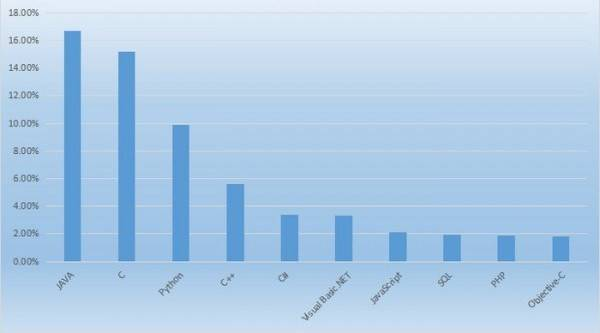
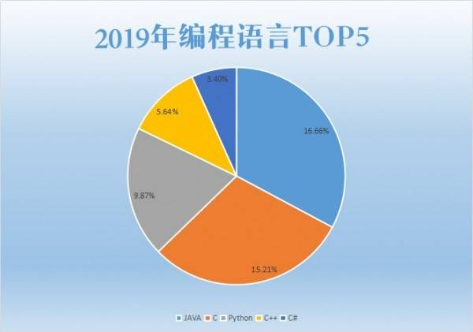
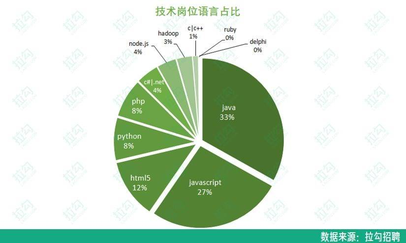
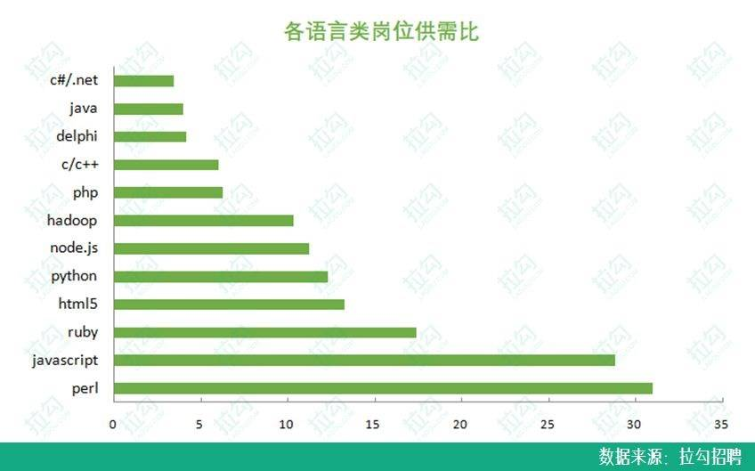
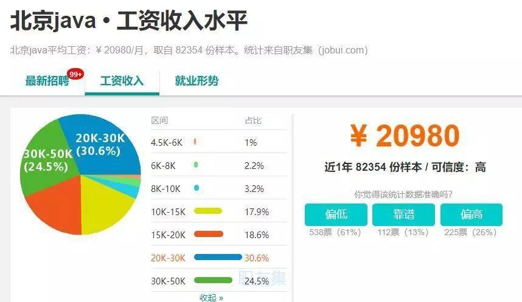
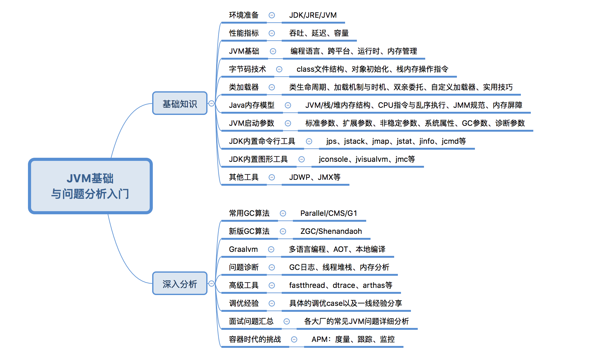

# 01 阅读此专栏的正确姿势

### 课程背景

近些年来，无论是使用规模、开发者人数，还是技术生态成熟度、相关工具的丰富程度，Java 都当之无愧是后端开发语言中不可撼动的王者，也是开发各类业务系统的首选语言。

时至今日，整个 IT 招聘市场上，Java 开发工程师依然是缺口最大，需求最多的热门职位。另外，从整个市场环境看，传统企业的信息化，传统 IT 系统的互联网化，都还有非常大的发展空间，由此推断未来 Java 开发的市场前景广阔，从业人员的行业红利还可以持续很长时间。

从权威的 TIOBE 编程语言排行榜 2019 年 11 月数据来看，Java 的流行程度也是稳居第一。

拉勾网 2019 年 9 月统计的招聘岗位比例，也可以看到 Java 和 JavaScript 是最高的，不过 Java 的求职难度只有 JavaScript 的 1/7。

Java 平均一个岗位有 4 个人竞争，而 JavaScript 则是 28 个，Perl 最夸张，超过 30 个。

而通过职友网的数据统计，北京、上海、杭州、深圳的 Java 程序员平均薪酬在 16-21K 之间，在广州、成都、苏州、南京等城市也有 11K-13K 的平均收入，远超一般行业的收入水平。

所以学习 Java 目前还是一个非常有优势的职业发展选择。

而了解 JVM 则是深入学习 Java 必不可少的一环，也是 Java 开发人员迈向更高水平的一个阶梯。我们不仅要会用 Java 写代码做系统，更要懂得如何理解和分析 Java 程序运行起来以后内部发生了什么，然后可以怎么让它运行的更好。

就像我们要想多年开车的老司机，仅仅会开车肯定不能当一个好司机。车开多了，总会有一些多多少少大大小小的故障毛病。老司机需要知道什么现象说明有了什么毛病，需要怎么处理，不然就会导致经常抛锚，影响我们的行程。

本课程就是用来教会我们怎么能够去了解 JVM 这辆优秀跑车的一些原理和怎么去用各种工具分析修理它。

### 课程特点

市面上各类 JVM 相关的资料虽多，但是明显存在两个极端：过于生涩难懂，或者流于某个技巧点而不系统化。同时各大公司也都越来越重视推动和发展 JVM 相关技术，一线大厂技术面试现在 JVM 知识也是必考科目。

在这个背景下，我们全面梳理了系统化学习 JVM 的知识和经验，包括 JVM 的技术和内存模型，JVM 参数和内置工具，GC 算法，GC 日志、内存和线程等相关问题排查分析，以及常见的面试问题深度剖析等高级的进阶方法与实战，既满足大家快速系统化学习和全面掌握知识的需求，又兼顾大家的面试经验辅导。

- 通过体系化的学习，了解一般原理，知其然知其所以然；
- 熟悉工具和方案，知道从何下手，工作中如何分析和解决问题；
- 随着课程的演示和练习，加深理解，不管大家之前的基础如何，都能够融会贯通；
- 面试题的解析部分，会根据大家的反馈进行持续更新，长期助力于大家的学习和进步。

本课程的特点可以总结为 16 个字：

> 体系完整、层次分明、深入浅出、实践为要

### 为什么做这门课

最近有人问我，程序员多以高深技术为尊，为什么你要做 JVM 的一个偏向于基础和实际应用的专栏，而不是一个讲 JVM 内部实现的各种底层原理，或者是高深的各种算法原理之类的内容。

我在此想说一下我对这个问题的想法：

我个人一直认为，技术应该有两方面，有一小部分人去做高精尖的，以理论为主，更多的人以把技术应用到实际工作、改进效率、提高生产力，以实用为主。这也契合了技术大牛史海峰老师经常说的一句话，架构师应该是一个胸怀理想的实用主义者。

所以，我们再这个课程里，只给大家呈现那些对大家的工作和其他方面，应该会有用的东西，脚踏实地的东西，不管是技术点，还是经验之谈，虽有少量的前瞻性介绍和展望，但是主线一定是偏向于基础和实际应用的。

前一阵在网上听樊登老师的演讲，他提到的一个东西方教学的差异。国人教学、传授知识，喜欢按孔子、老子的这一套，讲究悟性，说一句话就很高深，让人摸不着头脑，然后你要是有悟性，就能悟到真理，悟不到就说明还需要加倍努力。

而西方从苏格拉底、柏拉图、亚里士多德起，就喜欢用逻辑，第一步是这样，第二步是那样，第三步要是发现第一步不完善，那么 OK，我们就可以去改善第一步，然后继续第二步，第三步......这样我们的知识体系就会慢慢的越来越完善，厚实，接近真理，并且这个方法是可以复制的。

所以我们公司技术委员会就组织了一些一线的技术人员，在我们的研发团队实验了几期 4~6 课时，每次 2 小时的“知识+实践”课程，并且受到了良好的效果和积极的反馈。

恰好当时内部培训的时候，《JVM 基础入门》这门课是我和富飞一起组织的，富飞在以往的工作经历中，翻译和撰写了不少 JVM 相关的技术文章和博客，在 JVM 方面积累了大量的一手经验和技巧。

知识这种东西，独乐乐不如众乐乐，一个人会了它的价值就有限，我们在公司内部做了培训也还是只影响了参加培训的百八十个人。如果把 JVM 的内容进行更加完整的整理加工，再融合目前行业里大家最关心的各类问题，变成一个公开的课程，那么就可以影响到更多的人，产生更大的价值，对大家都有益，这是一个多赢的事情（这也是史老师那句话的前半句里的“胸怀理想"吧）。

基于这些原因，大家一拍即合，于是就有了这个课程跟大家见面。我们相信这门课程，一定不会让大家失望。

### 课程内容

本课程分为两部分，基础知识篇主要介绍 JVM 的基础知识、JDK 相关的各种工具用法，深入分析篇讲解各种 GC 算法、如何进行 JVM 的 GC 日志、线程、内存等各类指标进行分析和问题诊断，再结合作者的实际分析调优经验，以及对于常见的 JVM 面试问题进行分析和解答，为学习者梳理清楚 JVM 的整体知识脉络，带来最全面的 JVM 一线经验和实用技巧。

本次分享您将了解以下内容（22 课时）：

#### 基础知识篇

1. 环境准备：千里之行，始于足下
2. 常用性能指标：没有量化，就没有改进
3. JVM 基础知识：不积跬步，无以至千里
4. Java 字节码技术：不积细流，无以成江河
5. JVM 类加载器：山不辞土，故能成其高
6. JVM 内存模型：海不辞水，故能成其深
7. JVM 启动参数详解：博观而约取、厚积而薄发
8. JDK 内置命令行工具介绍：工欲善其事，必先利其器
9. JDK 内置图形界面工具介绍：海阔凭鱼跃，天高任鸟飞
10. JDWP 简介：十步杀一人，千里不留行
11. JMX 与相关工具：山高月小，水落石出

#### 深入分析篇

1. 常见的 GC 算法介绍（Parallel/CMS/G1）：温故而知新
2. Java11 ZGC 和 Java12 Shenandoah 介绍：苟日新、日日新、又日新
3. Oracle Graalvm 介绍：会当凌绝顶、一览众山小
4. GC 日志解读与分析：千淘万漉虽辛苦，吹尽狂沙始到金
5. JVM 的线程堆栈等数据分析：操千曲而后晓声、观千剑而后识器
6. 内存 dump 和内存分析工具：万里赴戎机、关山度若飞
7. fastthread 相关的工具介绍：欲穷千里目，更上一层楼
8. 面临复杂问题时的几个高级工具：它山之石，可以攻玉
9. JVM 问题排查分析调优经验：纸上得来终觉浅，绝知此事要躬行
10. JVM 相关的常见面试问题汇总：运筹策帷帐之中，决胜于千里之外
11. 应对容器时代面临的挑战：长风破浪会有时、直挂云帆济沧海

### 送给大家的话

俗话说，“活到老、学到老”。IT 行业的技术发展和创新速度太快，新的知识很快成为老知识，新的技巧很快成为旧把式，只有终身学习才能适应技术本身的发展。同时现在随着网络的发展，特别是各类新的内容平台和媒体的涌现，信息不是太少了，而是太多了。

信息爆炸带来了甄别有用信息的过程成本增加，这时候选择好的学习途径、学习内容就跟学习方法一样重要，为大家系统化的总结经验和传播知识也同样变得很重要。

让我们一起在 GitChat 平台不断学习，跟志同道合的同学们一起努力，共同进步。