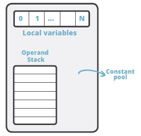
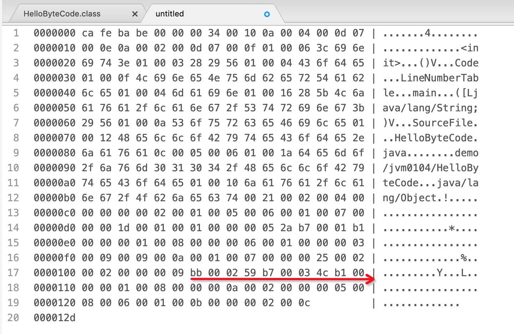
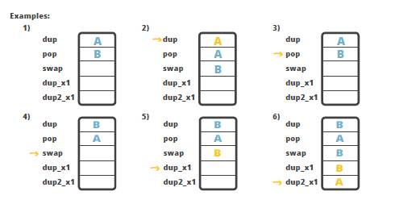
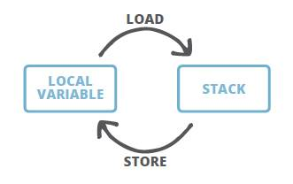
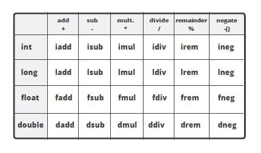
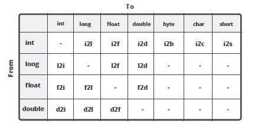

# 05 Java 字节码技术：不积细流，无以成江河

Java 中的字节码，英文名为 `bytecode`, 是 Java 代码编译后的中间代码格式。JVM 需要读取并解析字节码才能执行相应的任务。

**从技术人员的角度看**，Java 字节码是 JVM 的指令集。JVM 加载字节码格式的 class 文件，校验之后通过 JIT 编译器转换为本地机器代码执行。 简单说字节码就是我们编写的 Java 应用程序大厦的每一块砖，如果没有字节码的支撑，大家编写的代码也就没有了用武之地，无法运行。也可以说，Java 字节码就是 JVM 执行的指令格式。

那么我们为什么需要掌握它呢？

不管用什么编程语言，对于卓越而有追求的程序员，都能深入去探索一些技术细节，在需要的时候，可以在代码被执行前解读和理解中间形式的代码。对于 Java 来说，中间代码格式就是 Java 字节码。 了解字节码及其工作原理，对于编写高性能代码至关重要，对于深入分析和排查问题也有一定作用，所以我们要想深入了解 JVM 来说，了解字节码也是夯实基础的一项基本功。同时对于我们开发人员来时，不了解平台的底层原理和实现细节，想要职业进阶绝对不是长久之计，毕竟我们都希望成为更好的程序员， 对吧？

任何有实际经验的开发者都知道，业务系统总不可能没有 BUG，了解字节码以及 Java 编译器会生成什么样的字节码，才能说具备扎实的 JVM 功底，会在排查问题和分析错误时非常有用，也能更好地解决问题。

而对于工具领域和程序分析来说, 字节码就是必不可少的基础知识了，通过修改字节码来调整程序的行为是司空见惯的事情。想了解分析器(Profiler)，Mock 框架，AOP 等工具和技术这一类工具，则必须完全了解 Java 字节码。

### 4.1 Java 字节码简介

有一件有趣的事情，就如名称所示, `Java bytecode` 由单字节(`byte`)的指令组成，理论上最多支持 `256` 个操作码(opcode)。实际上 Java 只使用了 200 左右的操作码， 还有一些操作码则保留给调试操作。

操作码， 下面称为 `指令`, 主要由`类型前缀`和`操作名称`两部分组成。

> 例如，'`i`' 前缀代表 ‘`integer`’，所以，'`iadd`' 很容易理解, 表示对整数执行加法运算。

根据指令的性质，主要分为四个大类：

1. 栈操作指令，包括与局部变量交互的指令
2. 程序流程控制指令
3. 对象操作指令，包括方法调用指令
4. 算术运算以及类型转换指令

此外还有一些执行专门任务的指令，比如同步(synchronization)指令，以及抛出异常相关的指令等等。下文会对这些指令进行详细的讲解。

### 4.2 获取字节码清单

可以用 `javap` 工具来获取 class 文件中的指令清单。 `javap` 是标准 JDK 内置的一款工具, 专门用于反编译 class 文件。

让我们从头开始, 先创建一个简单的类，后面再慢慢扩充。

```java
package demo.jvm0104;


public class HelloByteCode {

    public static void main(String[] args) {

        HelloByteCode obj = new HelloByteCode();

    }

}
```

代码很简单, main 方法中 new 了一个对象而已。然后我们编译这个类:

```shell
javac demo/jvm0104/HelloByteCode.java
```

使用 javac 编译 ，或者在 IDEA 或者 Eclipse 等集成开发工具自动编译，基本上是等效的。只要能找到对应的 class 即可。

> javac 不指定 `-d` 参数编译后生成的 `.class` 文件默认和源代码在同一个目录。
>
> 注意: `javac` 工具默认开启了优化功能, 生成的字节码中没有局部变量表(LocalVariableTable)，相当于局部变量名称被擦除。如果需要这些调试信息, 在编译时请加上 `-g` 选项。有兴趣的同学可以试试两种方式的区别，并对比结果。
>
> JDK 自带工具的详细用法, 请使用: `javac -help` 或者 `javap -help` 来查看; 其他类似。

然后使用 `javap` 工具来执行反编译, 获取字节码清单：

```shell
javap -c demo.jvm0104.HelloByteCode

# 或者: 

javap -c demo/jvm0104/HelloByteCode

javap -c demo/jvm0104/HelloByteCode.class
```

javap 还是比较聪明的, 使用包名或者相对路径都可以反编译成功, 反编译后的结果如下所示：

```java
Compiled from "HelloByteCode.java"

public class demo.jvm0104.HelloByteCode {

  public demo.jvm0104.HelloByteCode();

    Code:

       0: aload_0

       1: invokespecial #1                  // Method java/lang/Object."<init>":()V

       4: return


  public static void main(java.lang.String[]);

    Code:

       0: new           #2                  // class demo/jvm0104/HelloByteCode

       3: dup

       4: invokespecial #3                  // Method "<init>":()V

       7: astore_1

       8: return

}
```

OK，我们成功获取到了字节码清单, 下面进行简单的解读。

### 4.3 解读字节码清单

可以看到，反编译后的代码清单中, 有一个默认的构造函数 `public demo.jvm0104.HelloByteCode()`, 以及 `main` 方法。

刚学 Java 时我们就知道， 如果不定义任何构造函数，就会有一个默认的无参构造函数，这里再次验证了这个知识点。好吧，这比较容易理解！我们通过查看编译后的 class 文件证实了其中存在默认构造函数，所以这是 Java 编译器生成的， 而不是运行时JVM自动生成的。

自动生成的构造函数，其方法体应该是空的，但这里看到里面有一些指令。为什么呢？

再次回顾 Java 知识, 每个构造函数中都会先调用 `super` 类的构造函数对吧？ 但这不是 JVM 自动执行的, 而是由程序指令控制，所以默认构造函数中也就有一些字节码指令来干这个事情。

基本上，这几条指令就是执行 `super()` 调用；

```java
  public demo.jvm0104.HelloByteCode();

    Code:

       0: aload_0

       1: invokespecial #1                  // Method java/lang/Object."<init>":()V

       4: return
```

至于其中解析的 `java/lang/Object` 不用说, 默认继承了 Object 类。这里再次验证了这个知识点，而且这是在编译期间就确定了的。

继续往下看 c,

```
  public static void main(java.lang.String[]);

    Code:

       0: new           #2                  // class demo/jvm0104/HelloByteCode

       3: dup

       4: invokespecial #3                  // Method "<init>":()V

       7: astore_1

       8: return
```

main 方法中创建了该类的一个实例， 然后就 return 了， 关于里面的几个指令， 稍后讲解。

### 4.4 查看 class 文件中的常量池信息

`常量池` 大家应该都听说过, 英文是 `Constant pool`。这里做一个强调: 大多数时候指的是 `运行时常量池`。但运行时常量池里面的常量是从哪里来的呢? 主要就是由 class 文件中的 `常量池结构体` 组成的。

要查看常量池信息, 我们得加一点魔法参数:

```shell
javap -c -verbose demo.jvm0104.HelloByteCode
```

在反编译 class 时，指定 `-verbose` 选项, 则会 `输出附加信息`。

结果如下所示:

```java
Classfile /XXXXXXX/demo/jvm0104/HelloByteCode.class

  Last modified 2019-11-28; size 301 bytes

  MD5 checksum 542cb70faf8b2b512a023e1a8e6c1308

  Compiled from "HelloByteCode.java"

public class demo.jvm0104.HelloByteCode

  minor version: 0

  major version: 52

  flags: ACC_PUBLIC, ACC_SUPER

Constant pool:

   #1 = Methodref #4.#13 // java/lang/Object."<init>":()V

   #2 = Class #14 // demo/jvm0104/HelloByteCode

   #3 = Methodref #2.#13 // demo/jvm0104/HelloByteCode."<init>":()V

   #4 = Class #15 // java/lang/Object

   #5 = Utf8 <init>

   #6 = Utf8 ()V

   #7 = Utf8 Code

   #8 = Utf8 LineNumberTable

   #9 = Utf8 main

  #10 = Utf8 ([Ljava/lang/String;)V

  #11 = Utf8 SourceFile

  #12 = Utf8 HelloByteCode.java

  #13 = NameAndType #5:#6 // "<init>":()V

  #14 = Utf8 demo/jvm0104/HelloByteCode

  #15 = Utf8 java/lang/Object

{

  public demo.jvm0104.HelloByteCode();

    descriptor: ()V

    flags: ACC_PUBLIC

    Code:

      stack=1, locals=1, args_size=1

         0: aload_0

         1: invokespecial #1 // Method java/lang/Object."<init>":()V

         4: return

      LineNumberTable:

        line 3: 0


  public static void main(java.lang.String[]);

    descriptor: ([Ljava/lang/String;)V

    flags: ACC_PUBLIC, ACC_STATIC

    Code:

      stack=2, locals=2, args_size=1

         0: new #2 // class demo/jvm0104/HelloByteCode

         3: dup

         4: invokespecial #3 // Method "<init>":()V

         7: astore_1

         8: return

      LineNumberTable:

        line 5: 0

        line 6: 8

}

SourceFile: "HelloByteCode.java"
```

其中显示了很多关于 class 文件信息： 编译时间， MD5 校验和， 从哪个 `.java` 源文件编译得来，符合哪个版本的 Java 语言规范等等。

还可以看到 `ACC_PUBLIC` 和 `ACC_SUPER` 访问标志符。 `ACC_PUBLIC` 标志很容易理解：这个类是 `public` 类，因此用这个标志来表示。

但 `ACC_SUPER` 标志是怎么回事呢？ 这就是历史原因, JDK 1.0 的 BUG 修正中引入 `ACC_SUPER` 标志来修正 `invokespecial` 指令调用 super 类方法的问题，从 Java 1.1 开始， 编译器一般都会自动生成`ACC_SUPER` 标志。

有些同学可能注意到了， 好多指令后面使用了 `#1, #2, #3` 这样的编号。

这就是对常量池的引用。 那常量池里面有些什么呢?

```java
Constant pool:

   #1 = Methodref #4.#13 // java/lang/Object."<init>":()V

   #2 = Class #14 // demo/jvm0104/HelloByteCode

   #3 = Methodref #2.#13 // demo/jvm0104/HelloByteCode."<init>":()V

   #4 = Class #15 // java/lang/Object

   #5 = Utf8 <init>

......
```

这是摘取的一部分内容, 可以看到常量池中的常量定义。还可以进行组合, 一个常量的定义中可以引用其他常量。

比如第一行: `#1 = Methodref #4.#13 // java/lang/Object."<init>":()V`, 解读如下:

- `#1` 常量编号, 该文件中其他地方可以引用。
- `=` 等号就是分隔符.
- `Methodref` 表明这个常量指向的是一个方法；具体是哪个类的哪个方法呢? 类指向的 `#4`, 方法签名指向的 `#13`; 当然双斜线注释后面已经解析出来可读性比较好的说明了。

同学们可以试着解析其他的常量定义。 自己实践加上知识回顾，能有效增加个人的记忆和理解。

总结一下，常量池就是一个常量的大字典，使用编号的方式把程序里用到的各类常量统一管理起来，这样在字节码操作里，只需要引用编号即可。

### 4.5 查看方法信息

在 `javap` 命令中使用 `-verbose` 选项时， 还显示了其他的一些信息。 例如， 关于 `main` 方法的更多信息被打印出来：

```java
  public static void main(java.lang.String[]);

    descriptor: ([Ljava/lang/String;)V

    flags: ACC_PUBLIC, ACC_STATIC

    Code:

      stack=2, locals=2, args_size=1
```

可以看到方法描述: `([Ljava/lang/String;)V`：

- 其中小括号内是入参信息/形参信息；
- 左方括号表述数组；
- `L` 表示对象；
- 后面的`java/lang/String`就是类名称；
- 小括号后面的 `V` 则表示这个方法的返回值是 `void`；
- 方法的访问标志也很容易理解 `flags: ACC_PUBLIC, ACC_STATIC`，表示 public 和 static。

还可以看到执行该方法时需要的栈(stack)深度是多少，需要在局部变量表中保留多少个槽位, 还有方法的参数个数: `stack=2, locals=2, args_size=1`。把上面这些整合起来其实就是一个方法：

> public static void main(java.lang.String[]);
>
> 注：实际上我们一般把一个方法的修饰符+名称+参数类型清单+返回值类型，合在一起叫“方法签名”，即这些信息可以完整的表示一个方法。

稍微往回一点点，看编译器自动生成的无参构造函数字节码:

```java
  public demo.jvm0104.HelloByteCode();

    descriptor: ()V

    flags: ACC_PUBLIC

    Code:

      stack=1, locals=1, args_size=1

         0: aload_0

         1: invokespecial #1 // Method java/lang/Object."<init>":()V

         4: return
```

你会发现一个奇怪的地方, 无参构造函数的参数个数居然不是 0: `stack=1, locals=1, args_size=1`。 这是因为在 Java 中, 如果是静态方法则没有 `this` 引用。 对于非静态方法， `this` 将被分配到局部变量表的第 0 号槽位中, 关于局部变量表的细节,下面再进行介绍。

> 有反射编程经验的同学可能比较容易理解: `Method#invoke(Object obj, Object... args)`; 有JavaScript编程经验的同学也可以类比: `fn.apply(obj, args) && fn.call(obj, arg1, arg2);`

### 4.6 线程栈与字节码执行模型

想要深入了解字节码技术，我们需要先对字节码的执行模型有所了解。

JVM 是一台基于栈的计算机器。每个线程都有一个独属于自己的线程栈(JVM stack)，用于存储`栈帧`(Frame)。每一次方法调用，JVM都会自动创建一个栈帧。`栈帧` 由 `操作数栈`， `局部变量数组` 以及一个`class 引用`组成。`class 引用` 指向当前方法在运行时常量池中对应的 class)。

我们在前面反编译的代码中已经看到过这些内容。



`局部变量数组` 也称为 `局部变量表`(LocalVariableTable), 其中包含了方法的参数，以及局部变量。 局部变量数组的大小在编译时就已经确定: 和局部变量+形参的个数有关，还要看每个变量/参数占用多少个字节。操作数栈是一个 LIFO 结构的栈， 用于压入和弹出值。 它的大小也在编译时确定。

有一些操作码/指令可以将值压入“操作数栈”； 还有一些操作码/指令则是从栈中获取操作数，并进行处理，再将结果压入栈。操作数栈还用于接收调用其他方法时返回的结果值。

### 4.7 方法体中的字节码解读

看过前面的示例，细心的同学可能会猜测，方法体中那些字节码指令前面的数字是什么意思，说是序号吧但又不太像，因为他们之间的间隔不相等。看看 main 方法体对应的字节码：

```java
         0: new #2 // class demo/jvm0104/HelloByteCode

         3: dup

         4: invokespecial #3 // Method "<init>":()V

         7: astore_1

         8: return
```

间隔不相等的原因是, 有一部分操作码会附带有操作数, 也会占用字节码数组中的空间。

例如， `new` 就会占用三个槽位: 一个用于存放操作码指令自身，两个用于存放操作数。

因此，下一条指令 `dup` 的索引从 `3` 开始。

如果将这个方法体变成可视化数组，那么看起来应该是这样的：


每个操作码/指令都有对应的十六进制(HEX)表示形式， 如果换成十六进制来表示，则方法体可表示为HEX字符串。例如上面的方法体百世成十六进制如下所示：


甚至我们还可以在支持十六进制的编辑器中打开 class 文件，可以在其中找到对应的字符串：

（此图由开源文本编辑软件Atom的hex-view插件生成）

粗暴一点，我们可以通过 HEX 编辑器直接修改字节码，尽管这样做会有风险， 但如果只修改一个数值的话应该会很有趣。

其实要使用编程的方式，方便和安全地实现字节码编辑和修改还有更好的办法，那就是使用 ASM 和 Javassist 之类的字节码操作工具，也可以在类加载器和 Agent 上面做文章，下一节课程会讨论 `类加载器`，其他主题则留待以后探讨。

### 4.8 对象初始化指令：new 指令, init 以及 clinit 简介

我们都知道 `new`是 Java 编程语言中的一个关键字， 但其实在字节码中，也有一个指令叫做 `new`。 当我们创建类的实例时, 编译器会生成类似下面这样的操作码：

```java
         0: new #2 // class demo/jvm0104/HelloByteCode

         3: dup

         4: invokespecial #3 // Method "<init>":()V
```

当你同时看到 `new, dup` 和 `invokespecial` 指令在一起时，那么一定是在创建类的实例对象！

为什么是三条指令而不是一条呢？这是因为：

- `new` 指令只是创建对象，但没有调用构造函数。
- `invokespecial` 指令用来调用某些特殊方法的, 当然这里调用的是构造函数。
- `dup` 指令用于复制栈顶的值。

由于构造函数调用不会返回值，所以如果没有 dup 指令, 在对象上调用方法并初始化之后，操作数栈就会是空的，在初始化之后就会出问题, 接下来的代码就无法对其进行处理。

这就是为什么要事先复制引用的原因，为的是在构造函数返回之后，可以将对象实例赋值给局部变量或某个字段。因此，接下来的那条指令一般是以下几种：

- `astore {N}` or `astore_{N}` – 赋值给局部变量，其中 `{N}` 是局部变量表中的位置。
- `putfield` – 将值赋给实例字段
- `putstatic` – 将值赋给静态字段

在调用构造函数的时候，其实还会执行另一个类似的方法 `<init>` ，甚至在执行构造函数之前就执行了。

还有一个可能执行的方法是该类的静态初始化方法 `<clinit>`， 但 `<clinit>` 并不能被直接调用，而是由这些指令触发的： `new`, `getstatic`, `putstatic` or `invokestatic`。

也就是说，如果创建某个类的新实例， 访问静态字段或者调用静态方法，就会触发该类的静态初始化方法【如果尚未初始化】。

实际上，还有一些情况会触发静态初始化， 详情请参考 JVM 规范： [[http://docs.oracle.com/javase/specs/jvms/se8/html/](https://docs.oracle.com/javase/specs/jvms/se8/html/)]

### 4.9 栈内存操作指令

有很多指令可以操作方法栈。 前面也提到过一些基本的栈操作指令： 他们将值压入栈，或者从栈中获取值。 除了这些基础操作之外也还有一些指令可以操作栈内存； 比如 `swap` 指令用来交换栈顶两个元素的值。下面是一些示例：

最基础的是 `dup` 和 `pop` 指令。

- `dup` 指令复制栈顶元素的值。
- `pop` 指令则从栈中删除最顶部的值。

还有复杂一点的指令：比如，`swap`, `dup_x1` 和 `dup2_x1`。

- 顾名思义，`swap` 指令可交换栈顶两个元素的值，例如A和B交换位置(图中示例4)；
- `dup_x1` 将复制栈顶元素的值，并在栈顶插入两次(图中示例5)；
- `dup2_x1` 则复制栈顶两个元素的值，并插入第三个值(图中示例6)。



`dup_x1` 和 `dup2_x1` 指令看起来稍微有点复杂。而且为什么要设置这种指令呢? 在栈中复制最顶部的值？

请看一个实际案例：怎样交换 2 个 double 类型的值？

需要注意的是，一个 double 值占两个槽位，也就是说如果栈中有两个 double 值，它们将占用 4 个槽位。

要执行交换，你可能想到了 `swap` 指令，但问题是 `swap` 只适用于单字(one-word, 单字一般指 32 位 4 个字节，64 位则是双字)，所以不能处理 double 类型，但 Java 中又没有 swap2 指令。

怎么办呢? 解决方法就是使用 `dup2_x2` 指令，将操作数栈顶部的 double 值，复制到栈底 double 值的下方， 然后再使用 `pop2` 指令弹出栈顶的 double 值。结果就是交换了两个 double 值。 示意图如下图所示:


#### `dup`、`dup_x1`、`dup2_x1` 指令补充说明

指令的详细说明可参考 [JVM 规范](https://docs.oracle.com/javase/specs/jvms/se8/html/jvms-6.html)：

**dup 指令**

官方说明是：复制栈顶的值，并将复制的值压入栈。

操作数栈的值变化情况（方括号标识新插入的值）：

```
..., value →

..., value [,value]
```

**dup_x1 指令**

官方说明是：复制栈顶的值，并将复制的值插入到最上面 2 个值的下方。

操作数栈的值变化情况（方括号标识新插入的值）：

```
..., value2, value1 →

..., [value1,] value2, value1
```

**dup2_x1 指令**

官方说明是：复制栈顶 1 个 64 位/或 2 个 32 位的值, 并将复制的值按照原始顺序，插入原始值下面一个 32 位值的下方。

操作数栈的值变化情况（方括号标识新插入的值）：

```
# 情景 1: value1, value2, and value3 都是分组 1 的值(32 位元素)

..., value3, value2, value1 →

..., [value2, value1,] value3, value2, value1


# 情景 2: value1 是分组 2 的值(64 位,long 或double), value2 是分组 1 的值(32 位元素)

..., value2, value1 →

..., [value1,] value2, value1
```

> [Table 2.11.1-B 实际类型与 JVM 计算类型映射和分组](https://docs.oracle.com/javase/specs/jvms/se8/html/jvms-2.html#jvms-2.11.1)

| 实际类型      | JVM 计算类型  | 类型分组 |
| :------------ | :------------ | :------- |
| boolean       | int           | 1        |
| byte          | int           | 1        |
| char          | int           | 1        |
| short         | int           | 1        |
| int           | int           | 1        |
| float         | float         | 1        |
| reference     | reference     | 1        |
| returnAddress | returnAddress | 1        |
| long          | long          | 2        |
| double        | double        | 2        |

### 4.10 局部变量表

`stack` 主要用于执行指令，而局部变量则用来保存中间结果，两者之间可以直接交互。

让我们编写一个复杂点的示例：

第一步，先编写一个计算移动平均数的类:

```java
package demo.jvm0104;

//移动平均数

public class MovingAverage {

    private int count = 0;

    private double sum = 0.0D;

    public void submit(double value){

        this.count ++;

        this.sum += value;

    }

    public double getAvg(){

        if(0 == this.count){ return sum;}

        return this.sum/this.count;

    }

}
```

第二步，然后写一个类来调用:

```java
package demo.jvm0104;

public class LocalVariableTest {

    public static void main(String[] args) {

        MovingAverage ma = new MovingAverage();

        int num1 = 1;

        int num2 = 2;

        ma.submit(num1);

        ma.submit(num2);

        double avg = ma.getAvg();

    }

}
```

其中 main 方法中向 `MovingAverage` 类的实例提交了两个数值，并要求其计算当前的平均值。

然后我们需要编译（还记得前面提到, 生成调试信息的 `-g` 参数吗）。

```shell
javac -g demo/jvm0104/*.java
```

然后使用 javap 反编译:

```shell
javap -c -verbose demo/jvm0104/LocalVariableTest
```

看 main 方法对应的字节码：

```java
  public static void main(java.lang.String[]);

    descriptor: ([Ljava/lang/String;)V

    flags: ACC_PUBLIC, ACC_STATIC

    Code:

      stack=3, locals=6, args_size=1

         0: new           #2                  // class demo/jvm0104/MovingAverage

         3: dup

         4: invokespecial #3                  // Method demo/jvm0104/MovingAverage."<init>":()V

         7: astore_1

         8: iconst_1

         9: istore_2

        10: iconst_2

        11: istore_3

        12: aload_1

        13: iload_2

        14: i2d

        15: invokevirtual #4                  // Method demo/jvm0104/MovingAverage.submit:(D)V

        18: aload_1

        19: iload_3

        20: i2d

        21: invokevirtual #4                  // Method demo/jvm0104/MovingAverage.submit:(D)V

        24: aload_1

        25: invokevirtual #5                  // Method demo/jvm0104/MovingAverage.getAvg:()D

        28: dstore        4

        30: return

      LineNumberTable:

        line 5: 0

        line 6: 8

        line 7: 10

        line 8: 12

        line 9: 18

        line 10: 24

        line 11: 30

      LocalVariableTable:

        Start  Length  Slot  Name   Signature

            0      31     0  args   [Ljava/lang/String;

            8      23     1    ma   Ldemo/jvm0104/MovingAverage;

           10      21     2  num1   I

           12      19     3  num2   I

           30       1     4   avg   D
```

------

- 编号 `0` 的字节码 `new`, 创建 `MovingAverage` 类的对象;
- 编号 `3` 的字节码 `dup` 复制栈顶引用值。
- 编号 `4` 的字节码 `invokespecial` 执行对象初始化。
- 编号 `7` 开始, 使用 `astore_1` 指令将引用地址值(addr.)存储(store)到编号为`1`的局部变量中： `astore_1` 中的 `1` 指代 LocalVariableTable 中`ma`对应的槽位编号，
- 编号8开始的指令： `iconst_1` 和 `iconst_2` 用来将常量值`1`和`2`加载到栈里面， 并分别由指令 `istore_2` 和 `istore_3` 将它们存储到在 LocalVariableTable 的槽位 2 和槽位 3 中。

```java
         8: iconst_1

         9: istore_2

        10: iconst_2

        11: istore_3
```

请注意，store 之类的指令调用实际上从栈顶删除了一个值。 这就是为什么再次使用相同值时，必须再加载(load)一次的原因。

例如在上面的字节码中，调用 `submit` 方法之前， 必须再次将参数值加载到栈中：

```java
        12: aload_1

        13: iload_2

        14: i2d

        15: invokevirtual #4                  // Method demo/jvm0104/MovingAverage.submit:(D)V
```

调用 `getAvg()` 方法后，返回的结果位于栈顶，然后使用 `dstore` 将 `double` 值保存到本地变量`4`号槽位，这里的`d`表示目标变量的类型为`double`。

```java
        24: aload_1

        25: invokevirtual #5                  // Method demo/jvm0104/MovingAverage.getAvg:()D

        28: dstore        4
```

关于 `LocalVariableTable` 有个有意思的事情，就是最前面的槽位会被方法参数占用。

在这里，因为 `main` 是静态方法，所以槽位0中并没有设置为 `this` 引用的地址。 但是对于非静态方法来说， `this` 会将分配到第 0 号槽位中。

> 再次提醒: 有过反射编程经验的同学可能比较容易理解: `Method#invoke(Object obj, Object... args)`; 有JavaScript编程经验的同学也可以类比: `fn.apply(obj, args) && fn.call(obj, arg1, arg2);`

理解这些字节码的诀窍在于:

给局部变量赋值时，需要使用相应的指令来进行 `store`，如 `astore_1`。`store` 类的指令都会删除栈顶值。 相应的 `load` 指令则会将值从局部变量表压入操作数栈，但并不会删除局部变量中的值。

### 4.11 流程控制指令

流程控制指令主要是分支和循环在用, 根据检查条件来控制程序的执行流程。

一般是 `If-Then-Else` 这种三元运算符(ternary operator)， Java中的各种循环，甚至异常处的理操作码都可归属于 程序流程控制。

然后，我们再增加一个示例，用循环来提交给 MovingAverage 类一定数量的值：

```java
package demo.jvm0104;

public class ForLoopTest {

    private static int[] numbers = {1, 6, 8};

    public static void main(String[] args) {

        MovingAverage ma = new MovingAverage();

        for (int number : numbers) {

            ma.submit(number);

        }

        double avg = ma.getAvg();

    }

}
```

同样执行编译和反编译:

```shell
javac -g demo/jvm0104/*.java

javap -c -verbose demo/jvm0104/ForLoopTest
```

因为 `numbers` 是本类中的 `static` 属性， 所以对应的字节码如下所示:

```
         0: new           #2                  // class demo/jvm0104/MovingAverage

         3: dup

         4: invokespecial #3                  // Method demo/jvm0104/MovingAverage."<init>":()V

         7: astore_1

         8: getstatic     #4                  // Field numbers:[I

        11: astore_2

        12: aload_2

        13: arraylength

        14: istore_3

        15: iconst_0

        16: istore        4

        18: iload         4

        20: iload_3

        21: if_icmpge     43

        24: aload_2

        25: iload         4

        27: iaload

        28: istore        5

        30: aload_1

        31: iload         5

        33: i2d

        34: invokevirtual #5                  // Method demo/jvm0104/MovingAverage.submit:(D)V

        37: iinc          4, 1

        40: goto          18

        43: aload_1

        44: invokevirtual #6                  // Method demo/jvm0104/MovingAverage.getAvg:()D

        47: dstore_2

        48: return

      LocalVariableTable:

        Start  Length  Slot  Name   Signature

           30       7     5 number   I

            0      49     0  args   [Ljava/lang/String;

            8      41     1    ma   Ldemo/jvm0104/MovingAverage;

           48       1     2   avg   D
```

位置 [8~16] 的指令用于循环控制。 我们从代码的声明从上往下看, 在最后面的LocalVariableTable 中:

- `0` 号槽位被 main 方法的参数 `args` 占据了。
- `1` 号槽位被 `ma` 占用了。
- `5` 号槽位被 `number` 占用了。
- `2` 号槽位是for循环之后才被 `avg` 占用的。

那么中间的 `2`,`3`,`4` 号槽位是谁霸占了呢? 通过分析字节码指令可以看出，在 `2`,`3`,`4` 槽位有 3 个匿名的局部变量(`astore_2`, `istore_3`, `istore 4`等指令)。

- `2`号槽位的变量保存了 numbers 的引用值，占据了 `2`号槽位。
- `3`号槽位的变量, 由 `arraylength` 指令使用, 得出循环的长度。
- `4`号槽位的变量, 是循环计数器， 每次迭代后使用 `iinc` 指令来递增。

> 如果我们的 JDK 版本再老一点, 则会在 `2`,`3`,`4` 槽位发现三个源码中没有出现的变量： `arr$`, `len$`, `i$`， 也就是循环变量。

循环体中的第一条指令用于执行 循环计数器与数组长度 的比较：

```
        18: iload         4

        20: iload_3

        21: if_icmpge     43
```

这段指令将局部变量表中 `4`号槽位 和 `3`号槽位的值加载到栈中，并调用 `if_icmpge` 指令来比较他们的值。

【`if_icmpge` 解读: if, integer, compare, great equal】, 如果一个数的值大于或等于另一个值，则程序执行流程跳转到`pc=43`的地方继续执行。

在这个例子中就是， 如果`4`号槽位的值 大于或等于 `3`号槽位的值, 循环就结束了，这里 43 位置对于的是循环后面的代码。如果条件不成立，则循环进行下一次迭代。

在循环体执行完，它的循环计数器加 1，然后循环跳回到起点以再次验证循环条件：

```
        37: iinc          4, 1   // 4号槽位的值加1

        40: goto          18     // 跳到循环开始的地方
```

### 4.12 算术运算指令与类型转换指令

Java 字节码中有许多指令可以执行算术运算。实际上，指令集中有很大一部分表示都是关于数学运算的。对于所有数值类型(`int`, `long`, `double`, `float`)，都有加，减，乘，除，取反的指令。

那么 `byte` 和 `char`, `boolean` 呢? JVM 是当做 `int` 来处理的。另外还有部分指令用于数据类型之间的转换。

> 算术操作码和类型

当我们想将 `int` 类型的值赋值给 `long` 类型的变量时，就会发生类型转换。

> 类型转换操作码

在前面的示例中， 将 `int` 值作为参数传递给实际上接收 `double` 的 `submit()` 方法时，可以看到, 在实际调用该方法之前，使用了类型转换的操作码：

```
        31: iload         5

        33: i2d

        34: invokevirtual #5                  // Method demo/jvm0104/MovingAverage.submit:(D)V
```

也就是说, 将一个 int 类型局部变量的值, 作为整数加载到栈中，然后用 `i2d` 指令将其转换为 `double` 值，以便将其作为参数传给`submit`方法。

唯一不需要将数值load到操作数栈的指令是 `iinc`，它可以直接对 `LocalVariableTable` 中的值进行运算。 其他的所有操作均使用栈来执行。

### 4.13 方法调用指令和参数传递

前面部分稍微提了一下方法调用： 比如构造函数是通过 `invokespecial` 指令调用的。

这里列举了各种用于方法调用的指令：

- `invokestatic`，顾名思义，这个指令用于调用某个类的静态方法，这也是方法调用指令中最快的一个。
- `invokespecial`, 我们已经学过了, `invokespecial` 指令用来调用构造函数，但也可以用于调用同一个类中的 private 方法, 以及可见的超类方法。
- `invokevirtual`，如果是具体类型的目标对象，`invokevirtual`用于调用公共，受保护和打包私有方法。
- `invokeinterface`，当要调用的方法属于某个接口时，将使用 `invokeinterface` 指令。

> 那么 `invokevirtual` 和 `invokeinterface` 有什么区别呢？这确实是个好问题。 为什么需要 `invokevirtual` 和 `invokeinterface` 这两种指令呢? 毕竟所有的接口方法都是公共方法, 直接使用 `invokevirtual` 不就可以了吗？

这么做是源于对方法调用的优化。JVM 必须先解析该方法，然后才能调用它。

- 使用 `invokestatic` 指令，JVM 就确切地知道要调用的是哪个方法：因为调用的是静态方法，只能属于一个类。
- 使用 `invokespecial` 时， 查找的数量也很少， 解析也更加容易， 那么运行时就能更快地找到所需的方法。

使用 `invokevirtual` 和 `invokeinterface` 的区别不是那么明显。想象一下，类定义中包含一个方法定义表， 所有方法都有位置编号。下面的示例中：A 类包含 method1 和 method2 方法； 子类B继承A，继承了 method1，覆写了 method2，并声明了方法 method3。

> 请注意，method1 和 method2 方法在类 A 和类 B 中处于相同的索引位置。

```java
class A

    1: method1

    2: method2

class B extends A

    1: method1

    2: method2

    3: method3
```

那么，在运行时只要调用 method2，一定是在位置 2 处找到它。

现在我们来解释`invokevirtual` 和 `invokeinterface` 之间的本质区别。

假设有一个接口 X 声明了 methodX 方法, 让 B 类在上面的基础上实现接口 X：

```java
class B extends A implements X

    1: method1

    2: method2

    3: method3

    4: methodX
```

新方法 methodX 位于索引 4 处，在这种情况下，它看起来与 method3 没什么不同。

但如果还有另一个类 C 也实现了 X 接口，但不继承 A，也不继承 B：

```java
class C implements X

    1: methodC

    2: methodX
```

类 C 中的接口方法位置与类 B 的不同，这就是为什么运行时在 `invokinterface` 方面受到更多限制的原因。 与 `invokinterface` 相比， `invokevirtual` 针对具体的类型方法表是固定的，所以每次都可以精确查找，效率更高（具体的分析讨论可以参见参考材料的第一个链接）。

### 4.14 JDK7 新增的方法调用指令 invokedynamic

Java 虚拟机的字节码指令集在 JDK7 之前一直就只有前面提到的 4 种指令（invokestatic，invokespecial，invokevirtual，invokeinterface）。随着 JDK 7 的发布，字节码指令集新增了`invokedynamic`指令。这条新增加的指令是实现“动态类型语言”（Dynamically Typed Language）支持而进行的改进之一，同时也是 JDK 8 以后支持的 lambda 表达式的实现基础。

为什么要新增加一个指令呢？

我们知道在不改变字节码的情况下，我们在 Java 语言层面想调用一个类 A 的方法 m，只有两个办法：

- 使用`A a=new A(); a.m()`，拿到一个 A 类型的实例，然后直接调用方法；
- 通过反射，通过 A.class.getMethod 拿到一个 Method，然后再调用这个`Method.invoke`反射调用；

这两个方法都需要显式的把方法 m 和类型 A 直接关联起来，假设有一个类型 B，也有一个一模一样的方法签名的 m 方法，怎么来用这个方法在运行期指定调用 A 或者 B 的 m 方法呢？这个操作在 JavaScript 这种基于原型的语言里或者是 C# 这种有函数指针/方法委托的语言里非常常见，Java 里是没有直接办法的。Java 里我们一般建议使用一个 A 和 B 公有的接口 IC，然后 IC 里定义方法 m，A 和 B 都实现接口 IC，这样就可以在运行时把 A 和 B 都当做 IC 类型来操作，就同时有了方法 m，这样的“强约束”带来了很多额外的操作。

而新增的 invokedynamic 指令，配合新增的方法句柄（Method Handles，它可以用来描述一个跟类型 A 无关的方法 m 的签名，甚至不包括方法名称，这样就可以做到我们使用方法 m 的签名，但是直接执行的时候调用的是相同签名的另一个方法 b），可以在运行时再决定由哪个类来接收被调用的方法。在此之前，只能使用反射来实现类似的功能。该指令使得可以出现基于 JVM 的动态语言，让 jvm 更加强大。而且在 JVM 上实现动态调用机制，不会破坏原有的调用机制。这样既很好的支持了 Scala、Clojure 这些 JVM 上的动态语言，又可以支持代码里的动态 lambda 表达式。

RednaxelaFX 评论说：

> 简单来说就是以前设计某些功能的时候把做法写死在了字节码里，后来想改也改不了了。 所以这次给 lambda 语法设计翻译到字节码的策略是就用 invokedynamic 来作个弊，把实际的翻译策略隐藏在 JDK 的库的实现里（metafactory）可以随时改，而在外部的标准上大家只看到一个固定的 invokedynamic。

### 参考材料

- Why Should I Know About Java Bytecode: https://jrebel.com/rebellabs/rebel-labs-report-mastering-java-bytecode-at-the-core-of-the-jvm/
- 轻松看懂Java字节码: https://juejin.im/post/5aca2c366fb9a028c97a5609
- invokedynamic指令：https://www.cnblogs.com/wade-luffy/p/6058087.html
- Java 8的Lambda表达式为什么要基于invokedynamic？：https://www.zhihu.com/question/39462935
- Invokedynamic：https://www.jianshu.com/p/ad7d572196a8
- JVM之动态方法调用：invokedynamic： https://ifeve.com/jvm%E4%B9%8B%E5%8A%A8%E6%80%81%E6%96%B9%E6%B3%95%E8%B0%83%E7%94%A8%EF%BC%9Ainvokedynamic/