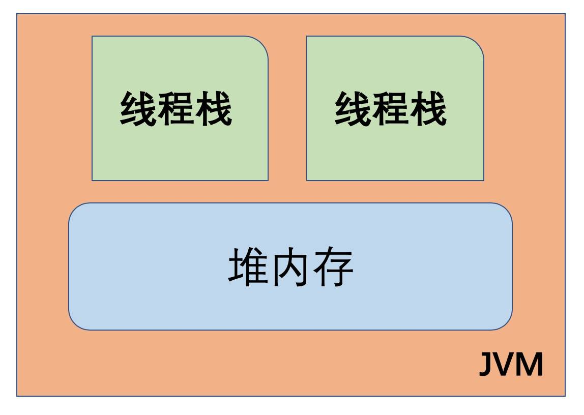
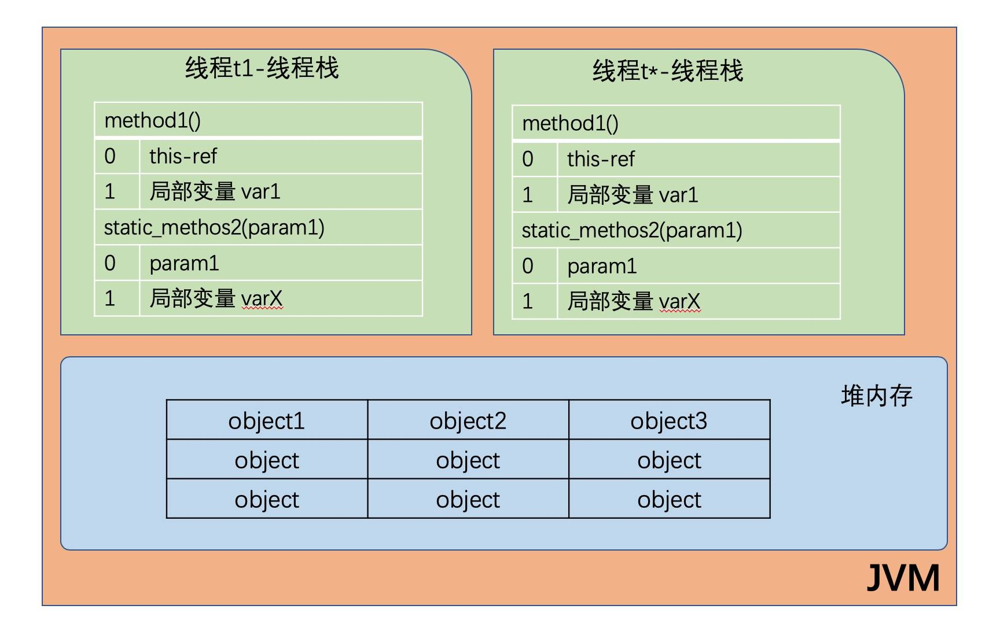
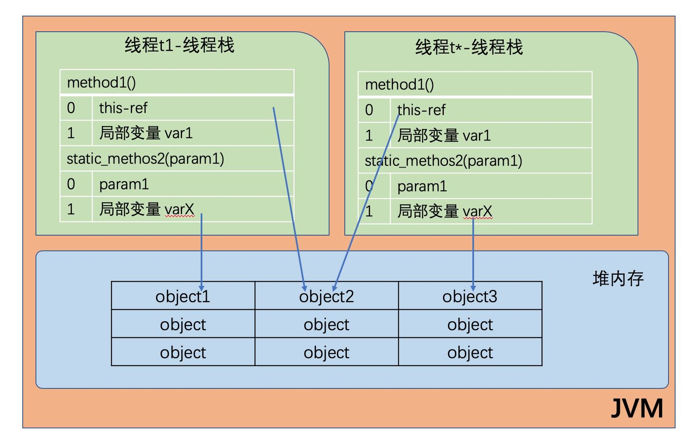
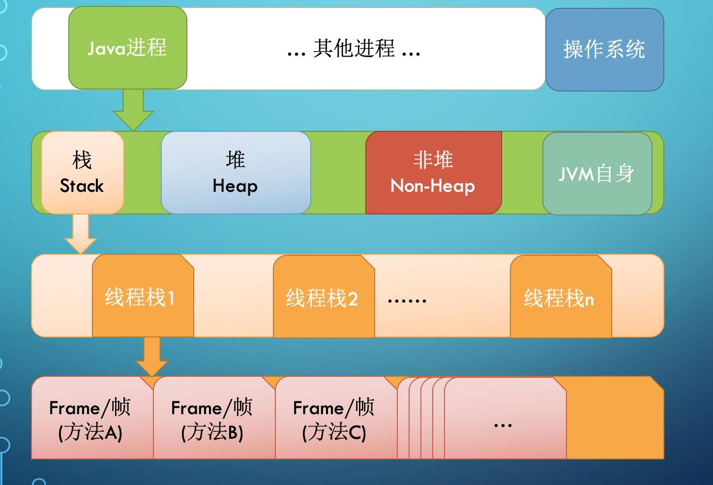
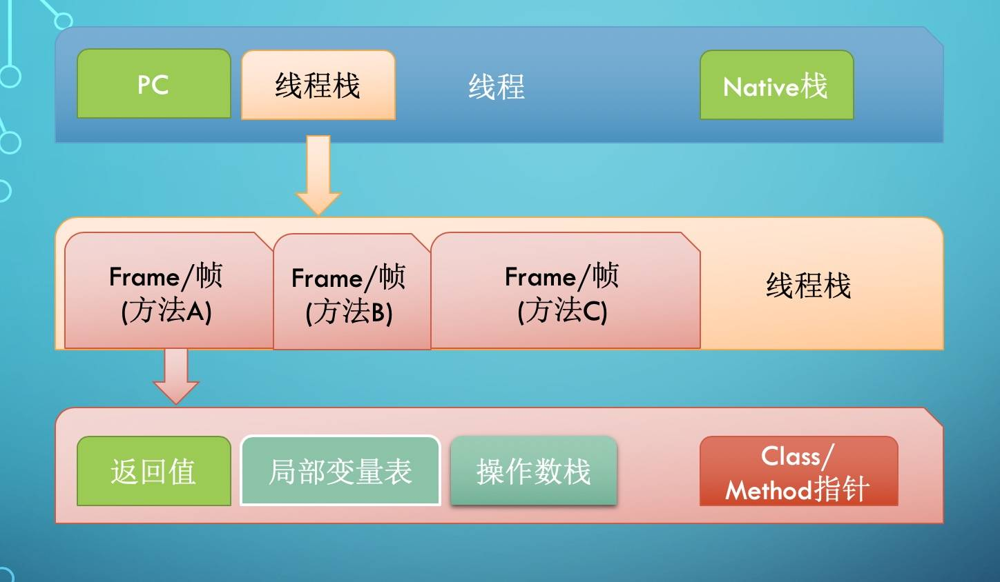
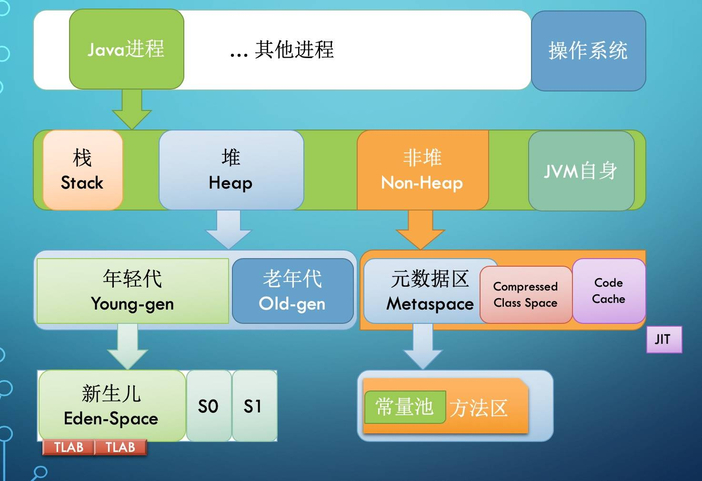
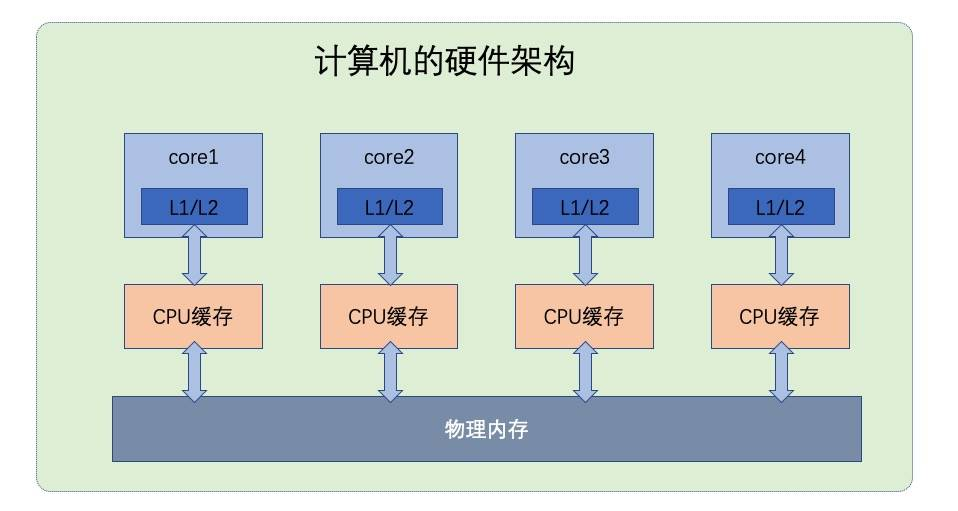

# 07 Java 内存模型：海不辞水，故能成其深

了解计算机历史的同学应该知道，计算机刚刚发明的时候，是没有内存这个概念的，速度慢到无法忍受。 直到冯诺依曼提出了一个天才的设计才解决了这个问题，没错，这个设计就是加了内存，所以现代的电子计算机又叫做“冯诺依曼机”。

JVM 是一个完整的计算机模型，所以自然就需要有对应的内存模型，这个模型被称为 “`Java 内存模型`”，对应的英文是“`Java Memory Model`”，简称 `JMM`。

Java 内存模型规定了 JVM 应该如何使用计算机内存（RAM）。 广义来讲， Java 内存模型分为两个部分：

- JVM 内存结构
- JMM 与线程规范

其中，JVM 内存结构是底层实现，也是我们理解和认识 JMM 的基础。 大家熟知的堆内存、栈内存等运行时数据区的划分就可以归为 JVM 内存结构。

就像很多神书讲 JVM 开篇就讲怎么编译 JVM 一样，讲 JMM 一上来就引入 CPU 寄存器的同步机制。虽然看起来高大上、显得高深莫测，但是大家很难理解。

所以我们这节课先从基础讲起，避开生涩的一些过于底层的术语，学习基本的 JVM 内存结构。理解了这些基本的知识点，然后再来学习 JMM 和线程相关的知识。

### 6.1 JVM 内存结构

我们先来看看 JVM 整体的内存概念图：

JVM 内部使用的 Java 内存模型， 在逻辑上将内存划分为 `线程栈`（thread stacks）和`堆内存` （heap）两个部分。 如下图所示：



JVM 中，每个正在运行的线程，都有自己的线程栈。 线程栈包含了当前正在执行的方法链/调用链上的所有方法的状态信息。

所以线程栈又被称为“`方法栈`”或“`调用栈`”（call stack）。线程在执行代码时，调用栈中的信息会一直在变化。

线程栈里面保存了调用链上正在执行的所有方法中的局部变量。

- 每个线程都只能访问自己的线程栈。
- 每个线程都不能访问(看不见)其他线程的局部变量。

即使两个线程正在执行完全相同的代码，但每个线程都会在自己的线程栈内创建对应代码中声明的局部变量。 所以每个线程都有一份自己的局部变量副本。

- 所有原生类型的局部变量都存储在线程栈中，因此对其他线程是不可见的。
- 线程可以将一个原生变量值的副本传给另一个线程，但不能共享原生局部变量本身。
- 堆内存中包含了 Java 代码中创建的所有对象，不管是哪个线程创建的。 其中也涵盖了包装类型（例如`Byte`，`Integer`，`Long`等）。
- 不管是创建一个对象并将其赋值给局部变量， 还是赋值给另一个对象的成员变量， 创建的对象都会被保存到堆内存中。

下图演示了线程栈上的调用栈和局部变量，以及存储在堆内存中的对象：



- 如果是原生数据类型的局部变量，那么它的内容就全部保留在线程栈上。
- 如果是对象引用，则栈中的局部变量槽位中保存着对象的引用地址，而实际的对象内容保存在堆中。
- 对象的成员变量与对象本身一起存储在堆上, 不管成员变量的类型是原生数值，还是对象引用。
- 类的静态变量则和类定义一样都保存在堆中。

总结一下：**原始数据类型和对象引用地址在栈上；对象、对象成员与类定义、静态变量在堆上**。

堆内存又称为“`共享堆`”，堆中的所有对象，可以被所有线程访问, 只要他们能拿到对象的引用地址。

- 如果一个线程可以访问某个对象时，也就可以访问该对象的成员变量。
- 如果两个线程同时调用某个对象的同一方法，则它们都可以访问到这个对象的成员变量，但每个线程的局部变量副本是独立的。

示意图如下所示：



总结一下：虽然各个线程自己使用的局部变量都在自己的栈上，但是大家可以共享堆上的对象，特别地各个不同线程访问同一个对象实例的基础类型的成员变量，会给每个线程一个变量的副本。

### 6.2 栈内存的结构

根据以上内容和对 JVM 内存划分的理解，制作了几张逻辑概念图供大家参考。

先看看栈内存(Stack)的大体结构：



每启动一个线程，JVM 就会在栈空间栈分配对应的**线程栈**, 比如 1MB 的空间（`-Xss1m`）。

线程栈也叫做 Java 方法栈。 如果使用了 JNI 方法，则会分配一个单独的本地方法栈(Native Stack)。

线程执行过程中，一般会有多个方法组成调用栈(Stack Trace), 比如 A 调用 B，B 调用 C……每执行到一个方法，就会创建对应的**栈帧**(Frame)。



栈帧是一个逻辑上的概念，具体的大小在一个方法编写完成后基本上就能确定。

比如 `返回值` 需要有一个空间存放吧，每个`局部变量`都需要对应的地址空间，此外还有给指令使用的 `操作数栈`，以及 class 指针(标识这个栈帧对应的是哪个类的方法, 指向非堆里面的 Class 对象）。

### 6.3 堆内存的结构

Java 程序除了栈内存之外，最主要的内存区域就是堆内存了。



堆内存是所有线程共用的内存空间，理论上大家都可以访问里面的内容。

但 JVM 的具体实现一般会有各种优化。比如将逻辑上的 Java 堆,划分为`堆(Heap)`和`非堆(Non-Heap)`两个部分.。这种划分的依据在于，我们编写的 Java 代码，基本上只能使用 Heap 这部分空间，发生内存分配和回收的主要区域也在这部分，所以有一种说法，这里的 Heap 也叫 GC 管理的堆(GC Heap)。

GC 理论中有一个重要的思想，叫做分代。 经过研究发现，程序中分配的对象，要么用过就扔，要么就能存活很久很久。

因此，JVM 将 Heap 内存分为年轻代（Young generation）和老年代（Old generation, 也叫 Tenured）两部分。

年轻代还划分为 3 个内存池，新生代(Eden space)和存活区(Survivor space), 在大部分 GC 算法中有 2 个存活区(S0, S1)，在我们可以观察到的任何时刻，S0 和 S1 总有一个是空的, 但一般较小，也不浪费多少空间。

具体实现对新生代还有优化，那就是 TLAB(Thread Local Allocation Buffer), 给每个线程先划定一小片空间，你创建的对象先在这里分配，满了再换。这能极大降低并发资源锁定的开销。

Non-Heap 本质上还是 Heap，只是一般不归 GC 管理，里面划分为 3 个内存池。

- Metaspace, 以前叫持久代(永久代, Permanent generation), Java8 换了个名字叫 Metaspace. Java8 将方法区移动到了 Meta 区里面，而方法又是class的一部分和 CCS 交叉了?
- CCS, Compressed Class Space, 存放 class 信息的，和 Metaspace 有交叉。
- Code Cache, 存放 JIT 编译器编译后的本地机器代码。

JVM 的内存结构大致如此。 掌握了这些基础知识，我们再来看看 JMM。

### 6.4 CPU 指令

我们知道，计算机按支持的指令大致可以分为两类：

- `精简指令集计算机(RISC)`, 代表是如今大家熟知的 ARM 芯片，功耗低，运算能力相对较弱。
- `复杂指令集计算机(CISC)`, 代表作是 Intel 的 X86 芯片系列，比如奔腾，酷睿，至强，以及 AMD 的 CPU。特点是性能强劲，功耗高。（实际上从奔腾 4 架构开始，对外是复杂指令集，内部实现则是精简指令集，所以主频才能大幅度提高）

写过程序的人都知道，同样的计算，可以有不同的实现方式。 硬件指令设计同样如此，比如说我们的系统需要实现某种功能，那么复杂点的办法就是在 CPU 中封装一个逻辑运算单元来实现这种的运算，对外暴露一个专用指令。

当然也可以偷懒，不实现这个指令，而是由程序编译器想办法用原有的那些基础的，通用指令来模拟和拼凑出这个功能。那么随着时间的推移，实现专用指令的 CPU 指令集就会越来越复杂, ，被称为复杂指令集。 而偷懒的 CPU 指令集相对来说就会少很多，甚至砍掉了很多指令，所以叫精简指令集计算机。

不管哪一种指令集，CPU 的实现都是采用流水线的方式。如果 CPU 一条指令一条指令地执行，那么很多流水线实际上是闲置的。简单理解，可以类比一个 KFC 的取餐窗口就是一条流水线。于是硬件设计人员就想出了一个好办法： “`指令乱序`”。 CPU 完全可以根据需要，通过内部调度把这些指令打乱了执行，充分利用流水线资源，只要最终结果是等价的，那么程序的正确性就没有问题。但这在如今多 CPU 内核的时代，随着复杂度的提升，并发执行的程序面临了很多问题。



CPU 是多个核心一起执行，同时 JVM 中还有多个线程在并发执行，这种多对多让局面变得异常复杂，稍微控制不好，程序的执行结果可能就是错误的。

### 6.5 JMM 背景

目前的 JMM 规范对应的是 “[JSR-133. Java Memory Model and Thread Specification](https://jcp.org/en/jsr/detail?id=133)” ，这个规范的部分内容润色之后就成为了《Java语言规范》的 [$17.4. Memory Model章节](https://docs.oracle.com/javase/specs/jls/se8/html/jls-17.html#jls-17.4)。可以看到，JSR133 的最终版修订时间是在 2014 年，这是因为之前的 Java 内存模型有些坑，所以在 Java 1.5 版本的时候进行了重新设计，并一直沿用到今天。

JMM 规范明确定义了不同的线程之间，通过哪些方式，在什么时候可以看见其他线程保存到共享变量中的值；以及在必要时，如何对共享变量的访问进行同步。这样的好处是屏蔽各种硬件平台和操作系统之间的内存访问差异，实现了 Java 并发程序真正的跨平台。

随着 Java 在 Web 领域的大规模应用，为了充分利用多核的计算能力，多线程编程越来越受欢迎。这时候就出现很多线程安全方面的问题。想要真正掌握并发程序设计，则必须要理解 Java 内存模型。可以说，我们在 JVM 内存结构中学过的`堆内存`、`栈内存`等知识，以及 Java 中的同步、锁、线程等等术语都和JMM 有非常大的关系。

### 6.6 JMM 简介

JVM 支持程序多线程执行，每个线程是一个 `Thread`，如果不指定明确的同步措施，那么多个线程在访问同一个共享变量时，就看会发生一些奇怪的问题，比如 A 线程读取了一个变量 a=10，想要做一个只要大于9就减2的操作，同时 B 线程先在 A 线程操作前设置 a=8，其实这时候已经不满足 A 线程的操作条件了，但是 A 线程不知道，依然执行了 a-2，最终 a=6；实际上 a 的正确值应该是 8，这个没有同步的机制在多线程下导致了错误的最终结果。

这样一来，就需要 JMM 定义多线程执行环境下的一些语义问题，也就是定义了哪些方式是允许的。

下面我们简要介绍一下 JMM 规范里有些什么内容。

> 给定一个程序和该程序的一串执行轨迹，内存模型描述了该执行轨迹是否是该程序的一次合法执行。对于 Java，内存模型检查执行轨迹中的每次读操作，然后根据特定规则，检验该读操作观察到的写是否合法。 内存模型描述了某个程序的可能行为。JVM 实现可以自由地生成想要的代码，只要该程序所有最终执行产生的结果能通过内存模型进行预测。这为大量的代码转换提供了充分的自由，包括动作（action）的重排序以及非必要的同步移除。 内存模型的一个高级、非正式的表述"显示其是一组规则，规定了一个线程的写操作何时会对另一个线程可见"。通俗地说，读操作 r 通常能看到任何写操作 w 写入的值，意味着 w 不是在 r 之后发生，且 w 看起来没有被另一个写操作 w' 覆盖掉（从 r 的角度看）。

JMM 定义了一些术语和规定，大家略有了解即可。

- 能被多个线程共享使用的内存称为“`共享内存`”或“`堆内存`”。
- 所有的对象(包括内部的实例成员变量)，static 变量，以及数组，都必须存放到堆内存中。
- 局部变量，方法的形参/入参，异常处理语句的入参不允许在线程之间共享，所以不受内存模型的影响。
- 多个线程同时对一个变量访问时【读取/写入】，这时候只要有某个线程执行的是写操作，那么这种现象就称之为“冲突”。
- 可以被其他线程影响或感知的操作，称为线程间的交互行为， 可分为： 读取、写入、同步操作、外部操作等等。 其中同步操作包括：对 volatile 变量的读写，对管程(monitor)的锁定与解锁，线程的起始操作与结尾操作，线程启动和结束等等。 外部操作则是指对线程执行环境之外的操作，比如停止其他线程等等。

JMM 规范的是线程间的交互操作，而不管线程内部对局部变量进行的操作。

> 有兴趣的同学可参阅: ifeve 翻译的: [JSR133 中文版.pdf](http://ifeve.com/wp-content/uploads/2014/03/JSR133中文版.pdf)

### 6.7 内存屏障简介

前面提到了CPU会在合适的时机，按需要对将要进行的操作重新排序，但是有时候这个重排机会导致我们的代码跟预期不一致。

怎么办呢？JMM 引入了内存屏障机制。

内存屏障可分为`读屏障`和`写屏障`，用于控制可见性。 常见的 `内存屏障` 包括：

```
#LoadLoad

#StoreStore

#LoadStore

#StoreLoad
```

这些屏障的主要目的，是用来短暂屏蔽 CPU 的指令重排序功能。 和 CPU 约定好，看见这些指令时，就要保证这个指令前后的相应操作不会被打乱。

- 比如看见 `#LoadLoad`, 那么屏障前面的 Load 指令就一定要先执行完，才能执行屏障后面的 Load 指令。
- 比如我要先把 a 值写到 A 字段中，然后再将 b 值写到 B 字段对应的内存地址。如果要严格保障这个顺序,那么就可以在这两个 Store 指令之间加入一个 `#StoreStore` 屏障。
- 遇到 `#LoadStore` 屏障时, CPU 自废武功，短暂屏蔽掉指令重排序功能。
- `#StoreLoad` 屏障, 能确保屏障之前执行的所有 store 操作，都对其他处理器可见; 在屏障后面执行的 load 指令, 都能取得到最新的值。换句话说, 有效阻止屏障之前的 store 指令，与屏障之后的 load 指令乱序 、即使是多核心处理器，在执行这些操作时的顺序也是一致的。

代价最高的是 `#StoreLoad` 屏障, 它同时具有其他几类屏障的效果，可以用来代替另外三种内存屏障。

如何理解呢?

就是只要有一个 CPU 内核收到这类指令，就会做一些操作，同时发出一条广播, 给某个内存地址打个标记，其他 CPU 内核与自己的缓存交互时，就知道这个缓存不是最新的，需要从主内存重新进行加载处理。

### 小结

本节我们讲解了JMM的一系列知识，让大家能够了解Java的内存模型，包括：

1. JVM 的内存区域分为: `堆内存` 和 `栈内存`；
2. 堆内存的实现可分为两部分: `堆(Heap)` 和 `非堆(Non-Heap)`;
3. 堆主要由 GC 负责管理，按分代的方式一般分为: 老年代+年轻代；年轻代=新生代+存活区；
4. CPU 有一个性能提升的利器: `指令重排序`；
5. JMM 规范对应的是 JSR133, 现在由 Java 语言规范和 JVM 规范来维护；
6. 内存屏障的分类与作用。

### 参考链接

1. [JSR-133. Java Memory Model and Thread Specification](https://jcp.org/en/jsr/detail?id=133)
2. [The Java Memory Model](https://github.com/cncounter/translation/blob/master/tiemao_2019/18_java-concurrency/11_java-memory-model.md.html)
3. [memoryModel-CurrentDraftSpec.pdf](http://www.cs.umd.edu/~pugh/java/memoryModel/CurrentDraftSpec.pdf)
4. [The JSR-133 Cookbook for Compiler Writers](http://gee.cs.oswego.edu/dl/jmm/cookbook.html)
5. [类比版本控制系统来理解内存屏障](https://github.com/cncounter/translation/blob/master/tiemao_2016/08_memory-barriers/memory-barriers.md.html)
6. [Java Language Specification, Chapter 17. Threads and Locks](https://docs.oracle.com/javase/specs/jls/se8/html/jls-17.html)
7. [JVM内部结构详解](https://github.com/cncounter/translation/blob/926502b537cb440f7371907d67bf93db01f77653/tiemao_2017/12_JVMInternals/12_JVMInternals.md.html)
8. [Metaspace解密](http://lovestblog.cn/blog/2016/10/29/metaspace/)