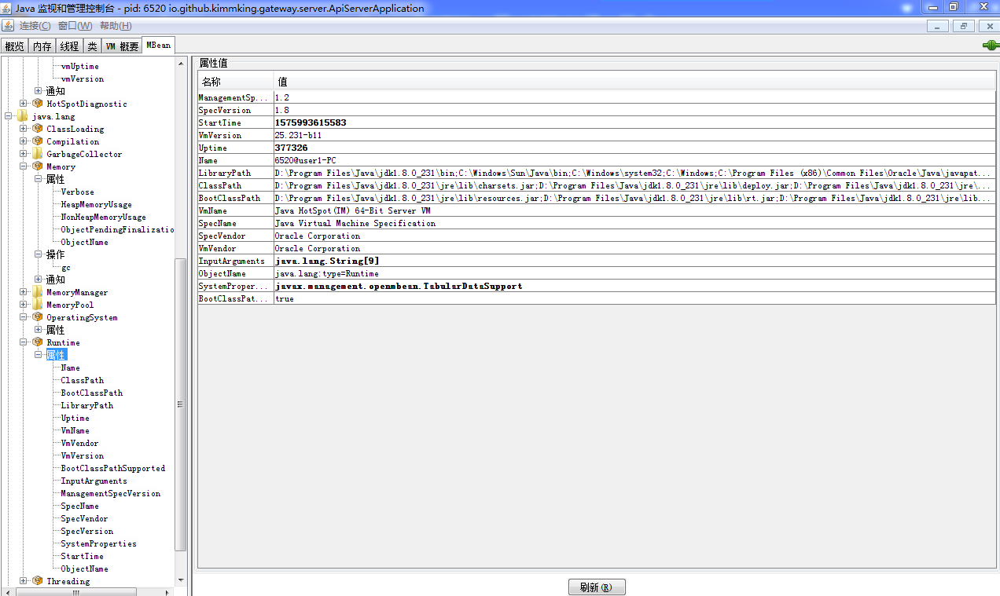
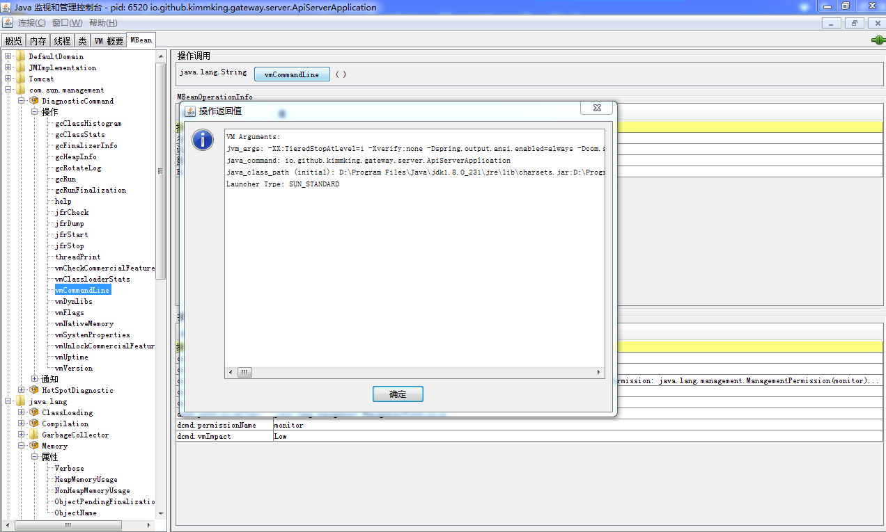
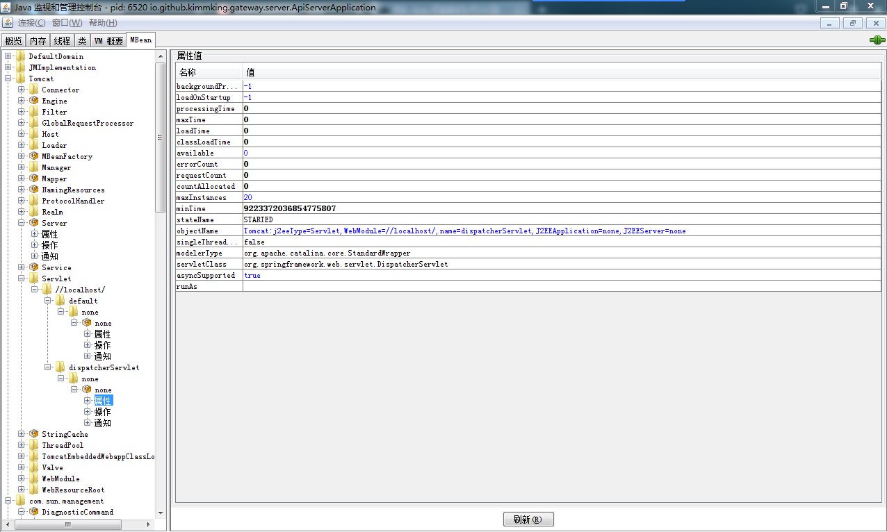
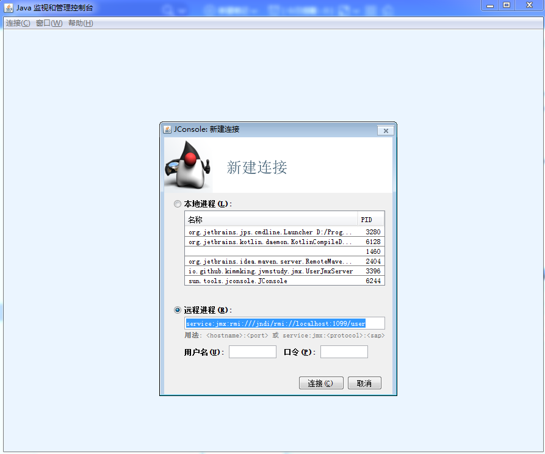
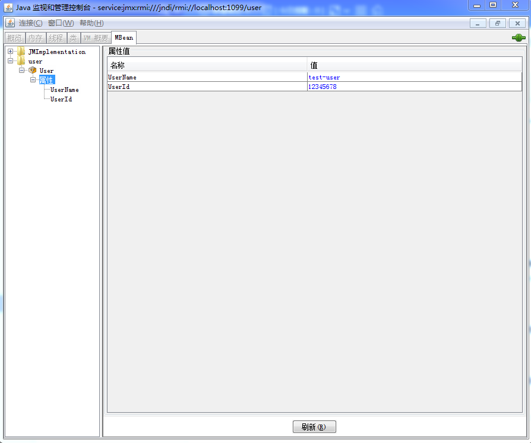

# 12 JMX 与相关工具：山高月小，水落石出

Java 平台提供了全面的 JVM 监控和管理措施。

在 Java SE 5 之前，虽然 JVM 提供了一些底层的 API，比如 JVMPI 和 JVMTI，但这些 API 都是面向 C 语言的，需要通过 JNI 等方式才能调用，想要监控 JVM 和系统资源非常不方便。

Java SE 5.0 版本引入了 JMX 技术（Java Management Extensions，Java 管理扩展），JMX 技术的前身是“JSR3:Java Management Extensions”，以及“JSR 160:JMX Remote API”。

JMX 是用于监控和管理 JVM 资源（包括应用程序、设备、服务和 JVM）的一组标准 API。

通过这些 API 接口，可以对外暴露 JVM 和宿主机的一些信息，甚至支持远程动态调整某些运行时参数。

JMX 技术让我们在 JDK 中开发自检程序成为可能，同时也提供了很多轻量级的 API 来监测 JVM 状态和运行中对象/线程状态，从而提高了 Java 语言自身的管理监测能力。

客户端使用 JMX 主要通过两种方式：

- 程序代码手动获取 MXBean；
- 通过网络远程获取 MBean。

从 JVM 运行时获取 GC 行为数据，最简单的办法是使用标准 JMX API 接口。JMX 也是获取 JVM 内部运行时状态信息 的标准 API。可以编写程序代码，通过 JMX API 来访问本程序所在的 JVM，也可以通过 JMX 客户端执行（远程）访问。MXBean 可用于监控和管理 JVM，每个 MXBean 都封装了一部分功能。

如果用通俗的话来讲，就是我们可以在 JVM 这个机构内部搞一个“政务信息公开系统”，这个东西就可以看做是 MBeanServer，然后系统默认有很多信息，比如 JVM 的基本信息、内存和 GC 的信息等，可以放到这个系统来公开。应用程序里的其他 Java 代码也可以自己定义一些 MBean，然后把这些自己想要公开的信息挂到这个系统里来。这个时候，就不管是本 JVM 内部，还是其他的 Java 应用程序，都可以访问到这个 MBeanServer 上的所有公开信息，也就是 MBean 的属性，甚至可以直接调用 MBean 提供的方法反过来影响系统。

## 获取当前 JVM 的 MXBean 信息

JDK 默认提供的 MXBean 相关类，主要位于 rt.jar 文件的 java.lang.management 包中。获取 JVM 中 MXBean 信息的代码示例如下：

```java
package jvm.chapter11;


import com.alibaba.fastjson.JSON;

import com.alibaba.fastjson.serializer.*;

import java.lang.management.*;

import java.util.*;


public class MXBeanTest {

    public static void main(String[] args) {

        Map<String, Object> beansMap = loadMXBeanMap();

        String jsonString = toJSON(beansMap);

        System.out.println(jsonString);

    }

    public static Map<String, Object> loadMXBeanMap() {

        // import java.lang.management.*

        // 1. 操作系统信息

        OperatingSystemMXBean operatingSystemMXBean =

                ManagementFactory.getOperatingSystemMXBean();

        // 2. 运行时

        RuntimeMXBean runtimeMXBean =

                ManagementFactory.getRuntimeMXBean();

        // 3.1 JVM 内存信息

        MemoryMXBean memoryMXBean =

                ManagementFactory.getMemoryMXBean();

        // 3.2 JVM 内存池-列表

        List<MemoryPoolMXBean> memoryPoolMXBeans =

                ManagementFactory.getMemoryPoolMXBeans();

        // 3.3 内存管理器-列表

        List<MemoryManagerMXBean> memoryManagerMXBeans =

                ManagementFactory.getMemoryManagerMXBeans();

        // 4. class 加载统计信息

        ClassLoadingMXBean classLoadingMXBean =

                ManagementFactory.getClassLoadingMXBean();

        // 5. 编译统计信息

        CompilationMXBean compilationMXBean =

                ManagementFactory.getCompilationMXBean();

        // 6. 线程

        ThreadMXBean threadMXBean =

                ManagementFactory.getThreadMXBean();

        // 7. GC

        List<GarbageCollectorMXBean> garbageCollectorMXBeans =

                ManagementFactory.getGarbageCollectorMXBeans();

        // 8. 获取平台日志 MXBean

        PlatformLoggingMXBean platformLoggingMXBean =

                ManagementFactory.getPlatformMXBean(PlatformLoggingMXBean.class);

        //

        Map<String, Object> beansMap = new HashMap<String, Object>();

        //

        beansMap.put("operatingSystemMXBean", operatingSystemMXBean);

        beansMap.put("runtimeMXBean", runtimeMXBean);

        beansMap.put("memoryMXBean", memoryMXBean);

        beansMap.put("memoryPoolMXBeans", memoryPoolMXBeans);

        beansMap.put("memoryManagerMXBeans", memoryManagerMXBeans);

        beansMap.put("classLoadingMXBean", classLoadingMXBean);

        beansMap.put("compilationMXBean", compilationMXBean);

        beansMap.put("threadMXBean", threadMXBean);

        beansMap.put("garbageCollectorMXBeans", garbageCollectorMXBeans);

        beansMap.put("platformLoggingMXBean", platformLoggingMXBean);

        return beansMap;

    }


    public static String toJSON(Object obj) {

        // MemoryPoolMXBean 这些未设置的属性序列化时会报错

        SimplePropertyPreFilter filter = new SimplePropertyPreFilter();

        filter.getExcludes().add("collectionUsageThreshold");

        filter.getExcludes().add("collectionUsageThresholdCount");

        filter.getExcludes().add("collectionUsageThresholdExceeded");

        filter.getExcludes().add("usageThreshold");

        filter.getExcludes().add("usageThresholdCount");

        filter.getExcludes().add("usageThresholdExceeded");

        //

        String jsonString = JSON.toJSONString(obj, filter, 

                SerializerFeature.PrettyFormat);

        return jsonString;

    }

}
```

取得这些 MXBean 之后，就能采集到对应的 Java 运行时信息，定时上报给某个系统，那么一个简单的监控就创建了。

当然，这么简单的事情，肯定有现成的轮子啦。比如 Spring Boot Actuator，以及后面介绍的 Micrometer 等。各种监控服务提供的 Agent-lib 中也会通过类似的手段采集相应的数据。

如果想通过编程方式获取远程机器上的 MXBean，请参考：

> [Using the Platform MBean Server and Platform MXBeans](https://docs.oracle.com/javase/8/docs/technotes/guides/management/mxbeans.html)

## 使用 JMX 工具远程连接

最常见的 JMX 客户端是 JConsole 和 JVisualVM（可以安装各种插件，十分强大）。两个工具都是标准 JDK 的一部分，而且很容易使用. 如果使用的是 JDK 7u40 及更高版本，还可以使用另一个工具：Java Mission Control（JMC，大致翻译为 Java 控制中心）。

监控本地 JVM 并不需要额外配置，如果是远程监控，还可以在服务端部署 Jstatd 服务暴露部分信息给 JMX 客户端。

所有 JMX 客户端都是独立的程序，可以连接到目标 JVM 上。目标 JVM 可以在本机，也可以是远端 JVM。

想要支持 JMX 客户端连接服务端 JVM 实例，则 Java 启动脚本中需要加上相关的配置参数，示例如下：

```shell
-Dcom.sun.management.jmxremote

-Dcom.sun.management.jmxremote.port=10990

-Dcom.sun.management.jmxremote.ssl=false

-Dcom.sun.management.jmxremote.authenticate=false
```

如果服务器具有多张网卡（多个 IP），由于安全限制，必须明确指定 hostname， 一般是 IP。

```shell
-Djava.rmi.server.hostname=47.57.227.67
```

这样启动之后，JMX 客户端（如 JConsole、JVisualVM、JMC）就可以通过 `<IP:端口>` 连接。(参考 JVisualVM 的示例）。

如这里对应的就类似于：47.57.227.67:10990。

> 如果想要远程查看 VisualGC，则服务端需要开启 Jstatd 来支持，JVisualVM 先连 Jstatd 远程主机，接着在远程主机上点右键添加 JMX 连接。关于 JVisualVM 的使用，请参考前面的文章《JDK 内置图形界面工具》。

以 JConsole 为例，我们看一下，连接到了远程 JVM 以后，在最后一个面板即可看到 MBean 信息。

例如，我们可以查看 JVM 的一些信息：



也可以直接调用方法，例如查看 VM 参数：



如果启动的进程是 Tomcat 或者是 Spring Boot 启动的嵌入式 Tomcat，那么我们还可以看到很多 Tomcat 的信息：



## JMX 的 MBean 创建和远程访问

前面讲了在同一个 JVM 里获取 MBean，现在我们再来写一个更完整的例子：创建一个 MBean，然后远程访问它。

先定义一个 UserMBean 接口（必须以 MBean 作为后缀）：

```java
package io.github.kimmking.jvmstudy.jmx;

public interface UserMBean {

    Long getUserId();

    String getUserName();

    void setUserId(Long userId);

    void setUserName(String userName);

}
```

然后实现它：

```java
package io.github.kimmking.jvmstudy.jmx;

public class User implements UserMBean {

    Long userId = 12345678L;

    String userName = "jvm-user";

    @Override

    public Long getUserId() {

        return userId;

    }


    @Override

    public String getUserName() {

        return userName;

    }


    @Override

    public void setUserId(Long userId) {

        this.userId = userId;

    }


    @Override

    public void setUserName(String userName) {

        this.userName = userName;

    }

}
```

最后实现一个类来启动 MBeanServer：

```java
package io.github.kimmking.jvmstudy.jmx;


import javax.management.MBeanServer;

import javax.management.MBeanServerFactory;

import javax.management.ObjectName;

import javax.management.remote.JMXConnectorServer;

import javax.management.remote.JMXConnectorServerFactory;

import javax.management.remote.JMXServiceURL;

import java.lang.management.ManagementFactory;

import java.rmi.registry.LocateRegistry;

import java.rmi.registry.Registry;


public class UserJmxServer {


    public static void main(String[] args){


        MBeanServer server;

        User bean=new User();


        try {


            int rmiPort = 1099;

            String jmxServerName = "TestJMXServer";


            Registry registry = LocateRegistry.createRegistry(rmiPort);

            server = MBeanServerFactory.createMBeanServer("user");


            ObjectName objectName = new ObjectName("user:name=User");

            server.registerMBean(bean, objectName);


            JMXServiceURL url = new JMXServiceURL("service:jmx:rmi:///jndi/rmi://localhost:1099/user");

            System.out.println("JMXServiceURL: " + url.toString());

            JMXConnectorServer jmxConnServer = JMXConnectorServerFactory.newJMXConnectorServer(url, null, server);

            jmxConnServer.start();


        }catch (Exception e){

            e.printStackTrace();

        }

    }

}
```

通过这几个代码我们可以看到，使用 MBean 机制，需要：

- 先定义 MBean 接口；
- 实现这个接口；
- 然后把接口和类，注册到 MBeanServer，这里可以用 JVM 里的默认 MBeanServer，也可以自己创建一个新的 Server，这里为了简单，就使用了默认的。

然后我们就可以使用客户端工具或者代码来访问 MBeanServer，查看和操作 MBean，由于 MBean 类似反射的机制（如果早期做过 Windows 平台的 COM 对象开发，就会发现是类似的），客户端不需要知道具体的 MBean 接口或者实现类，也能请求服务器端。

如果大家学习过 Apache Dubbo，就知道在 Dubbo 里消费端必须拿到服务提供者的服务接口，才能配置和调用，这里不同的地方就是客户端是不需要 MBean 接口的。

### JConsole 里查看自定义 MBean

首先我们启动这个应用 UserJmxServer，接下来我们使用工具来查看和操作它。

打开 JConsole，在远程输入：

```
service:jmx:rmi:///jndi/rmi://localhost:1099/user
```



查看 User 的属性：


直接修改 UserName 的值：



### 使用 JMX 远程访问 MBean

我们先使用 JMXUrl 来创建一个 MBeanServerConnection，连接到 MBeanServer，然后就可以通过 ObjectName，也可以看做是 MBean 的地址，像反射一样去拿服务器端 MBean 里的属性，或者调用 MBean 的方法。示例如下：

```java
package io.github.kimmking.jvmstudy.jmx;


import javax.management.*;

import javax.management.remote.*;

import java.rmi.registry.LocateRegistry;

import java.rmi.registry.Registry;

import java.util.Iterator;

import java.util.Set;


public class UserJmxClient {

    public static void main(String[] args){

        try {

            String surl = "service:jmx:rmi:///jndi/rmi://localhost:1099/user";

            JMXServiceURL url = new JMXServiceURL(surl);

            JMXConnector jmxc = JMXConnectorFactory.connect(url, null);

            MBeanServerConnection mbsc = jmxc.getMBeanServerConnection();


            System.out.println("Domains:---------------");

            String domains[] = mbsc.getDomains();

            for (int i = 0; i < domains.length; i++) {

                System.out.println("\tDomain[" + i + "] = " + domains[i]);

            }

            System.out.println("all ObjectName：---------------");

            Set<ObjectInstance> set = mbsc.queryMBeans(null, null);

            for (Iterator<ObjectInstance> it = set.iterator(); it.hasNext();) {

                ObjectInstance objectInstance = (ObjectInstance) it.next();

                System.out.println("\t" + objectInstance.getObjectName() + " => " + objectInstance.getClassName());

            }

            System.out.println("user:name=User：---------------");

            ObjectName mbeanName = new ObjectName("user:name=User");

            MBeanInfo info = mbsc.getMBeanInfo(mbeanName);

            System.out.println("Class: " + info.getClassName());

            if (info.getAttributes().length > 0){

                for(MBeanAttributeInfo m : info.getAttributes())

                    System.out.println("\t ==> Attriber：" + m.getName());

            }

            if (info.getOperations().length > 0){

                for(MBeanOperationInfo m : info.getOperations())

                    System.out.println("\t ==> Operation：" + m.getName());

            }


            System.out.println("Testing userName and userId .......");

            Object userNameObj = mbsc.getAttribute(mbeanName,"UserName");

            System.out.println("\t ==> userName：" + userNameObj);

            Object userIdObj = mbsc.getAttribute(mbeanName,"UserId");

            System.out.println("\t ==> userId：" + userIdObj);


            Attribute userNameAttr = new Attribute("UserName","kimmking");

            mbsc.setAttribute(mbeanName,userNameAttr);


            System.out.println("Modify UserName .......");


            userNameObj = mbsc.getAttribute(mbeanName,"UserName");

            System.out.println("\t ==> userName：" + userNameObj);


            jmxc.close();

        }catch (Exception e){

            e.printStackTrace();

        }

    }

}
```

直接运行，输出如下：

```
Domains:---------------

 Domain[0] = JMImplementation

 Domain[1] = user

all ObjectName：---------------

 JMImplementation:type=MBeanServerDelegate => javax.management.MBeanServerDelegate

 user:name=User => io.github.kimmking.jvmstudy.jmx.User

user:name=User：---------------

Class: io.github.kimmking.jvmstudy.jmx.User

  ==> Attriber：UserName

  ==> Attriber：UserId

Testing userName and userId .......

  ==> userName：jvm-user

  ==> userId：12345678

Modify UserName .......

  ==> userName：kimmking
```

在前面的 JConsole 示例中，我们可以看到 JMX 的 MBeanServer 里的所有 MBean 就是一个树结构，那么怎么定位一个 MBean 对象，就是靠它的地址，ObjectName 属性，例如例子里的 `user:name=User`。ObjectName 跟 LDAP 里定位的 DN 非常像，可以直接在客户端拿到一个服务端实际对象的代理对象。然后进行操作：

- queryMBeans：查询当前 Server 的所有 MBean 对象，进而可以拿到每个 MBean 内的 MBeanInfo 信息，有什么属性和方法。
- getAttribute：从 Server 上拿到某个 MBean 对象的某个属性值。
- setAttribute：设置 Server 上的某个 MBean 的某个属性值。
- invoke：调用 Server 上某个 MBean 的某个方法。

从上面的分析，我们可以看到，JMX 其实是基于 MBean 和 MBeanServer 模型、RMI 协议，在设计上非常精巧的远程调用技术。通过学习这个技术的细节，我们可以了解一般的 RPC 等技术。学会了这种 JVM 默认的管理 API 技术，我们也可以更方便的了解和分析 JVM 情况。

## 更多用法

JMX 是基于 RMI 的 JVM 管理技术，底层是 Java 平台专有的 RMI 远程方法调用，很难做到跨语言调用。怎么才能做到跨平台呢？现在最火的远程调用方式非 REST 莫属。能否让 JMX 使用 REST API 直接调用呢？答案是肯定的。

另外，想要进行性能分析，只有 JVM 的信息还是不够的，我们还需要跟其他的各类监控集成，比如 Datadog 或是其他 APM，本篇只是简单涉及。

### JMX 与 REST API

先说一下 JMX 的 REST API，有一个框架 Jolokia，它可以自动把 JMX 的结构转换成 REST API 和 JSON 数据。在开源软件 ActiveMQ 的控制台里就默认使用了这个框架，这样可以直接达到如下效果。

我们使用 curl 手工执行一次 REST 调用，会直接返回给我们 API 的 JSON 结果。

```shell
$ curl http://localhost:8161/hawtio/jolokia/read/org.apache.activemq:brokerName=localhost,type=Broker/Queues


{"timestamp":1392110578,"status":200,"request":{"mbean":"org.apache.activemq:brokerName=localhost,type=Broker","attribute":"Queues","type":"read"},"value":[{"objectName":"org.apache.activemq:brokerName=localhost,destinationName=a,destinationType=Queue,type=Broker"}]}
```

更多信息，可以阅读参考材料。

### JMX 与其他软件

JConsole 及 JVisualVM 等工具提供了实时查看的能力，但如果我们想监控大量 JVM 实例的历史数据，应该怎么办呢?

既然 JMX 提供了这些数据，只要我们有一个工具来定时采集，并上报给对应的 APM 收集系统，那么我们就保存了长期的历史数据，作为进一步分析和性能诊断的依据。

例如 DataDog，听云等服务提供商都集成了对 JMX 的支持。

因为我们的专栏主要讲解 JDK 相关工具的用法，所以想了解的同学请搜索关键字，如：“Datadog JMX”或者“听云 JMX”等等。

> 如果你搜索“Spring JMX“，甚至能看到 JMX 可以把很多东西玩出花来，但 JMX 比起 HTTP API 来说还是比较重的，所以对于具有编程能力的企业和工程师来说，想要灵活和方便的话，HTTP 接口才是最方便的方式。

## 相关链接

- [Java Management Extensions (JMX) Guide](https://docs.oracle.com/javase/8/docs/technotes/guides/jmx/index.html)
- [Monitoring and Management for the Java Platform](https://docs.oracle.com/javase/8/docs/technotes/guides/management/index.html)
- [在 ActiveMQ 中使用 JMX](https://blog.csdn.net/kimmking/article/details/9170563)
- [Jolokia is remote JMX with JSON over HTTP.](https://jolokia.org/)
- [ActiveMQ REST Management API](https://blog.csdn.net/KimmKing/article/details/19081973)