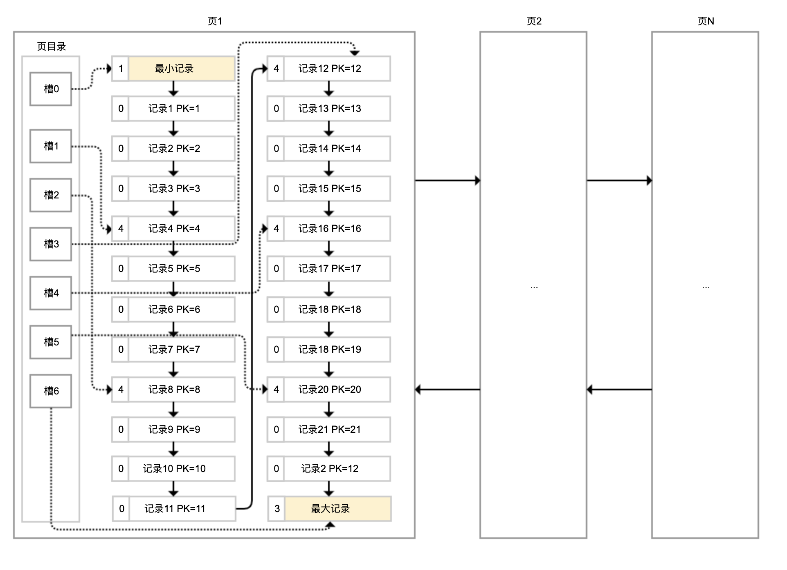
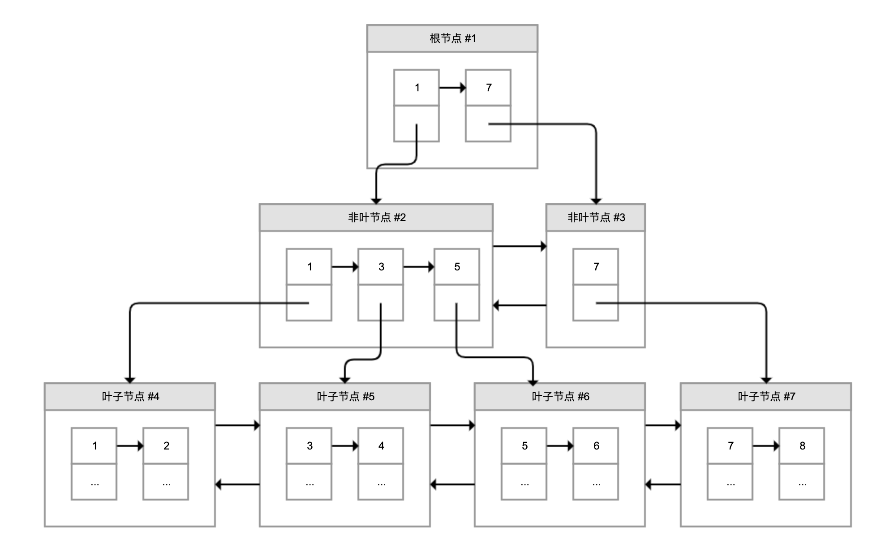
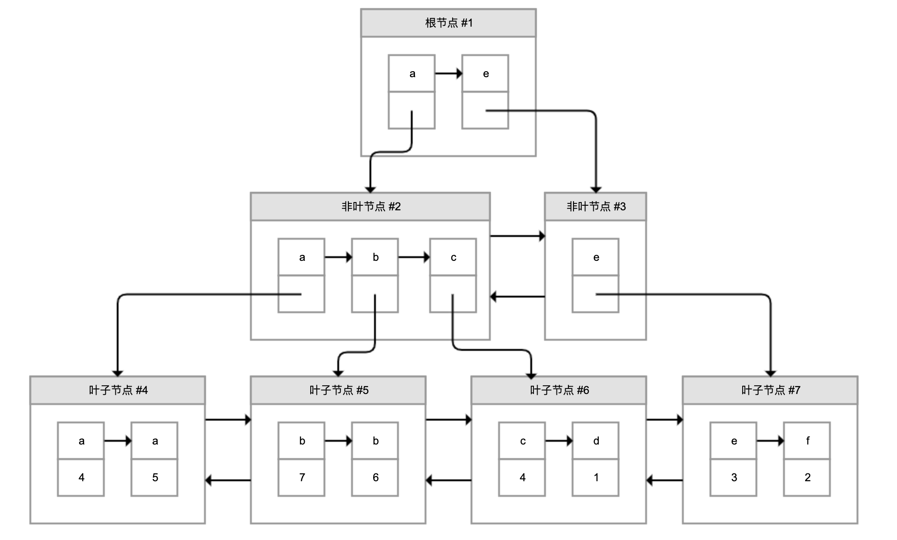
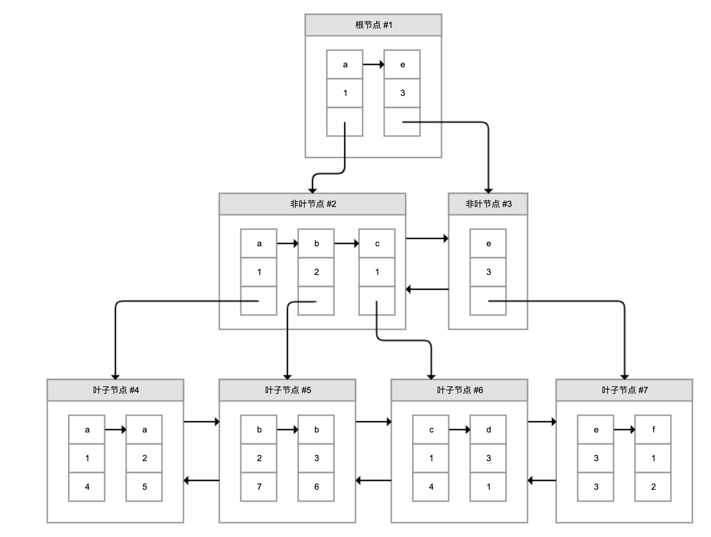
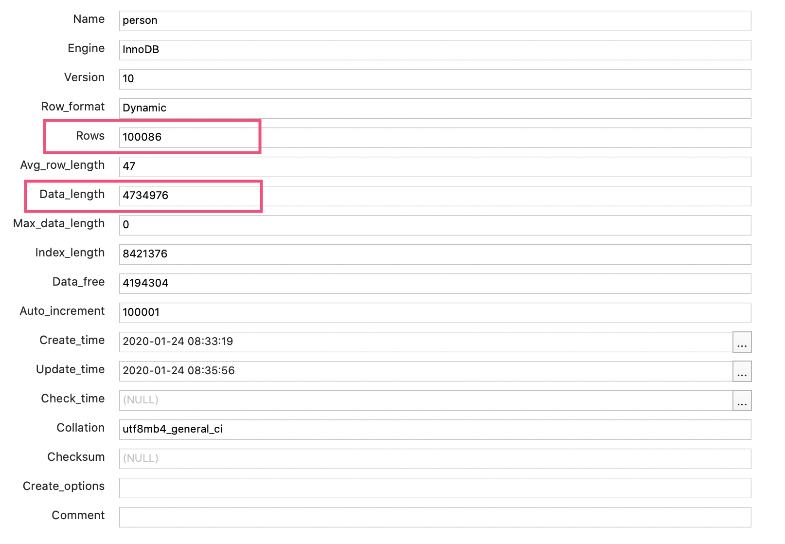

# 07 数据库索引：索引并不是万能药

你好，我是朱晔。今天，我要和你分享的主题是，数据库的索引并不是万能药。

几乎所有的业务项目都会涉及数据存储，虽然当前各种 NoSQL 和文件系统大行其道，但 MySQL 等关系型数据库因为满足 ACID、可靠性高、对开发友好等特点，仍然最常被用于存储重要数据。在关系型数据库中，索引是优化查询性能的重要手段。

为此，我经常看到一些同学一遇到查询性能问题，就盲目要求运维或 DBA 给数据表相关字段创建大量索引。显然，这种想法是错误的。今天，我们就以 MySQL 为例来深入理解下索引的原理，以及相关误区。

## InnoDB 是如何存储数据的？

MySQL 把数据存储和查询操作抽象成了存储引擎，不同的存储引擎，对数据的存储和读取方式各不相同。MySQL 支持多种存储引擎，并且可以以表为粒度设置存储引擎。因为支持事务，我们最常使用的是 InnoDB。为方便理解下面的内容，我先和你简单说说 InnoDB 是如何存储数据的。

虽然数据保存在磁盘中，但其处理是在内存中进行的。为了减少磁盘随机读取次数，InnoDB 采用页而不是行的粒度来保存数据，即数据被分成若干页，以页为单位保存在磁盘中。InnoDB 的页大小，一般是 16KB。

各个数据页组成一个双向链表，每个数据页中的记录按照主键顺序组成单向链表；每一个数据页中有一个页目录，方便按照主键查询记录。数据页的结构如下：



页目录通过槽把记录分成不同的小组，每个小组有若干条记录。如图所示，记录中最前面的小方块中的数字，代表的是当前分组的记录条数，最小和最大的槽指向 2 个特殊的伪记录。有了槽之后，我们按照主键搜索页中记录时，就可以采用二分法快速搜索，无需从最小记录开始遍历整个页中的记录链表。

举一个例子，如果要搜索主键（PK）=15 的记录：

先二分得出槽中间位是 (0+6)/2=3，看到其指向的记录是 12＜15，所以需要从 #3 槽后继续搜索记录；

再使用二分搜索出 #3 槽和 #6 槽的中间位是 (3+6)/2=4.5 取整 4，#4 槽对应的记录是 16＞15，所以记录一定在 #4 槽中；

再从 #3 槽指向的 12 号记录开始向下搜索 3 次，定位到 15 号记录。

理解了 InnoDB 存储数据的原理后，我们就可以继续学习 MySQL 索引相关的原理和坑了。

## 聚簇索引和二级索引

说到索引，页目录就是最简单的索引，是通过对记录进行一级分组来降低搜索的时间复杂度。但，这样能够降低的时间复杂度数量级，非常有限。当有无数个数据页来存储表数据的时候，我们就需要考虑如何建立合适的索引，才能方便定位记录所在的页。

为了解决这个问题，InnoDB 引入了 B+ 树。如下图所示，B+ 树是一棵倒过来的树：



B+ 树的特点包括：

最底层的节点叫作叶子节点，用来存放数据；

其他上层节点叫作非叶子节点，仅用来存放目录项，作为索引；

非叶子节点分为不同层次，通过分层来降低每一层的搜索量；

所有节点按照索引键大小排序，构成一个双向链表，加速范围查找。

因此，InnoDB 使用 B+ 树，既可以保存实际数据，也可以加速数据搜索，这就是聚簇索引。如果把上图叶子节点下面方块中的省略号看作实际数据的话，那么它就是聚簇索引的示意图。由于数据在物理上只会保存一份，所以包含实际数据的聚簇索引只能有一个。

InnoDB 会自动使用主键（唯一定义一条记录的单个或多个字段）作为聚簇索引的索引键（如果没有主键，就选择第一个不包含 NULL 值的唯一列）。上图方框中的数字代表了索引键的值，对聚簇索引而言一般就是主键。

我们再看看 B+ 树如何实现快速查找主键。比如，我们要搜索 PK=4 的数据，通过根节点中的索引可以知道数据在第一个记录指向的 2 号页中，通过 2 号页的索引又可以知道数据在 5 号页，5 号页就是实际的数据页，然后再通过二分法查找页目录马上可以找到记录的指针。

为了实现非主键字段的快速搜索，就引出了二级索引，也叫作非聚簇索引、辅助索引。二级索引，也是利用的 B+ 树的数据结构，如下图所示：



这次二级索引的叶子节点中保存的不是实际数据，而是主键，获得主键值后去聚簇索引中获得数据行。这个过程就叫作回表。

举个例子，有个索引是针对用户名字段创建的，索引记录上面方块中的字母是用户名，按照顺序形成链表。如果我们要搜索用户名为 b 的数据，经过两次定位可以得出在 #5 数据页中，查出所有的主键为 7 和 6，再拿着这两个主键继续使用聚簇索引进行两次回表得到完整数据。

## 考虑额外创建二级索引的代价

创建二级索引的代价，主要表现在维护代价、空间代价和回表代价三个方面。接下来，我就与你仔细分析下吧。

首先是维护代价。创建 N 个二级索引，就需要再创建 N 棵 B+ 树，新增数据时不仅要修改聚簇索引，还需要修改这 N 个二级索引。

我们通过实验测试一下创建索引的代价。假设有一个 person 表，有主键 ID，以及 name、score、create_time 三个字段：

```
CREATE TABLE `person` (


  `id` bigint(20) NOT NULL AUTO_INCREMENT,


  `name` varchar(255) NOT NULL,


  `score` int(11) NOT NULL,


  `create_time` timestamp NOT NULL,


  PRIMARY KEY (`id`)


) ENGINE=InnoDB DEFAULT CHARSET=utf8mb4;
```

通过下面的存储过程循环创建 10 万条测试数据，我的机器的耗时是 140 秒（本文的例子均在 MySQL 5.7.26 中执行）：

```
CREATE DEFINER=`root`@`%` PROCEDURE `insert_person`()


begin


    declare c_id integer default 1;


    while c_id<=100000 do


    insert into person values(c_id, concat('name',c_id), c_id+100, date_sub(NOW(), interval c_id second));


    set c_id=c_id+1;


    end while;


end
```

如果再创建两个索引，一个是 name 和 score 构成的联合索引，另一个是单一列 create_time 的索引，那么创建 10 万条记录的耗时提高到 154 秒：

```
KEY `name_score` (`name`,`score`) USING BTREE,


KEY `create_time` (`create_time`) USING BTREE
```

这里，我再额外提一下，页中的记录都是按照索引值从小到大的顺序存放的，新增记录就需要往页中插入数据，现有的页满了就需要新创建一个页，把现有页的部分数据移过去，这就是页分裂；如果删除了许多数据使得页比较空闲，还需要进行页合并。页分裂和合并，都会有 IO 代价，并且可能在操作过程中产生死锁。

你可以查看这个文档，以进一步了解如何设置合理的合并阈值，来平衡页的空闲率和因为再次页分裂产生的代价。

其次是空间代价。虽然二级索引不保存原始数据，但要保存索引列的数据，所以会占用更多的空间。比如，person 表创建了两个索引后，使用下面的 SQL 查看数据和索引占用的磁盘：

```
DATA_LENGTH, INDEX_LENGTH FROM information_schema.TABLES WHERE TABLE_NAME='person'
```

结果显示，数据本身只占用了 4.7M，而索引占用了 8.4M。

最后是回表的代价。二级索引不保存原始数据，通过索引找到主键后需要再查询聚簇索引，才能得到我们要的数据。比如，使用 SELECT * 按照 name 字段查询用户，使用 EXPLAIN 查看执行计划：

```
EXPLAIN SELECT * FROM person WHERE NAME='name1'
```

执行计划如下，可以发现：


key 字段代表实际走的是哪个索引，其值是 name_score，说明走的是 name_score 这个索引。

type 字段代表了访问表的方式，其值 ref 说明是二级索引等值匹配，符合我们的查询。

把 SQL 中的 * 修改为 NAME 和 SCORE，也就是 SELECT name_score 联合索引包含的两列：

```
EXPLAIN SELECT NAME,SCORE FROM person WHERE NAME='name1'
```

再来看看执行计划：


可以看到，Extra 列多了一行 Using index 的提示，证明这次查询直接查的是二级索引，免去了回表。

原因很简单，联合索引中其实保存了多个索引列的值，对于页中的记录先按照字段 1 排序，如果相同再按照字段 2 排序，如图所示：



图中，叶子节点每一条记录的第一和第二个方块是索引列的数据，第三个方块是记录的主键。如果我们需要查询的是索引列索引或联合索引能覆盖的数据，那么查询索引本身已经“覆盖”了需要的数据，不再需要回表查询。因此，这种情况也叫作索引覆盖。我会在最后一小节介绍如何查看不同查询的成本，和你一起看看索引覆盖和索引查询后回表的代价差异。

最后，我和你总结下关于索引开销的最佳实践吧。

第一，无需一开始就建立索引，可以等到业务场景明确后，或者是数据量超过 1 万、查询变慢后，再针对需要查询、排序或分组的字段创建索引。创建索引后可以使用 EXPLAIN 命令，确认查询是否可以使用索引。我会在下一小节展开说明。

第二，尽量索引轻量级的字段，比如能索引 int 字段就不要索引 varchar 字段。索引字段也可以是部分前缀，在创建的时候指定字段索引长度。针对长文本的搜索，可以考虑使用 Elasticsearch 等专门用于文本搜索的索引数据库。

第三，尽量不要在 SQL 语句中 SELECT *，而是 SELECT 必要的字段，甚至可以考虑使用联合索引来包含我们要搜索的字段，既能实现索引加速，又可以避免回表的开销。

## 不是所有针对索引列的查询都能用上索引

在上一个案例中，我创建了一个 name+score 的联合索引，仅搜索 name 时就能够用上这个联合索引。这就引出两个问题：

是不是建了索引一定可以用上？

怎么选择创建联合索引还是多个独立索引？

首先，我们通过几个案例来分析一下索引失效的情况。

第一，索引只能匹配列前缀。比如下面的 LIKE 语句，搜索 name 后缀为 name123 的用户无法走索引，执行计划的 type=ALL 代表了全表扫描：

```
EXPLAIN SELECT * FROM person WHERE NAME LIKE '%name123' LIMIT 100
```


把百分号放到后面走前缀匹配，type=range 表示走索引扫描，key=name_score 看到实际走了 name_score 索引：

```
EXPLAIN SELECT * FROM person WHERE NAME LIKE 'name123%' LIMIT 100
```


原因很简单，索引 B+ 树中行数据按照索引值排序，只能根据前缀进行比较。如果要按照后缀搜索也希望走索引的话，并且永远只是按照后缀搜索的话，可以把数据反过来存，用的时候再倒过来。

第二，条件涉及函数操作无法走索引。比如搜索条件用到了 LENGTH 函数，肯定无法走索引：

```
EXPLAIN SELECT * FROM person WHERE LENGTH(NAME)=7
```


同样的原因，索引保存的是索引列的原始值，而不是经过函数计算后的值。如果需要针对函数调用走数据库索引的话，只能保存一份函数变换后的值，然后重新针对这个计算列做索引。

第三，联合索引只能匹配左边的列。也就是说，虽然对 name 和 score 建了联合索引，但是仅按照 score 列搜索无法走索引：

```
EXPLAIN SELECT * FROM person WHERE SCORE>45678
```


原因也很简单，在联合索引的情况下，数据是按照索引第一列排序，第一列数据相同时才会按照第二列排序。也就是说，如果我们想使用联合索引中尽可能多的列，查询条件中的各个列必须是联合索引中从最左边开始连续的列。如果我们仅仅按照第二列搜索，肯定无法走索引。尝试把搜索条件加入 name 列，可以看到走了 name_score 索引：

```
EXPLAIN SELECT * FROM person WHERE SCORE>45678 AND NAME LIKE 'NAME45%'
```


需要注意的是，因为有查询优化器，所以 name 作为 WHERE 子句的第几个条件并不是很重要。

现在回到最开始的两个问题。

是不是建了索引一定可以用上？并不是，只有当查询能符合索引存储的实际结构时，才能用上。这里，我只给出了三个肯定用不上索引的反例。其实，有的时候即使可以走索引，MySQL 也不一定会选择使用索引。我会在下一小节展开这一点。

怎么选择建联合索引还是多个独立索引？如果你的搜索条件经常会使用多个字段进行搜索，那么可以考虑针对这几个字段建联合索引；同时，针对多字段建立联合索引，使用索引覆盖的可能更大。如果只会查询单个字段，可以考虑建单独的索引，毕竟联合索引保存了不必要字段也有成本。

## 数据库基于成本决定是否走索引

通过前面的案例，我们可以看到，查询数据可以直接在聚簇索引上进行全表扫描，也可以走二级索引扫描后到聚簇索引回表。看到这里，你不禁要问了，MySQL 到底是怎么确定走哪种方案的呢。

其实，MySQL 在查询数据之前，会先对可能的方案做执行计划，然后依据成本决定走哪个执行计划。

这里的成本，包括 IO 成本和 CPU 成本：

IO 成本，是从磁盘把数据加载到内存的成本。默认情况下，读取数据页的 IO 成本常数是 1（也就是读取 1 个页成本是 1）。

CPU 成本，是检测数据是否满足条件和排序等 CPU 操作的成本。默认情况下，检测记录的成本是 0.2。

基于此，我们分析下全表扫描的成本。

全表扫描，就是把聚簇索引中的记录依次和给定的搜索条件做比较，把符合搜索条件的记录加入结果集的过程。那么，要计算全表扫描的代价需要两个信息：

聚簇索引占用的页面数，用来计算读取数据的 IO 成本；

表中的记录数，用来计算搜索的 CPU 成本。

那么，MySQL 是实时统计这些信息的吗？其实并不是，MySQL 维护了表的统计信息，可以使用下面的命令查看：

```
SHOW TABLE STATUS LIKE 'person'
```

输出如下：



可以看到：

总行数是 100086 行（之前 EXPLAIN 时，也看到 rows 为 100086）。你可能说，person 表不是有 10 万行记录吗，为什么这里多了 86 行？其实，MySQL 的统计信息是一个估算，其统计方式比较复杂我就不再展开了。但不妨碍我们根据这个值估算 CPU 成本，是 100086*0.2=20017 左右。

数据长度是 4734976 字节。对于 InnoDB 来说，这就是聚簇索引占用的空间，等于聚簇索引的页面数量 * 每个页面的大小。InnoDB 每个页面的大小是 16KB，大概计算出页面数量是 289，因此 IO 成本是 289 左右。

所以，全表扫描的总成本是 20306 左右。

接下来，我还是用 person 表这个例子，和你分析下 MySQL 如何基于成本来制定执行计划。现在，我要用下面的 SQL 查询 name>‘name84059’ AND create_time>‘2020-01-24 05:00:00’

```
EXPLAIN SELECT * FROM person WHERE NAME >'name84059' AND create_time>'2020-01-24 05:00:00'
```

其执行计划是全表扫描：


只要把 create_time 条件中的 5 点改为 6 点就变为走索引了，并且走的是 create_time 索引而不是 name_score 联合索引：


我们可以得到两个结论：

MySQL 选择索引，并不是按照 WHERE 条件中列的顺序进行的；

即便列有索引，甚至有多个可能的索引方案，MySQL 也可能不走索引。

其原因就是，MySQL 并不是猜拳决定是否走索引的，而是根据成本来判断的。虽然表的统计信息不完全准确，但足够用于策略的判断了。

不过，有时会因为统计信息的不准确或成本估算的问题，实际开销会和 MySQL 统计出来的差距较大，导致 MySQL 选择错误的索引或是直接选择走全表扫描，这个时候就需要人工干预，使用强制索引了。比如，像这样强制走 name_score 索引：

```
EXPLAIN SELECT * FROM person FORCE INDEX(name_score) WHERE NAME >'name84059' AND create_time>'2020-01-24 05:00:00' 
```

我们介绍了 MySQL 会根据成本选择执行计划，也通过 EXPLAIN 知道了优化器最终会选择怎样的执行计划，但 MySQL 如何制定执行计划始终是一个黑盒。那么，有没有什么办法可以了解各种执行计划的成本，以及 MySQL 做出选择的依据呢？

在 MySQL 5.6 及之后的版本中，我们可以使用 optimizer trace 功能查看优化器生成执行计划的整个过程。有了这个功能，我们不仅可以了解优化器的选择过程，更可以了解每一个执行环节的成本，然后依靠这些信息进一步优化查询。

如下代码所示，打开 optimizer_trace 后，再执行 SQL 就可以查询 information_schema.OPTIMIZER_TRACE 表查看执行计划了，最后可以关闭 optimizer_trace 功能：

```
SET optimizer_trace="enabled=on";


SELECT * FROM person WHERE NAME >'name84059' AND create_time>'2020-01-24 05:00:00';


SELECT * FROM information_schema.OPTIMIZER_TRACE;


SET optimizer_trace="enabled=off";
```

对于按照 create_time>'2020-01-24 05:00:00’条件走全表扫描的 SQL，我从 OPTIMIZER_TRACE 的执行结果中，摘出了几个重要片段来重点分析：

使用 name_score 对 name84059<name 条件进行索引扫描需要扫描 25362 行，成本是 30435，因此最终没有选择这个方案。这里的 30435 是查询二级索引的 IO 成本和 CPU 成本之和，再加上回表查询聚簇索引的 IO 成本和 CPU 成本之和，我就不再具体分析了：

```
{


  "index": "name_score",


  "ranges": [


    "name84059 < name"


  ],


  "rows": 25362,


  "cost": 30435,


  "chosen": false,


  "cause": "cost"


},
```

使用 create_time 进行索引扫描需要扫描 23758 行，成本是 28511，同样因为成本原因没有选择这个方案：

```
{


  "index": "create_time",


  "ranges": [


    "0x5e2a79d0 < create_time"


  ],


  "rows": 23758,


  "cost": 28511,


  "chosen": false,


  "cause": "cost"


}
```

最终选择了全表扫描方式作为执行计划。可以看到，全表扫描 100086 条记录的成本是 20306，和我们之前计算的一致，显然是小于其他两个方案的 28511 和 30435：

```
{


  "considered_execution_plans": [{


    "table": "`person`",


    "best_access_path": {


      "considered_access_paths": [{


        "rows_to_scan": 100086,


        "access_type": "scan",


        "resulting_rows": 100086,


        "cost": 20306,


        "chosen": true


      }]


    },


    "rows_for_plan": 100086,


    "cost_for_plan": 20306,


    "chosen": true


  }]


},
```

把 SQL 中的 create_time 条件从 05:00 改为 06:00，再次分析 OPTIMIZER_TRACE 可以看到，这次执行计划选择的是走 create_time 索引。因为是查询更晚时间的数据，走 create_time 索引需要扫描的行数从 23758 减少到了 16588。这次走这个索引的成本 19907 小于全表扫描的 20306，更小于走 name_score 索引的 30435：

```
{


  "index": "create_time",


  "ranges": [


    "0x5e2a87e0 < create_time"


  ],


  "rows": 16588,


  "cost": 19907,


  "chosen": true


}
```

有关 optimizer trace 的更多信息，你可以参考MySQL 的文档。

## 重点回顾

今天，我先和你分析了 MySQL InnoDB 存储引擎页、聚簇索引和二级索引的结构，然后分析了关于索引的两个误区。

第一个误区是，考虑到索引的维护代价、空间占用和查询时回表的代价，不能认为索引越多越好。索引一定是按需创建的，并且要尽可能确保足够轻量。一旦创建了多字段的联合索引，我们要考虑尽可能利用索引本身完成数据查询，减少回表的成本。

第二个误区是，不能认为建了索引就一定有效，对于后缀的匹配查询、查询中不包含联合索引的第一列、查询条件涉及函数计算等情况无法使用索引。此外，即使 SQL 本身符合索引的使用条件，MySQL 也会通过评估各种查询方式的代价，来决定是否走索引，以及走哪个索引。

因此，在尝试通过索引进行 SQL 性能优化的时候，务必通过执行计划或实际的效果来确认索引是否能有效改善性能问题，否则增加了索引不但没解决性能问题，还增加了数据库增删改的负担。如果对 EXPLAIN 给出的执行计划有疑问的话，你还可以利用 optimizer_trace 查看详细的执行计划做进一步分析。

今天用到的代码，我都放在了 GitHub 上，你可以点击这个链接查看。

## 思考与讨论

在介绍二级索引代价时，我们通过 EXPLAIN 命令看到了索引覆盖和回表的两种情况。你能用 optimizer trace 来分析一下这两种情况的成本差异吗？

索引除了可以用于加速搜索外，还可以在排序时发挥作用，你能通过 EXPLAIN 来证明吗？你知道，在什么情况下针对排序索引会失效吗？

针对数据库索引，你还有什么心得吗？我是朱晔，欢迎在评论区与我留言分享，也欢迎你把这篇文章分享给你的朋友或同事，一起交流。