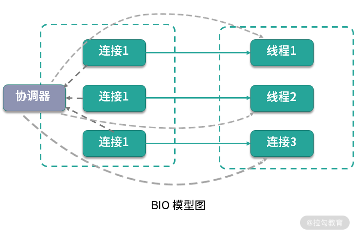
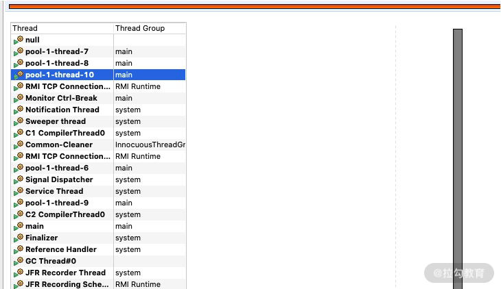
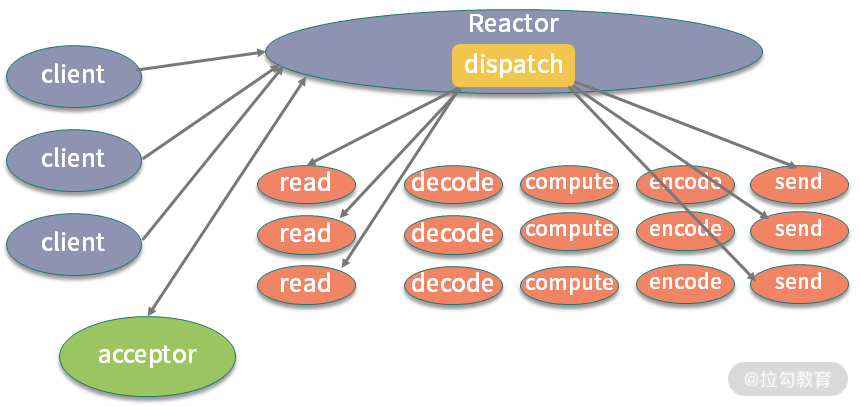
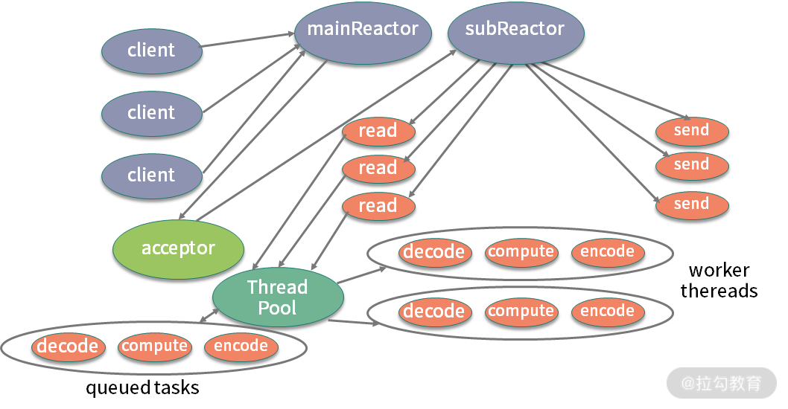
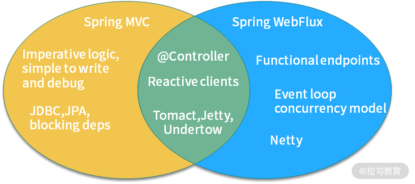

# 15 案例分析：从 BIO 到 NIO，再到 AIO

Netty 的高性能架构，是基于一个网络编程设计模式 Reactor 进行设计的。现在，大多数与 I/O 相关的组件，都会使用 Reactor 模型，比如 Tomcat、Redis、Nginx 等，可见 Reactor 应用的广泛性。

Reactor 是 NIO 的基础。为什么 NIO 的性能就能够比传统的阻塞 I/O 性能高呢？我们首先来看一下传统阻塞式 I/O 的一些特点。

### 阻塞 I/O 模型



如上图，是典型的**BIO 模型**，每当有一个连接到来，经过协调器的处理，就开启一个对应的线程进行接管。如果连接有 1000 条，那就需要 1000 个线程。

线程资源是非常昂贵的，除了占用大量的内存，还会占用非常多的 CPU 调度时间，所以 BIO 在连接非常多的情况下，效率会变得非常低。

下面的代码是使用 ServerSocket 实现的一个简单 Socket 服务器，监听在 8888 端口。

```
public class BIO {

    static boolean stop = false;


    public static void main(String[] args) throws Exception {

        int connectionNum = 0;

        int port = 8888;

        ExecutorService service = Executors.newCachedThreadPool();

        ServerSocket serverSocket = new ServerSocket(port);

        while (!stop) {

            if (10 == connectionNum) {

                stop = true;

            }

            Socket socket = serverSocket.accept();

            service.execute(() -> {

                try {

                    Scanner scanner = new Scanner(socket.getInputStream());

                    PrintStream printStream = new PrintStream(socket.getOutputStream());

                    while (!stop) {

                        String s = scanner.next().trim();

                        printStream.println("PONG:" + s);

                    }

                } catch (Exception ex) {

                    ex.printStackTrace();

                }

            });

            connectionNum++;

        }

        service.shutdown();

        serverSocket.close();

    }

}
```

启动之后，使用 nc 命令进行连接测试，结果如下。

```
$ nc -v localhost 8888

Connection to localhost port 8888 [tcp/ddi-tcp-1] succeeded!

hello

PONG:hello

nice

PONG:nice
```

使用 “04 | 工具实践：如何获取代码性能数据？”提到的 JMC 工具，在录制期间发起多个连接，能够发现有多个线程在运行，和连接数是一一对应的。



可以看到，BIO 的读写操作是阻塞的，线程的整个生命周期和连接的生命周期是一样的，而且不能够被复用。

就单个阻塞 I/O 来说，它的效率并不比 NIO 慢。但是当服务的连接增多，考虑到整个服务器的资源调度和资源利用率等因素，NIO 就有了显著的效果，NIO 非常适合高并发场景。

### 非阻塞 I/O 模型

其实，在处理 I/O 动作时，有大部分时间是在等待。比如，socket 连接要花费很长时间进行连接操作，在完成连接的这段时间内，它并没有占用额外的系统资源，但它只能阻塞等待在线程中。这种情况下，系统资源并不能被合理利用。

Java 的 NIO，在 Linux 上底层是使用 epoll 实现的。epoll 是一个高性能的多路复用 I/O 工具，改进了 select 和 poll 等工具的一些功能。**在网络编程中，对 epoll 概念的一些理解，几乎是面试中必问的问题。**

epoll 的数据结构是直接在内核上进行支持的，通过 epoll_create 和 epoll_ctl 等函数的操作，可以构造描述符（fd）相关的事件组合（event）。

这里有两个比较重要的概念：

- fd 每条连接、每个文件，都对应着一个描述符，比如端口号。内核在定位到这些连接的时候，就是通过 fd 进行寻址的。
- event 当 fd 对应的资源，有状态或者数据变动，就会更新 epoll_item 结构。在没有事件变更的时候，epoll 就阻塞等待，也不会占用系统资源；一旦有新的事件到来，epoll 就会被激活，将事件通知到应用方。

**关于 epoll 还会有一个面试题，相对于 select，epoll 有哪些改进？**

你可以这样回答：

- epoll 不再需要像 select 一样对 fd 集合进行轮询，也不需要在调用时将 fd 集合在用户态和内核态进行交换；
- 应用程序获得就绪 fd 的事件复杂度，epoll 是 O(1)，select 是 O(n)；
- select 最大支持约 1024 个 fd，epoll 支持 65535个；
- select 使用轮询模式检测就绪事件，epoll 采用通知方式，更加高效。

我们还是以 Java 中的 NIO 代码为例，来看一下 NIO 的具体概念。

```
public class NIO {

    static boolean stop = false;


    public static void main(String[] args) throws Exception {

        int connectionNum = 0;

        int port = 8888;

        ExecutorService service = Executors.newCachedThreadPool();


        ServerSocketChannel ssc = ServerSocketChannel.open();

        ssc.configureBlocking(false);

        ssc.socket().bind(new InetSocketAddress("localhost", port));


        Selector selector = Selector.open();

        ssc.register(selector, ssc.validOps());


        while (!stop) {

            if (10 == connectionNum) {

                stop = true;

            }

            int num = selector.select();

            if (num == 0) {

                continue;

            }

            Iterator<SelectionKey> events = selector.selectedKeys().iterator();

            while (events.hasNext()) {

                SelectionKey event = events.next();


                if (event.isAcceptable()) {

                    SocketChannel sc = ssc.accept();

                    sc.configureBlocking(false);

                    sc.register(selector, SelectionKey.OP_READ);

                    connectionNum++;

                } else if (event.isReadable()) {

                    try {

                        SocketChannel sc = (SocketChannel) event.channel();

                        ByteBuffer buf = ByteBuffer.allocate(1024);

                        int size = sc.read(buf);

                        if(-1==size){

                            sc.close();

                        }

                        String result = new String(buf.array()).trim();

                        ByteBuffer wrap = ByteBuffer.wrap(("PONG:" + result).getBytes());

                        sc.write(wrap);

                    } catch (Exception ex) {

                        ex.printStackTrace();

                    }

                } else if (event.isWritable()) {

                    SocketChannel sc = (SocketChannel) event.channel();

                }


                events.remove();

            }

        }

        service.shutdown();

        ssc.close();

    }

}
```

上面这段代码比较长，是使用 NIO 实现的和 BIO 相同的功能。从它的 API 设计上，我们就能够看到 epoll 的一些影子。

首先，我们创建了一个服务端 ssc，并开启一个新的事件选择器，监听它的 OP_ACCEPT 事件。

```
ServerSocketChannel ssc = ServerSocketChannel.open();

Selector selector = Selector.open();

ssc.register(selector, ssc.validOps());
```

共有 4 种事件类型，分别是：

- 新连接事件（OP_ACCEPT）；
- 连接就绪事件（OP_CONNECT）；
- 读就绪事件（OP_READ）；
- 写就绪事件（OP_WRITE）。

任何网络和文件操作，都可以抽象成这四个事件。


接下来，在 while 循环里，使用 select 函数，阻塞在主线程里。所谓**阻塞**，就是操作系统不再分配 CPU 时间片到当前线程中，所以 select 函数是几乎不占用任何系统资源的。

```
int num = selector.select();
```

一旦有新的事件到达，比如有新的连接到来，主线程就能够被调度到，程序就能够向下执行。这时候，就能够根据订阅的事件通知，持续获取订阅的事件。 由于注册到 selector 的连接和事件可能会有多个，所以这些事件也会有多个。我们使用安全的迭代器循环进行处理，在处理完毕之后，将它删除。

> 这里留一个思考题：如果事件不删除的话，或者漏掉了某个事件的处理，会有什么后果？

```
Iterator<SelectionKey> events = selector.selectedKeys().iterator();

    while (events.hasNext()) {

        SelectionKey event = events.next();

        ...

        events.remove();

    }

}
```

有新的连接到达时，我们订阅了更多的事件。对于我们的数据读取来说，对应的事件就是 OP_READ。和 BIO 编程面向流的方式不同，NIO 操作的对象是抽象的概念 Channel，通过缓冲区进行数据交换。

```
SocketChannel sc = ssc.accept();

sc.configureBlocking(false);

sc.register(selector, SelectionKey.OP_READ);
```

值得注意的是：服务端和客户端的实现方式，可以是不同的。比如，服务端是 NIO，客户端可以是 BIO，它们并没有什么强制要求。

**另外一个面试时候经常问到的事件就是 OP_WRITE**。我们上面提到过，这个事件是表示写就绪的，当底层的缓冲区有空闲，这个事件就会一直发生，浪费占用 CPU 资源。所以，我们一般是不注册 OP_WRITE 的。

这里还有一个细节，在读取数据的时候，并没有像 BIO 的方式一样使用循环来获取数据。

如下面的代码，我们创建了一个 1024 字节的缓冲区，用于数据的读取。如果连接中的数据，大于 1024 字节怎么办？

```
SocketChannel sc = (SocketChannel) event.channel();

ByteBuffer buf = ByteBuffer.allocate(1024);

int size = sc.read(buf);
```

这涉及两种事件的通知机制：

- **水平触发**(level-triggered) 称作 LT 模式。只要缓冲区有数据，事件就会一直发生
- **边缘触发**(edge-triggered) 称作 ET 模式。缓冲区有数据，仅会触发一次。事件想要再次触发，必须先将 fd 中的数据读完才行

可以看到，Java 的 NIO 采用的就是水平触发的方式。LT 模式频繁环唤醒线程，效率相比较ET模式低，所以 Netty 使用 JNI 的方式，实现了 ET 模式，效率上更高一些。

### Reactor 模式

了解了 BIO 和 NIO 的一些使用方式，Reactor 模式就呼之欲出了。

NIO 是基于事件机制的，有一个叫作 Selector 的选择器，阻塞获取关注的事件列表。获取到事件列表后，可以通过分发器，进行真正的数据操作。



> 该图来自 Doug Lea 的[《](http://gee.cs.oswego.edu/dl/cpjslides/nio.pdf)[Scalable IO in Java》](http://gee.cs.oswego.edu/dl/cpjslides/nio.pdf)，该图指明了最简单的 Reactor 模型的基本元素。

你可以回看下我在上文举例的 “Java 中的 NIO 代码”，对比分析一下，你会发现 Reactor

模型 里面有四个主要元素：

- **Acceptor**处理 client 的连接，并绑定具体的事件处理器；
- **Event**具体发生的事件，比如图中s的read、send等；
- **Handler**执行具体事件的处理者，比如处理读写事件的具体逻辑；
- **Reactor**将具体的事件分配（dispatch）给 Handler。

我们可以对上面的模型进行进一步细化，如下图所示，将 Reactor 分为 mainReactor 和 subReactor 两部分。



> 该图来自 Doug Lea 的 [《Scalable IO in Java》](http://gee.cs.oswego.edu/dl/cpjslides/nio.pdf)

- **mainReactor**负责监听处理新的连接，然后将后续的事件处理交给 subReactor；
- **subReactor**对事件处理的方式，也由阻塞模式变成了多线程处理，引入了任务队列的模式。

熟悉 Netty 的同学可以看到，这个 Reactor 模型就是 Netty 设计的基础。在 Netty 中，Boss 线程对应着对连接的处理和分派，相当于 mainReactor；Worker 线程对应着 subReactor，使用多线程负责读写事件的分发和处理。

这种模式将每个组件的职责分得更细，耦合度也更低，能有效解决 C10k 问题。

### AIO

关于 NIO 的概念，误解还是比较多的。

**面试官可能会问你：为什么我在使用 NIO 时，使用 Channel 进行读写，socket 的操作依然是阻塞的？NIO 的作用主要体现在哪里？**

```
//这行代码是阻塞的

int size = sc.read(buf);
```

这时你可以回答：NIO 只负责对发生在 fd 描述符上的事件进行通知。事件的获取和通知部分是非阻塞的，但收到通知之后的操作，却是阻塞的，即使使用多线程去处理这些事件，它依然是阻塞的。

AIO 更近一步，将这些对事件的操作也变成非阻塞的。下面是一段典型的 AIO 代码，它通过注册 CompletionHandler 回调函数进行事件处理。这里的事件是隐藏的，比如 read 函数，它不仅仅代表 Channel 可读了，而且会把数据自动的读取到 ByteBuffer 中。等完成了读取，就会通过回调函数通知你，进行后续的操作。

```
public class AIO {

    public static void main(String[] args) throws Exception {

        int port = 8888;

        AsynchronousServerSocketChannel ssc = AsynchronousServerSocketChannel.open();

        ssc.bind(new InetSocketAddress("localhost", port));

        ssc.accept(null, new CompletionHandler<AsynchronousSocketChannel, Object>() {

            void job(final AsynchronousSocketChannel sc) {

                ByteBuffer buffer = ByteBuffer.allocate(1024);

                sc.read(buffer, buffer, new CompletionHandler<Integer, ByteBuffer>() {

                    @Override

                    public void completed(Integer result, ByteBuffer attachment) {

                        String str = new String(attachment.array()).trim();

                        ByteBuffer wrap = ByteBuffer.wrap(("PONG:" + str).getBytes());

                        sc.write(wrap, null, new CompletionHandler<Integer, Object>() {

                            @Override

                            public void completed(Integer result, Object attachment) {

                                job(sc);

                            }

                            @Override

                            public void failed(Throwable exc, Object attachment) {

                                System.out.println("error");

                            }

                        });

                    }

                    @Override

                    public void failed(Throwable exc, ByteBuffer attachment) {

                        System.out.println("error");

                    }

                });

            }

            @Override

            public void completed(AsynchronousSocketChannel sc, Object attachment) {

                ssc.accept(null, this);

                job(sc);

            }

            @Override

            public void failed(Throwable exc, Object attachment) {

                exc.printStackTrace();

                System.out.println("error");

            }

        });

        Thread.sleep(Integer.MAX_VALUE);

    }

}
```

AIO 是 Java 1.7 加入的，理论上性能会有提升，但实际测试并不理想。这是因为，AIO主要处理对数据的自动读写操作。这些操作的具体逻辑，假如不放在框架中，也要放在内核中，并没有节省操作步骤，对性能的影响有限。而 Netty 的 NIO 模型加上多线程处理，在这方面已经做得很好，编程模式也比AIO简单。

所以，市面上对 AIO 的实践并不多，在采用技术选型的时候，一定要谨慎。

### 响应式编程

你可能听说过 Spring 5.0 的 WebFlux，WebFlux 是可以替代 Spring MVC 的一套解决方案，可以编写响应式的应用，两者之间的关系如下图所示：



Spring WebFlux 的底层使用的是 Netty，所以操作是异步非阻塞的，类似的组件还有 vert.x、akka、rxjava 等。

WebFlux 是运行在 project reactor 之上的一个封装，其根本特性是后者提供的，至于再底层的非阻塞模型，就是由 Netty 保证的了。

非阻塞的特性我们可以理解，那响应式又是什么概念呢？

**响应式编程**是一种面向数据流和变化传播的编程范式。这意味着可以在编程语言中很方便地表达静态或动态的数据流，而相关的计算模型会自动将变化的值，通过数据流进行传播。

这段话很晦涩，在编程方面，它表达的意思就是：**把生产者消费者模式，使用简单的API 表示出来，并自动处理背压（Backpressure）问题。**

背压，指的是生产者与消费者之间的流量控制，通过将操作全面异步化，来减少无效的等待和资源消耗。

Java 的 Lambda 表达式可以让编程模型变得非常简单，Java 9 更是引入了响应式流（Reactive Stream），方便了我们的操作。

比如，下面是 Spring Cloud GateWay 的 Fluent API 写法，响应式编程的 API 都是类似的。

```
public RouteLocator customerRouteLocator(RouteLocatorBuilder builder) {

        return builder.routes()

                .route(r -> r.path("/market/**")

                        .filters(f -> f.filter(new RequestTimeFilter())

                                .addResponseHeader("X-Response-Default-Foo", "Default-Bar"))

                        .uri("http://localhost:8080/market/list")

                        .order(0)

                        .id("customer_filter_router")

                )

                .build();

    }
```

从传统的开发模式过渡到 Reactor 的开发模式，是有一定成本的，不过它确实能够提高我们应用程序的性能，至于是否采用，这取决于你在编程难度和性能之间的取舍。

### 小结

本课时，我们系统地学习了 BIO、NIO、AIO 等概念和基本的编程模型 Reactor，我们了解到：

- BIO 的线程模型是一个连接对应一个线程的，非常浪费资源；
- NIO通过对关键事件的监听，通过主动通知的方式完成非阻塞操作，但它对事件本身的处理依然是非阻塞的；
- AIO 完全是异步非阻塞的，但现实中使用很少。

使用 Netty 的多 Acceptor 模式和多线程模式，我们能够方便地完成类似 AIO 这样的操作。Netty 的事件触发机制使用了高效的 ET 模式，使得支持的连接更多，性能更高。

使用 Netty，能够构建响应式编程的基础，加上类似 Lambda 表达式这样的书写风格，能够完成类似 WebFlux 这样的响应式框架。响应式编程是一个趋势，现在有越来越多的框架和底层的数据库支持响应式编程，我们的应用响应也会更加迅速。