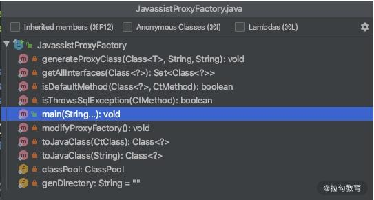
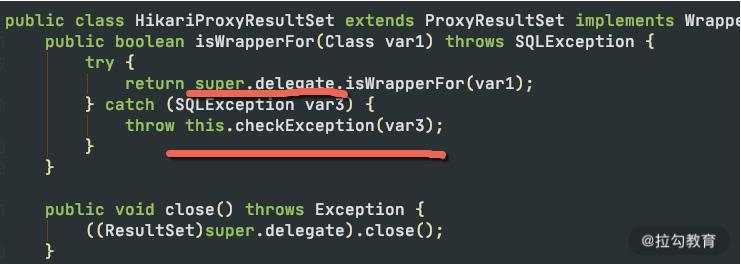

# 16 案例分析：常见 Java 代码优化法则

回顾一下 06 课时到 15 课时，我们分别了解缓冲、缓存、池化对象、大对象复用、并行计算、锁优化、NIO 等优化方法，它们对性能的提升往往是质的飞跃。

但语言本身对性能也是有影响的，比如就有很多公司就因为语言的特性由 Java 切换到 Golang。对于 Java 语言来说，也有它的一套优化法则，这些细微的性能差异，经过多次调用和迭代，会产生越来越大的影响。

本课时将集中讲解一些常用的代码优化法则，从而在编码中保持好的习惯，让代码保持最优状态。

### 代码优化法则

#### 1.使用局部变量可避免在堆上分配

由于堆资源是多线程共享的，是垃圾回收器工作的主要区域，过多的对象会造成 GC 压力。可以通过局部变量的方式，将变量在栈上分配。这种方式变量会随着方法执行的完毕而销毁，能够减轻 GC 的压力。

#### 2.减少变量的作用范围

注意变量的作用范围，尽量减少对象的创建。如下面的代码，变量 a 每次进入方法都会创建，可以将它移动到 if 语句内部。

```
public void test1(String str) {

    final int a = 100;

    if (!StringUtils.isEmpty(str)) {

        int b = a * a;

    }

}
```

#### 3.访问静态变量直接使用类名

有的同学习惯使用对象访问静态变量，这种方式多了一步寻址操作，需要先找到变量对应的类，再找到类对应的变量，如下面的代码：

```
public class StaticCall {

    public static final int A = 1;


    void test() {

        System.out.println(this.A);

        System.out.println(StaticCall.A);

    }

}
```

对应的字节码为：

```
void test();

    descriptor: ()V

    flags:

    Code:

      stack=2, locals=1, args_size=1

         0: getstatic     #2                  // Field java/lang/System.out:Ljava/io/PrintStream;

         3: aload_0

         4: pop

         5: iconst_1

         6: invokevirtual #3                  // Method java/io/PrintStream.println:(I)V

         9: getstatic     #2                  // Field java/lang/System.out:Ljava/io/PrintStream;

        12: iconst_1

        13: invokevirtual #3                  // Method java/io/PrintStream.println:(I)V

        16: return

      LineNumberTable:

        line 5: 0

        line 6: 9

        line 7: 16
```

可以看到使用 this 的方式多了一个步骤。

#### 4.字符串拼接使用 StringBuilder

字符串拼接，使用 StringBuilder 或者 StringBuffer，不要使用 + 号。比如下面这段代码，在循环中拼接了字符串。

```
public String test() {

    String str = "-1";

    for (int i = 0; i < 10; i++) {

        str += i;

    }

    return str;

}
```

从下面对应的字节码内容可以看出，它在每个循环里都创建了一个 StringBuilder 对象。所以，我们在平常的编码中，显式地创建一次即可。

```
 5: iload_2

 6: bipush        10

 8: if_icmpge     36

11: new           #3                  // class java/lang/StringBuilder

14: dup

15: invokespecial #4                  // Method java/lang/StringBuilder."<init>":()V

18: aload_1

19: invokevirtual #5                  // Method java/lang/StringBuilder.append:(Ljava/lang/String;)Ljava/lang/StringBuilder;

22: iload_2

23: invokevirtual #6                  // Method java/lang/StringBuilder.append:(I)Ljava/lang/StringBuilder;

26: invokevirtual #7                  // Method java/lang/StringBuilder.toString:()Ljava/lang/String;

29: astore_1

30: iinc          2, 1

33: goto          5
```

#### 5.重写对象的 HashCode，不要简单地返回固定值

在代码 review 的时候，我发现有开发重写 HashCode 和 Equals 方法时，会把 HashCode 的值返回固定的 0，而这样做是不恰当的。

当这些对象存入 HashMap 时，性能就会非常低，因为 HashMap 是通过 HashCode 定位到 Hash 槽，有冲突的时候，才会使用链表或者红黑树组织节点。固定地返回 0，相当于把 Hash 寻址功能给废除了。

#### 6.HashMap 等集合初始化的时候，指定初始值大小

这个原则参见 **“10 | 案例分析：大对象复用的目标和注意点”**，这样的对象有很多，比如 ArrayList，StringBuilder 等，通过指定初始值大小可减少扩容造成的性能损耗。

#### 7.遍历 Map 的时候，使用 EntrySet 方法

使用 EntrySet 方法，可以直接返回 set 对象，直接拿来用即可；而使用 KeySet 方法，获得的是key 的集合，需要再进行一次 get 操作，多了一个操作步骤。所以更推荐使用 EntrySet 方式遍历 Map。

#### 8.不要在多线程下使用同一个 Random

Random 类的 seed 会在并发访问的情况下发生竞争，造成性能降低，建议在多线程环境下使用 ThreadLocalRandom 类。

在 Linux 上，通过加入 JVM 配置 **-Djava.security.egd=file:/dev/./urandom**，使用 urandom 随机生成器，在进行随机数获取时，速度会更快。

#### 9.自增推荐使用 LongAddr

自增运算可以通过 synchronized 和 volatile 的组合，或者也可以使用原子类（比如 AtomicLong）。

后者的速度比前者要高一些，AtomicLong 使用 CAS 进行比较替换，在线程多的情况下会造成过多无效自旋，所以可以使用 LongAdder 替换 AtomicLong 进行进一步的性能提升。

#### 10.不要使用异常控制程序流程

异常，是用来了解并解决程序中遇到的各种不正常的情况，它的实现方式比较昂贵，比平常的条件判断语句效率要低很多。

这是因为异常在字节码层面，需要生成一个如下所示的异常表（Exception table），多了很多判断步骤。

```
Exception table:

    from    to  target type

    7    17    20   any

    20    23    20   any
```

所以，尽量不要使用异常控制程序流程。

#### 11.不要在循环中使用 try catch

道理与上面类似，很多文章介绍，不要把异常处理放在循环里，而应该把它放在最外层，但实际测试情况表明这两种方式性能相差并不大。

既然性能没什么差别，那么就推荐根据业务的需求进行编码。比如，循环遇到异常时，不允许中断，也就是允许在发生异常的时候能够继续运行下去，那么异常就只能在 for 循环里进行处理。

#### 12.不要捕捉 RuntimeException

Java 异常分为两种，一种是可以通过预检查机制避免的 RuntimeException；另外一种就是普通异常。

其中，RuntimeException 不应该通过 catch 语句去捕捉，而应该使用编码手段进行规避。

如下面的代码，list 可能会出现数组越界异常。是否越界是可以通过代码提前判断的，而不是等到发生异常时去捕捉。提前判断这种方式，代码会更优雅，效率也更高。

```
//BAD

public String test1(List<String> list, int index) {

    try {

        return list.get(index);

    } catch (IndexOutOfBoundsException ex) {

        return null;

    }

}


//GOOD

public String test2(List<String> list, int index) {

    if (index >= list.size() || index < 0) {

        return null;

    }

    return list.get(index);

}
```

#### 13.合理使用 PreparedStatement

PreparedStatement 使用预编译对 SQL 的执行进行提速，大多数数据库都会努力对这些能够复用的查询语句进行预编译优化，并能够将这些编译结果缓存起来。

这样等到下次用到的时候，就可以很快进行执行，也就少了一步对 SQL 的解析动作。

PreparedStatement 还能提高程序的安全性，能够有效防止 SQL 注入。

但如果你的程序每次 SQL 都会变化，不得不手工拼接一些数据，那么 PreparedStatement 就失去了它的作用，反而使用普通的 Statement 速度会更快一些。

#### 14.日志打印的注意事项

我们在“06 | 案例分析：缓冲区如何让代码加速”中了解了 logback 的异步日志，日志打印还有一些其他要注意的事情。

我们平常会使用 debug 输出一些调试信息，然后在线上关掉它。如下代码：

```
logger.debug("xjjdog:"+ topic + "  is  awesome"  );
```

程序每次运行到这里，都会构造一个字符串，不管你是否把日志级别调试到 INFO 还是 WARN，这样效率就会很低。

可以在每次打印之前都使用 isDebugEnabled 方法判断一下日志级别，代码如下：

```
if(logger.isDebugEnabled()) { 

    logger.debug("xjjdog:"+ topic + "  is  awesome"  );

}
```

使用占位符的方式，也可以达到相同的效果，就不用手动添加 isDebugEnabled 方法了，代码也优雅得多。

```
logger.debug("xjjdog:{}  is  awesome"  ,topic);
```

对于业务系统来说，日志对系统的性能影响非常大，不需要的日志，尽量不要打印，避免占用 I/O 资源。

#### 15.减少事务的作用范围

如果的程序使用了事务，那一定要注意事务的作用范围，尽量以最快的速度完成事务操作。这是因为，事务的隔离性是使用锁实现的，可以类比使用 **“13 | 案例分析：多线程锁的优化”** 中的多线程锁进行优化。

```
@Transactional 

public void test(String id){

    String value = rpc.getValue(id); //高耗时

    testDao.update(sql,value);

}
```

如上面的代码，由于 rpc 服务耗时高且不稳定，就应该把它移出到事务之外，改造如下：

```
public void test(String id){

    String value = rpc.getValue(id); //高耗时

    testDao(value);

}

@Transactional 

public void testDao(String value){

    testDao.update(value);

}
```

**这里有一点需要注意的地方，由于 SpringAOP 的原因，@Transactional 注解只能用到 public 方法上，如果用到 private 方法上，将会被忽略，这也是面试经常问的考点之一。**

#### 16.使用位移操作替代乘除法

计算机是使用二进制表示的，位移操作会极大地提高性能。

- << 左移相当于乘以 2；
- \>> 右移相当于除以 2；
- \>>> 无符号右移相当于除以 2，但它会忽略符号位，空位都以 0 补齐。

```
int a = 2;

int b = (a++) << (++a) + (++a);

System.out.println(b);
```

注意：位移操作的优先级非常低，所以上面的代码，输出是 1024。

#### 17.不要打印大集合或者使用大集合的 toString 方法

有的开发喜欢将集合作为字符串输出到日志文件中，这个习惯是非常不好的。

拿 ArrayList 来说，它需要遍历所有的元素来迭代生成字符串。在集合中元素非常多的情况下，这不仅会占用大量的内存空间，执行效率也非常慢。我曾经就遇到过这种批量打印方式造成系统性能直线下降的实际案例。

下面这段代码，就是 ArrayList 的 toString 方法。它需要生成一个迭代器，然后把所有的元素内容拼接成一个字符串，非常浪费空间。

```
public String toString() {

    Iterator<E> it = iterator();

    if (! it.hasNext())

        return "[]";


    StringBuilder sb = new StringBuilder();

    sb.append('[');

    for (;;) {

        E e = it.next();

        sb.append(e == this ? "(this Collection)" : e);

        if (! it.hasNext())

            return sb.append(']').toString();

        sb.append(',').append(' ');

    }

}
```

#### 18.程序中少用反射

反射的功能很强大，但它是通过解析字节码实现的，性能就不是很理想。

现实中有很多对反射的优化方法，比如把反射执行的过程（比如 Method）缓存起来，使用复用来加快反射速度。

Java 7.0 之后，加入了新的包 java.lang.invoke，同时加入了新的 JVM 字节码指令 invokedynamic，用来支持从 JVM 层面，直接通过字符串对目标方法进行调用。

如果你对性能有非常苛刻的要求，则使用 invoke 包下的 MethodHandle 对代码进行着重优化,但它的编程不如反射方便，在平常的编码中，反射依然是首选。

下面是一个使用 MethodHandle 编写的代码实现类。它可以完成一些动态语言的特性，通过方法名称和传入的对象主体，进行不同的调用，而 Bike 和 Man 类，可以是没有任何关系的。

```
import java.lang.invoke.MethodHandle;

import java.lang.invoke.MethodHandles;

import java.lang.invoke.MethodType;


public class MethodHandleDemo {

    static class Bike {

        String sound() {

            return "ding ding";

        }

    }


    static class Animal {

        String sound() {

            return "wow wow";

        }

    }


    static class Man extends Animal {

        @Override

        String sound() {

            return "hou hou";

        }

    }


    String sound(Object o) throws Throwable {

        MethodHandles.Lookup lookup = MethodHandles.lookup();

        MethodType methodType = MethodType.methodType(String.class);

        MethodHandle methodHandle = lookup.findVirtual(o.getClass(), "sound", methodType);


        String obj = (String) methodHandle.invoke(o);

        return obj;

    }


    public static void main(String[] args) throws Throwable {

        String str = new MethodHandleDemo().sound(new Bike());

        System.out.println(str);

        str = new MethodHandleDemo().sound(new Animal());

        System.out.println(str);

        str = new MethodHandleDemo().sound(new Man());

        System.out.println(str);

    }

}
```

#### 19.正则表达式可以预先编译，加快速度

Java 的正则表达式需要先编译再使用。

典型代码如下：

```
Pattern pattern = Pattern.compile({pattern});

Matcher pattern = pattern.matcher({content});
```

Pattern 编译非常耗时，它的 Matcher 方法是线程安全的，每次调用方法这个方法都会生成一个新的 Matcher 对象。所以，一般 Pattern 初始化一次即可，可以作为类的静态成员变量。

### 案例分析

#### 案例 1：正则表达式和状态机

正则表达式的执行效率是非常慢的，尤其是贪婪模式。

下面介绍一个我在实际工作中对正则的一个优化，使用状态机完成字符串匹配。

考虑到下面的一个 SQL 语句，它的语法类似于 NamedParameterJdbcTemplate，但我们对它做了增强。SQL 接收两个参数：smallId 和 firstName，当 firstName 为空的时候，处在 ##{} 之间的语句将被抹去。

```
select * from USERS

where id>:smallId

##{

 and FIRST_NAME like concat('%',:firstName,'%') }
```

可以看到，使用正则表达式可以很容易地实现这个功能。

```
#\{(.*?:([a-zA-Z0-9_]+).*?)\}
```

通过定义上面这样一个正则匹配，使用 Pattern 的 group 功能便能提取到相应的字符串。我们把匹配到的字符串保存下来，最后使用 replace 函数，将它替换成空字符串即可。

结果在实际使用的时候，发现正则的解析速度特别慢，尤其是在 SQL 非常大的时候，这种情况下，可以使用状态机去优化。我这里选用的是 ragel，你也可以使用类似 javacc 或者 antlr 之类的工具。它通过语法解析和简单的正则表达式，最终可以生成 Java 语法的代码。

生成的代码一般是不可读的，我们只关注定义文件即可。如下定义文件代码所示，通过定义一批描述符和处理程序，使用一些中间数据结构对结果进行缓存，只需要对 SQL 扫描一遍，即可获取相应的结果。

```
pairStart = '#{';

pairEnd = '}';

namedQueryStringFull = ( ':'alnum+)

            >buffer

            %namedQueryStringFull

            ;

pairBlock =

        (pairStart

            any*

            namedQueryStringFull

            any*

            pairEnd)

        >pairBlockBegin %pairBlockEnd

        ;

main := any* pairBlock any*;
```

把文件定义好之后，即可通过 ragel 命令生成 Java 语法的最终文件。

```
ragel -G2 -J -o P.java P.rl
```

完整的代码有点复杂，我已经放到了[仓库](https://gitee.com/xjjdog/tuning-lagou-res/tree/master/tuning-016/java/src/main/java/com/github/xjjdog/java/dsl)中，你可以实际分析一下。

我们来看一下它的性能。从测试结果可以看到，ragel 模式的性能是 regex 模式的 3 倍还多，SQL 越长，效果越明显。

```
Benchmark                     Mode  Cnt    Score     Error   Units

RegexVsRagelBenchmark.ragel  thrpt   10  691.224 ± 446.217  ops/ms

RegexVsRagelBenchmark.regex  thrpt   10  201.322 ±  47.056  ops/ms
```

#### 案例 2：HikariCP 的字节码修改

在 **“09 | 案例分析：池化对象的应用场景”** 中，我们提到了 HikariCP 对字节码的修改，这个职责是由 JavassistProxyFactory 类来管理的。Javassist 是一个字节码类库，HikariCP 就是用它对字节码进行修改。

如下图所示，这是工厂类的主要方法。



它通过 generateProxyClass 生成代理类，主要是针对 Connection、Statement、ResultSet、DatabaseMetaData 等 jdbc 的核心接口。

右键运行这个类，可以看到代码生成了一堆 Class 文件。

```
Generating com.zaxxer.hikari.pool.HikariProxyConnection

Generating com.zaxxer.hikari.pool.HikariProxyStatement

Generating com.zaxxer.hikari.pool.HikariProxyResultSet

Generating com.zaxxer.hikari.pool.HikariProxyDatabaseMetaData

Generating com.zaxxer.hikari.pool.HikariProxyPreparedStatement

Generating com.zaxxer.hikari.pool.HikariProxyCallableStatement

Generating method bodies for com.zaxxer.hikari.proxy.ProxyFactory
```

对于这一部分的代码组织，使用了设计模式中的委托模式。我们发现 HikariCP 源码中的代理类，比如 ProxyConnection，都是 abstract 的，它的具体实例就是使用 javassist 生成的 class 文件。反编译这些生成的 class 文件，可以看到它实际上是通过调用父类中的委托对象进行处理的。



这么做有两个好处：

- 第一，在代码中只需要实现需要修改的 JDBC 接口方法，其他的交给代理类自动生成的代码，极大地减少了编码数量。
- 第二，出现问题时，可以通过 checkException 函数对错误进行统一处理。

另外，我们注意到 ProxyFactory 类中的方法，都是静态方法，而不是通过单例实现的。为什么这么做呢？这就涉及 JVM 底层的两个字节码指令：invokestatic 和 invokevirtual。

下面是两种不同类型调用的字节码。

- **invokevirtual**

```
public final java.sql.PreparedStatement prepareStatement(java.lang.String, java.lang.String[]) throws java.sql.SQLException;

    flags: ACC_PRIVATE, ACC_FINAL

    Code:

      stack=5, locals=3, args_size=3

         0: getstatic     #59                 // Field PROXY_FACTORY:Lcom/zaxxer/hikari/proxy/ProxyFactory;

         3: aload_0

         4: aload_0

         5: getfield      #3                  // Field delegate:Ljava/sql/Connection;

         8: aload_1

         9: aload_2

        10: invokeinterface #74,  3           // InterfaceMethod java/sql/Connection.prepareStatement:(Ljava/lang/String;[Ljava/lang/String;)Ljava/sql/PreparedStatement;

        15: invokevirtual #69                 // Method com/zaxxer/hikari/proxy/ProxyFactory.getProxyPreparedStatement:(Lcom/zaxxer/hikari/proxy/ConnectionProxy;Ljava/sql/PreparedStatement;)Ljava/sql/PreparedStatement;

        18: return
```

- **invokestatic**

```
private final java.sql.PreparedStatement prepareStatement(java.lang.String, java.lang.String[]) throws java.sql.SQLException;

    flags: ACC_PRIVATE, ACC_FINAL

    Code:

      stack=4, locals=3, args_size=3

         0: aload_0

         1: aload_0

         2: getfield      #3                  // Field delegate:Ljava/sql/Connection;

         5: aload_1

         6: aload_2

         7: invokeinterface #72,  3           // InterfaceMethod java/sql/Connection.prepareStatement:(Ljava/lang/String;[Ljava/lang/String;)Ljava/sql/PreparedStatement;

        12: invokestatic  #67                 // Method com/zaxxer/hikari/proxy/ProxyFactory.getProxyPreparedStatement:(Lcom/zaxxer/hikari/proxy/ConnectionProxy;Ljava/sql/PreparedStatement;)Ljava/sql/PreparedStatement;

        15: areturn
```

大多数普通方法调用，使用的是**invokevirtual**指令，属于虚方法调用。

很多时候，JVM 需要根据调用者的动态类型，来确定调用的目标方法，这就是动态绑定的过程；相对比，**invokestatic**指令，就属于静态绑定过程，能够直接识别目标方法，效率会高那么一点点。

虽然 HikariCP 的这些优化有点吹毛求疵，但我们能够从中看到 HikariCP 这些追求性能极致的编码技巧。

### 小结

此外，学习 Java 规范，你还可以细读[《阿里巴巴 Java 开发规范》](https://github.com/alibaba/p3c/blob/master/Java开发手册（嵩山版）.pdf)，里面也有很多有意义的建议。

其实语言层面的性能优化，都是在各个资源之间的权衡（比如开发时间、代码复杂度、扩展性等）。这些法则也不是一成不变的教条，这就要求我们在编码中选择合适的工具，根据实际的工作场景进行灵活变动。

接下来，我们将进入“模块四：JVM 优化”，下一课时我将讲解 **“17 | 高级进阶：JVM 如何完成垃圾回收？”** ，带你向高级进阶。