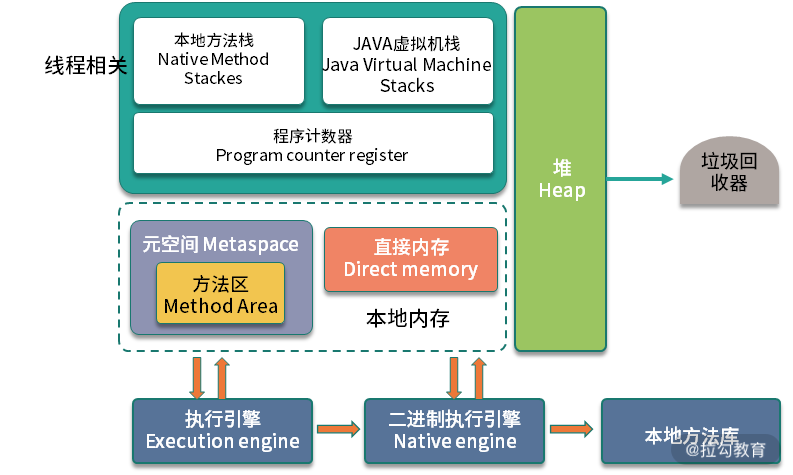
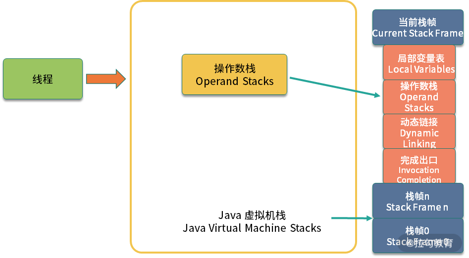
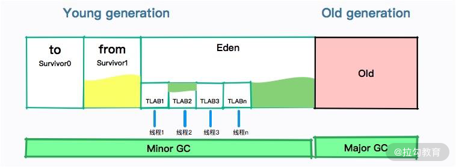
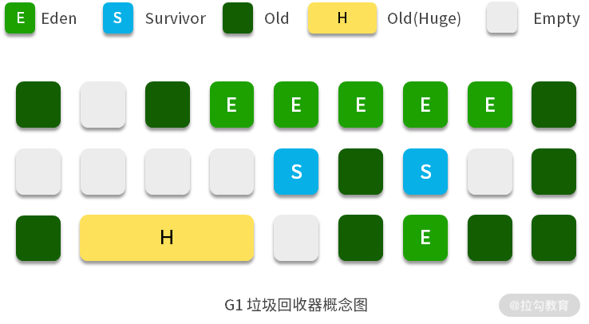

# 17 高级进阶：JVM 如何完成垃圾回收？

从本课时开始，我们将集中讲解一下 JVM（Java Virtual Machine）的基本知识点。Java 中的一些代码优化技巧，和JVM的关系非常的大，比如逃逸分析对非捕获型 Lambda 表达式的优化。

在进行这些优化之前，你需要对 JVM 的一些运行原理有较深刻的认识，在优化时才会有针对性的方向。

**另外，本课时的知识点，全部是面试的高频题目，这也从侧面看出 JVM 理论知识的重要性。**

### JVM 内存区域划分

学习 JVM，内存区域划分是绕不过去的知识点，这几乎是面试必考的题目。如下图所示，内存区域划分主要包括堆、Java 虚拟机栈、程序计数器、本地方法栈、元空间和直接内存这五部分，我将逐一介绍。



JVM 内存区域划分图

#### 1.堆

如 JVM 内存区域划分图所示，JVM 中占用内存最大的区域，就是堆（Heap），我们平常编码创建的对象，大多数是在这上面分配的，也是垃圾回收器回收的主要目标区域。

#### 2.Java 虚拟机栈

JVM 的解释过程是基于栈的，程序的执行过程也就是入栈出栈的过程，这也是 Java 虚拟机栈这个名称的由来。

Java 虚拟机栈是和线程相关的。当你启动一个新的线程，Java 就会为它分配一个虚拟机栈，之后所有这个线程的运行，都会在栈里进行。

Java 虚拟机栈，从方法入栈到具体的字节码执行，其实是一个双层的栈结构，也就是栈里面还包含栈。



Java 虚拟机栈图

如上图，Java 虚拟机栈里的每一个元素，叫作栈帧。每一个栈帧，包含四个区域： 局部变量表 、操作数栈、动态连接和返回地址。

其中，**操作数栈**就是具体的字节码指令所操作的栈区域，考虑到下面这段代码：

```
public void test(){

    int a = 1;

    a++;

}
```

JVM 将会为 test 方法生成一个栈帧，然后入栈，等 test 方法执行完毕，就会将对应的栈帧弹出。在对变量 a 进行加一操作的时候，就会对栈帧中的操作数栈运用相关的字节码指令。

#### 3.程序计数器

既然是线程，就要接受操作系统的调度，但总有时候，某些线程是获取不到 CPU 时间片的，那么当这个线程恢复执行的时候，它是如何确保找到切换之前执行的位置呢？这就是程序计数器的功能。

和 Java 虚拟机栈一样，它也是线程私有的。程序计数器只需要记录一个执行位置就可以，所以不需要太大的空间。事实上，程序计数器是 JVM 规范中唯一没有规定 OutOfMemoryError 情况的区域。

#### 4.本地方法栈

与 Java 虚拟机栈类似，本地方法栈，是针对 native 方法的。我们常用的 HotSpot，将 Java 虚拟机栈和本地方法栈合二为一，其实就是一个本地方法栈，大家注意规范里的这些差别就可以了。

#### 5.元空间

元空间是一个容易引起混淆的区域，原因就在于它经历了多次迭代才成为现在的模样。关于这部分区域，我们来讲解两个面试题，大家就明白了。

- **元空间是在堆上吗？**

答案：元空间并不是在堆上分配的，而是在堆外空间进行分配的，它的大小默认没有上限，我们常说的方法区，就在元空间中。

- **字符串常量池在那个区域中？**

答案：这个要看 JDK 版本。

在 JDK 1.8 之前，是没有元空间这个概念的，当时的方法区是放在一个叫作永久代的空间中。

而在 JDK 1.7 之前，字符串常量池也放在这个叫作永久带的空间中。但在 JDK 1.7 版本，已经将字符串常量池从永久带移动到了堆上。

所以，从 1.7 版本开始，字符串常量池就一直存在于堆上。

#### 6.直接内存

直接内存，指的是使用了 Java 的直接内存 API，进行操作的内存。这部分内存可以受到 JVM 的管控，比如 ByteBuffer 类所申请的内存，就可以使用具体的参数进行控制。

需要注意的是直接内存和本地内存不是一个概念。

- **直接内存**比较专一，有具体的 API（这里指的是ByteBuffer），也可以使用 -XX:MaxDirectMemorySize 参数控制它的大小；
- **本地内存**是一个统称，比如使用 native 函数操作的内存就是本地内存，本地内存的使用 JVM 是限制不住的，使用的时候一定要小心。

### GC Roots

对象主要是在堆上分配的，我们可以把它想象成一个池子，对象不停地创建，后台的垃圾回收进程不断地清理不再使用的对象。当内存回收的速度，赶不上对象创建的速度，这个对象池子就会产生溢出，也就是我们常说的 OOM。

把不再使用的对象及时地从堆空间清理出去，是避免 OOM 有效的方法。那 JVM 是如何判断哪些对象应该被清理，哪些对象需要被继续使用呢？

这里首先强调一个概念，这对理解垃圾回收的过程非常有帮助，面试时也能很好地展示自己。

**垃圾回收**，并不是找到不再使用的对象，然后将这些对象清除掉。它的过程正好相反，JVM 会找到正在使用的对象，对这些使用的对象进行标记和追溯，然后一股脑地把剩下的对象判定为垃圾，进行清理。

了解了这个概念，我们就可以看下一些基本的衍生分析：

- GC 的速度，和堆内**存活对象**的多少有关，与堆内所有对象的数量无关；
- GC 的速度与堆的大小无关，32GB 的堆和 4GB 的堆，只要存活对象是一样的，垃圾回收速度也会差不多；
- 垃圾回收不必每次都把垃圾清理得干干净净，最重要的是不要把正在使用的对象判定为垃圾。

**那么，如何找到这些存活对象，也就是哪些对象是正在被使用的，就成了问题的核心。**

大家可以想一下写代码的时候，如果想要保证一个 HashMap 能够被持续使用，可以把它声明成静态变量，这样就不会被垃圾回收器回收掉。**我们把这些正在使用的引用的入口，叫作GC Roots。**

这种使用 tracing 方式寻找存活对象的方法，还有一个好听的名字，叫作**可达性分析法**。

概括来讲，GC Roots 包括：

- Java 线程中，当前所有正在被调用的方法的引用类型参数、局部变量、临时值等。也就是与我们栈帧相关的各种引用；
- 所有当前被加载的 Java 类；
- Java 类的引用类型静态变量；
- 运行时常量池里的引用类型常量（String 或 Class 类型）；
- JVM 内部数据结构的一些引用，比如 sun.jvm.hotspot.memory.Universe 类；
- 用于同步的监控对象，比如调用了对象的 wait() 方法；
- JNI handles，包括 global handles 和 local handles。

对于这个知识点，不要死记硬背，可以对比着 JVM 内存区域划分那张图去看，入口大约有三个：线程、静态变量和 JNI 引用。

### 强、软、弱、虚引用

那么，通过 GC Roots 能够追溯到的对象，就一定不会被垃圾回收吗？这要看情况。

Java 对象与对象之间的引用，存在着四种不同的引用级别，强度从高到低依次是：强引用、软引用、弱引用、虚引用。

- **强应用** 默认的对象关系是强引用，也就是我们默认的对象创建方式。这种引用属于最普通最强硬的一种存在，只有在和 GC Roots 断绝关系时，才会被消灭掉。
- **软引用** 用于维护一些可有可无的对象。在内存足够的时候，软引用对象不会被回收；只有在内存不足时，系统则会回收软引用对象；如果回收了软引用对象之后，仍然没有足够的内存，才会抛出内存溢出异常。
- **弱引用** 级别就更低一些，当 JVM 进行垃圾回收时，无论内存是否充足，都会回收被弱引用关联的对象。软引用和弱引用在堆内缓存系统中使用非常频繁，可以在内存紧张时优先被回收掉。（我们在 **“07 | 案例分析：无处不在的缓存，高并发系统的法宝”** 就介绍过 Guava Cache 的这个特性。）
- **虚引用** 是一种形同虚设的引用，在现实场景中用得不是很多。这里有一个冷门的知识点：Java 9.0 以后新加入了 Cleaner 类，用来替代 Object 类的 finalizer 方法，这就是虚引用的一种应用场景。

### 分代垃圾回收

上面我们提到，垃圾回收的速度，是和存活的对象数量有关系的，如果这些对象太多，JVM 再做标记和追溯的时候，就会很慢。

一般情况下，JVM 在做这些事情的时候，都会停止业务线程的所有工作，进入 SafePoint 状态，这也就是我们通常说的 Stop the World。所以，现在的垃圾回收器，有一个主要目标，就是减少 STW 的时间。

其中一种有效的方式，就是采用**分代垃圾回收**，减少单次回收区域的大小。这是因为，大部分对象，可以分为两类：

- 大部分对象的生命周期都很短
- 其他对象则很可能会存活很长时间

这个假设我们称之为弱代假设（weak generational hypothesis）。

如下图，分代垃圾回收器会在逻辑上，把堆空间分为两部分：年轻代（Young generation）和老年代（Old generation）。



堆空间划分图：年轻代和老年代

#### 1.年轻代

年轻代中又分为一个伊甸园空间（Eden），两个幸存者空间（Survivor）。对象会首先在年轻代中的 Eden 区进行分配，当 Eden 区分配满的时候，就会触发年轻代的 GC。

此时，存活的对象会被移动到其中一个 Survivor 分区（以下简称 from）；年轻代再次发生垃圾回收，存活对象，包括 from 区中的存活对象，会被移动到 to 区。所以，from 和 to 两个区域，总有一个是空的。

Eden、from、to 的默认比例是 8:1:1，所以只会造成 10% 的空间浪费。这个比例，是由参数 -XX:SurvivorRatio 进行配置的（默认为 8）。

#### 2.老年代

对垃圾回收的优化，就是要让对象尽快在年轻代就回收掉，减少到老年代的对象。那么对象是如何进入老年代的呢？它主要有以下四种方式。

- **正常提升（Promotion）**

上面提到了年轻代的垃圾回收，如果对象能够熬过年轻代垃圾回收，它的年龄（age）就会加一，当对象的年龄达到一定阈值，就会被移动到老年代中。

- **分配担保**

如果年轻代的空间不足，又有新的对象需要分配空间，就需要依赖其他内存（这里是老年代）进行分配担保，对象将直接在老年代创建。

- **大对象直接在老年代分配**

超出某个阈值大小的对象，将直接在老年代分配，可以通过 -XX:PretenureSizeThreshold 配置这个阈值。

- **动态对象年龄判定**

有的垃圾回收算法，并不要求 age 必须达到 15 才能晋升到老年代，它会使用一些动态的计算方法。比如 G1，通过 TargetSurvivorRatio 这个参数，动态更改对象提升的阈值。

老年代的空间一般比较大，回收的时间更长，当老年代的空间被占满了，将发生老年代垃圾回收。

目前，被广泛使用的是 G1 垃圾回收器。G1 的目标是用来干掉 CMS 的，它同样有年轻代和老年代的概念。不过，G1 把整个堆切成了很多份，把每一份当作一个小目标，部分上目标很容易达成。



如上图，G1 也是有 Eden 区和 Survivor 区的概念的，只不过它们在内存上不是连续的，而是由一小份一小份组成的。G1 在进行垃圾回收的时候，将会根据最大停顿时间（MaxGCPauseMillis）设置的值，动态地选取部分小堆区进行垃圾回收。

G1 的配置非常简单，我们只需要配置三个参数，一般就可以获取优异的性能：

① MaxGCPauseMillis 设置最大停顿的预定目标，G1 垃圾回收器会自动调整，选取特定的小堆区；

② G1HeapRegionSize 设置小堆区的大小；

③ InitiatingHeapOccupancyPercent 当整个堆内存使用达到一定比例（默认是45%），并发标记阶段就会被启动。

### 小结

本课时，我们主要介绍了 JVM 的内存区域划分，**面试的时候，经常有同学把这个概念和 Java 的内存模型（JMM）搞混，这需要你特别注意。**

> JMM 指的是与多线程协作相关的主存与工作内存方面的内容，一定要和面试官确认好要问的问题。

这一课时我们主要介绍了堆、Java 虚拟机栈、程序计数器、本地方法栈、元空间、直接内存这六个概念。

接下来，我们看了 GC Roots 的概念，它是使用 tracing 方式的可达性分析法来实现的；在对象的引用关系上，还会有强、软、弱、虚的差别，而堆内缓存多是采用软引用或者弱引用。

最后我们看了**分代垃圾回收**的概念，了解了年轻代和老年代的一些回收策略。

JVM 的垃圾回收器更新很快，也有非常多的 JVM 版本，比如 Zing VM、Dalvik，目前被广泛应用的是 Hotspot，提供了海量的配置参数来支持我们的性能微调。

正如我刚刚所言，垃圾回收器的主要目标是保证回收效果的同时，提高吞吐量，减少 STW 的时间。

从 CMS 垃圾回收器，到 G1 垃圾回收器，再到现在支持 16TB 大小的 ZGC，垃圾回收器的演变越来越智能，配置参数也越来越少，能够达到开箱即用的效果。但无论使用哪种垃圾回收器，我们的编码方式还是会影响垃圾回收的效果，减少对象的创建，及时切断与不再使用对象的联系，是我们平常编码中一定要注意的。

**最后留一个思考题：我们常说的对象，除了基本数据类型，一定是在堆上分配的吗？欢迎你在留言区与大家分享探讨，我将一一点评解答。**