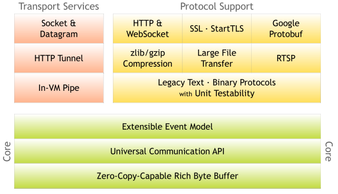
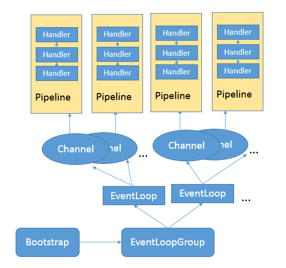

# 第38讲 对比Java标准NIO类库，你知道Netty是如何实现更高性能的吗？

今天我会对 NIO 进行一些补充，在[专栏第 11 讲](http://time.geekbang.org/column/article/8369)中，我们初步接触了 Java 提供的几种 IO 机制，作为语言基础类库，Java 自身的 NIO 设计更偏底层，这本无可厚非，但是对于一线的应用开发者，其复杂性、扩展性等方面，就存在一定的局限了。在基础 NIO 之上，Netty 构建了更加易用、高性能的网络框架，广泛应用于互联网、游戏、电信等各种领域。

今天我要问你的问题是，对比 Java 标准 NIO 类库，你知道 Netty 是如何实现更高性能的吗？

## 典型回答

单独从性能角度，Netty 在基础的 NIO 等类库之上进行了很多改进，例如：

- 更加优雅的 Reactor 模式实现、灵活的线程模型、利用 EventLoop 等创新性的机制，可以非常高效地管理成百上千的 Channel。
- 充分利用了 Java 的 Zero-Copy 机制，并且从多种角度，“斤斤计较”般的降低内存分配和回收的开销。例如，使用池化的 Direct Buffer 等技术，在提高 IO 性能的同时，减少了对象的创建和销毁；利用反射等技术直接操纵 SelectionKey，使用数组而不是 Java 容器等。
- 使用更多本地代码。例如，直接利用 JNI 调用 Open SSL 等方式，获得比 Java 内建 SSL 引擎更好的性能。
- 在通信协议、序列化等其他角度的优化。

总的来说，Netty 并没有 Java 核心类库那些强烈的通用性、跨平台等各种负担，针对性能等特定目标以及 Linux 等特定环境，采取了一些极致的优化手段。

## 考点分析

这是一个比较开放的问题，我给出的回答是个概要性的举例说明。面试官很可能利用这种开放问题作为引子，针对你回答的一个或者多个点，深入探讨你在不同层次上的理解程度。

在面试准备中，兼顾整体性的同时，不要忘记选定个别重点进行深入理解掌握，最好是进行源码层面的深入阅读和实验。如果你希望了解更多从性能角度 Netty 在编码层面的手段，可以参考 Norman 在 Devoxx 上的[分享](https://speakerdeck.com/normanmaurer/writing-highly-performant-network-frameworks-on-the-jvm-a-love-hate-relationship)，其中的很多技巧对于实现极致性能的 API 有一定借鉴意义，但在一般的业务开发中要谨慎采用。

虽然提到 Netty，人们会自然地想到高性能，但是 Netty 本身的优势不仅仅只有这一个方面，

下面我会侧重两个方面：

- 对 Netty 进行整体介绍，帮你了解其基本组成。
- 从一个简单的例子开始，对比在[第 11 讲](http://time.geekbang.org/column/article/8369)中基于 IO、NIO 等标准 API 的实例，分析它的技术要点，给你提供一个进一步深入学习的思路。

## 知识扩展

首先，我们从整体了解一下 Netty。按照官方定义，它是一个异步的、基于事件 Client/Server 的网络框架，目标是提供一种简单、快速构建网络应用的方式，同时保证高吞吐量、低延时、高可靠性。

从设计思路和目的上，Netty 与 Java 自身的 NIO 框架相比有哪些不同呢？

我们知道 Java 的标准类库，由于其基础性、通用性的定位，往往过于关注技术模型上的抽象，而不是从一线应用开发者的角度去思考。我曾提到过，引入并发包的一个重要原因就是，应用开发者使用 Thread API 比较痛苦，需要操心的不仅仅是业务逻辑，而且还要自己负责将其映射到 Thread 模型上。Java NIO 的设计也有类似的特点，开发者需要深入掌握线程、IO、网络等相关概念，学习路径很长，很容易导致代码复杂、晦涩，即使是有经验的工程师，也难以快速地写出高可靠性的实现。

Netty 的设计强调了 “**Separation Of Concerns**”，通过精巧设计的事件机制，将业务逻辑和无关技术逻辑进行隔离，并通过各种方便的抽象，一定程度上填补了了基础平台和业务开发之间的鸿沟，更有利于在应用开发中普及业界的最佳实践。

另外，**Netty > java.nio + java. net！**

从 API 能力范围来看，Netty 完全是 Java NIO 框架的一个大大的超集，你可以参考 Netty 官方的模块划分。

除了核心的事件机制等，Netty 还额外提供了很多功能，例如：

- 从网络协议的角度，Netty 除了支持传输层的 UDP、TCP、[SCTP](https://en.wikipedia.org/wiki/Stream_Control_Transmission_Protocol)协议，也支持 HTTP(s)、WebSocket 等多种应用层协议，它并不是单一协议的 API。
- 在应用中，需要将数据从 Java 对象转换成为各种应用协议的数据格式，或者进行反向的转换，Netty 为此提供了一系列扩展的编解码框架，与应用开发场景无缝衔接，并且性能良好。
- 它扩展了 Java NIO Buffer，提供了自己的 ByteBuf 实现，并且深度支持 Direct Buffer 等技术，甚至 hack 了 Java 内部对 Direct Buffer 的分配和销毁等。同时，Netty 也提供了更加完善的 Scatter/Gather 机制实现。

可以看到，Netty 的能力范围大大超过了 Java 核心类库中的 NIO 等 API，可以说它是一个从应用视角出发的产物。

当然，对于基础 API 设计，Netty 也有自己独到的见解，未来 Java NIO API 也可能据此进行一定的改进，如果你有兴趣可以参考[JDK-8187540](https://bugs.openjdk.java.net/browse/JDK-8187540)。

接下来，我们一起来看一个入门的代码实例，看看 Netty 应用到底是什么样子。

与[第 11 讲](http://time.geekbang.org/column/article/8369)类似，同样是以简化的 Echo Server 为例，下图是 Netty 官方提供的 Server 部分，完整用例请点击[链接](http://netty.io/4.1/xref/io/netty/example/echo/package-summary.html)。

上面的例子，虽然代码很短，但已经足够体现出 Netty 的几个核心概念，请注意我用红框标记出的部分：

- [ServerBootstrap](https://github.com/netty/netty/blob/2c13f71c733c5778cd359c9148f50e63d1878f7f/transport/src/main/java/io/netty/bootstrap/ServerBootstrap.java)，服务器端程序的入口，这是 Netty 为简化网络程序配置和关闭等生命周期管理，所引入的 Bootstrapping 机制。我们通常要做的创建 Channel、绑定端口、注册 Handler 等，都可以通过这个统一的入口，以**Fluent** API 等形式完成，相对简化了 API 使用。与之相对应， [Bootstrap](https://github.com/netty/netty/blob/2c13f71c733c5778cd359c9148f50e63d1878f7f/transport/src/main/java/io/netty/bootstrap/Bootstrap.java)则是 Client 端的通常入口。
- [Channel](https://github.com/netty/netty/blob/2c13f71c733c5778cd359c9148f50e63d1878f7f/transport/src/main/java/io/netty/channel/Channel.java)，作为一个基于 NIO 的扩展框架，Channel 和 Selector 等概念仍然是 Netty 的基础组件，但是针对应用开发具体需求，提供了相对易用的抽象。
- [EventLoop](https://github.com/netty/netty/blob/2c13f71c733c5778cd359c9148f50e63d1878f7f/transport/src/main/java/io/netty/channel/EventLoop.java)，这是 Netty 处理事件的核心机制。例子中使用了 EventLoopGroup。我们在 NIO 中通常要做的几件事情，如注册感兴趣的事件、调度相应的 Handler 等，都是 EventLoop 负责。
- [ChannelFuture](https://github.com/netty/netty/blob/2c13f71c733c5778cd359c9148f50e63d1878f7f/transport/src/main/java/io/netty/channel/ChannelFuture.java)，这是 Netty 实现异步 IO 的基础之一，保证了同一个 Channel 操作的调用顺序。Netty 扩展了 Java 标准的 Future，提供了针对自己场景的特有[Future](https://github.com/netty/netty/blob/eb7f751ba519cbcab47d640cd18757f09d077b55/common/src/main/java/io/netty/util/concurrent/Future.java)定义。
- ChannelHandler，这是应用开发者**放置业务逻辑的主要地方**，也是我上面提到的“Separation Of Concerns”原则的体现。
- [ChannelPipeline](https://github.com/netty/netty/blob/2c13f71c733c5778cd359c9148f50e63d1878f7f/transport/src/main/java/io/netty/channel/ChannelPipeline.java)，它是 ChannelHandler 链条的容器，每个 Channel 在创建后，自动被分配一个 ChannelPipeline。在上面的示例中，我们通过 ServerBootstrap 注册了 ChannelInitializer，并且实现了 initChannel 方法，而在该方法中则承担了向 ChannelPipleline 安装其他 Handler 的任务。

你可以参考下面的简化示意图，忽略 Inbound/OutBound Handler 的细节，理解这几个基本单元之间的操作流程和对应关系。

对比 Java 标准 NIO 的代码，Netty 提供的相对高层次的封装，减少了对 Selector 等细节的操纵，而 EventLoop、Pipeline 等机制则简化了编程模型，开发者不用担心并发等问题，在一定程度上简化了应用代码的开发。最难能可贵的是，这一切并没有以可靠性、可扩展性为代价，反而将其大幅度提高。

我在[专栏周末福利](http://time.geekbang.org/column/article/12188)中已经推荐了 Norman Maurer 等编写的《Netty 实战》（Netty In Action），如果你想系统学习 Netty，它会是个很好的入门参考。针对 Netty 的一些实现原理，很可能成为面试中的考点，例如：

- Reactor 模式和 Netty 线程模型。
- Pipelining、EventLoop 等部分的设计实现细节。
- Netty 的内存管理机制、[引用计数](http://netty.io/wiki/reference-counted-objects.html)等特别手段。
- 有的时候面试官也喜欢对比 Java 标准 NIO API，例如，你是否知道 Java NIO 早期版本中的 Epoll[空转问题](http://www.10tiao.com/html/308/201602/401718035/1.html)，以及 Netty 的解决方式等。

对于这些知识点，公开的深入解读已经有很多了，在学习时希望你不要一开始就被复杂的细节弄晕，可以结合实例，逐步、有针对性的进行学习。我的一个建议是，可以试着画出相应的示意图，非常有助于理解并能清晰阐述自己的看法。

今天，从 Netty 性能的问题开始，我概要地介绍了 Netty 框架，并且以 Echo Server 为例，对比了 Netty 和 Java NIO 在设计上的不同。但这些都仅仅是冰山的一角，全面掌握还需要下非常多的功夫。

## 一课一练

关于今天我们讨论的题目你做到心中有数了吗？今天的思考题是，Netty 的线程模型是什么样的？