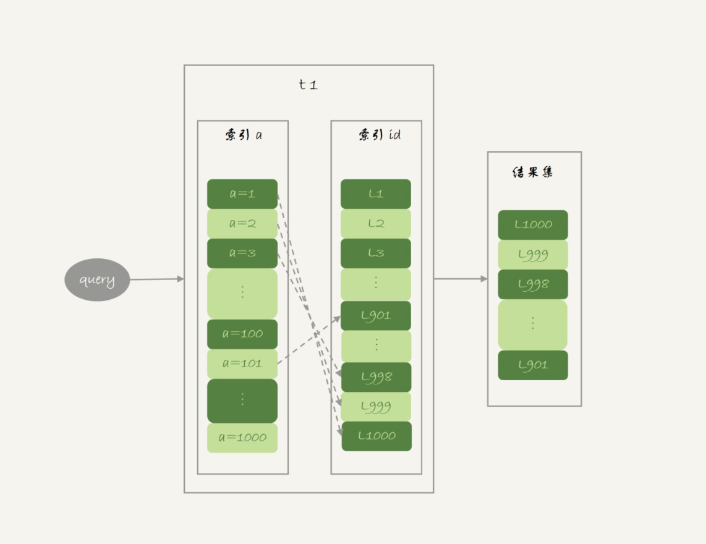
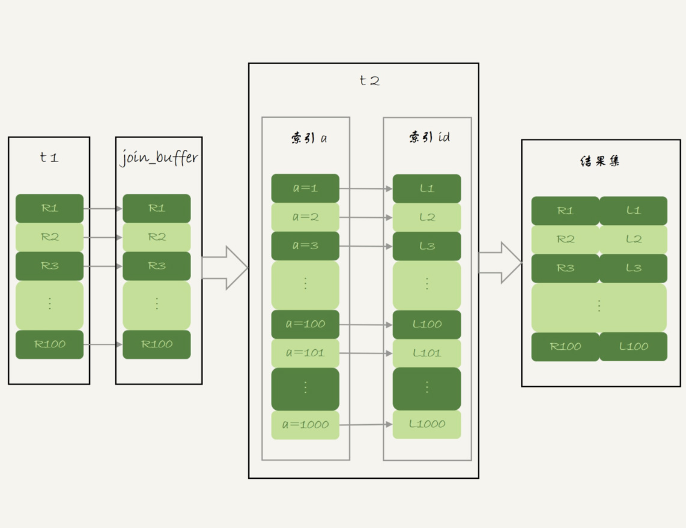

# 35 join语句怎么优化？

在上一篇文章中，我和你介绍了 join 语句的两种算法，分别是 Index Nested-Loop Join(NLJ) 和 Block Nested-Loop Join(BNL)。

我们发现在使用 NLJ 算法的时候，其实效果还是不错的，比通过应用层拆分成多个语句然后再拼接查询结果更方便，而且性能也不会差。

但是，BNL 算法在大表 join 的时候性能就差多了，比较次数等于两个表参与 join 的行数的乘积，很消耗 CPU 资源。

当然了，这两个算法都还有继续优化的空间，我们今天就来聊聊这个话题。

为了便于分析，我还是创建两个表 t1、t2 来和你展开今天的问题。

```
create table t1(id int primary key, a int, b int, index(a));
create table t2 like t1;
drop procedure idata;
delimiter ;;
create procedure idata()
begin
  declare i int;
  set i=1;
  while(i<=1000)do
    insert into t1 values(i, 1001-i, i);
    set i=i+1;
  end while;
  
  set i=1;
  while(i<=1000000)do
    insert into t2 values(i, i, i);
    set i=i+1;
  end while; 
end;;
delimiter ;
call idata();
```

为了便于后面量化说明，我在表 t1 里，插入了 1000 行数据，每一行的 a=1001-id 的值。也就是说，表 t1 中字段 a 是逆序的。同时，我在表 t2 中插入了 100 万行数据。

## Multi-Range Read 优化

在介绍 join 语句的优化方案之前，我需要先和你介绍一个知识点，即：Multi-Range Read 优化 (MRR)。这个优化的主要目的是尽量使用顺序读盘。

在[第 4 篇文章]中，我和你介绍 InnoDB 的索引结构时，提到了“回表”的概念。我们先来回顾一下这个概念。回表是指，InnoDB 在普通索引 a 上查到主键 id 的值后，再根据一个个主键 id 的值到主键索引上去查整行数据的过程。

然后，有同学在留言区问到，回表过程是一行行地查数据，还是批量地查数据？

我们先来看看这个问题。假设，我执行这个语句：

```
select * from t1 where a>=1 and a<=100;
```

主键索引是一棵 B+ 树，在这棵树上，每次只能根据一个主键 id 查到一行数据。因此，回表肯定是一行行搜索主键索引的，基本流程如图 1 所示。



图 1 基本回表流程

如果随着 a 的值递增顺序查询的话，id 的值就变成随机的，那么就会出现随机访问，性能相对较差。虽然“按行查”这个机制不能改，但是调整查询的顺序，还是能够加速的。

**因为大多数的数据都是按照主键递增顺序插入得到的，所以我们可以认为，如果按照主键的递增顺序查询的话，对磁盘的读比较接近顺序读，能够提升读性能。**

这，就是 MRR 优化的设计思路。此时，语句的执行流程变成了这样：

1. 根据索引 a，定位到满足条件的记录，将 id 值放入 read_rnd_buffer 中 ;
2. 将 read_rnd_buffer 中的 id 进行递增排序；
3. 排序后的 id 数组，依次到主键 id 索引中查记录，并作为结果返回。

这里，read_rnd_buffer 的大小是由 read_rnd_buffer_size 参数控制的。如果步骤 1 中，read_rnd_buffer 放满了，就会先执行完步骤 2 和 3，然后清空 read_rnd_buffer。之后继续找索引 a 的下个记录，并继续循环。

另外需要说明的是，如果你想要稳定地使用 MRR 优化的话，需要设置`set optimizer_switch="mrr_cost_based=off"`。（官方文档的说法，是现在的优化器策略，判断消耗的时候，会更倾向于不使用 MRR，把 mrr_cost_based 设置为 off，就是固定使用 MRR 了。）

下面两幅图就是使用了 MRR 优化后的执行流程和 explain 结果。


图 2 MRR 执行流程


图 3 MRR 执行流程的 explain 结果

从图 3 的 explain 结果中，我们可以看到 Extra 字段多了 Using MRR，表示的是用上了 MRR 优化。而且，由于我们在 read_rnd_buffer 中按照 id 做了排序，所以最后得到的结果集也是按照主键 id 递增顺序的，也就是与图 1 结果集中行的顺序相反。

到这里，我们小结一下。

**MRR 能够提升性能的核心**在于，这条查询语句在索引 a 上做的是一个范围查询（也就是说，这是一个多值查询），可以得到足够多的主键 id。这样通过排序以后，再去主键索引查数据，才能体现出“顺序性”的优势。

## Batched Key Access

理解了 MRR 性能提升的原理，我们就能理解 MySQL 在 5.6 版本后开始引入的 Batched Key Acess(BKA) 算法了。这个 BKA 算法，其实就是对 NLJ 算法的优化。

我们再来看看上一篇文章中用到的 NLJ 算法的流程图：


图 4 Index Nested-Loop Join 流程图

NLJ 算法执行的逻辑是：从驱动表 t1，一行行地取出 a 的值，再到被驱动表 t2 去做 join。也就是说，对于表 t2 来说，每次都是匹配一个值。这时，MRR 的优势就用不上了。

那怎么才能一次性地多传些值给表 t2 呢？方法就是，从表 t1 里一次性地多拿些行出来，一起传给表 t2。

既然如此，我们就把表 t1 的数据取出来一部分，先放到一个临时内存。这个临时内存不是别人，就是 join_buffer。

通过上一篇文章，我们知道 join_buffer 在 BNL 算法里的作用，是暂存驱动表的数据。但是在 NLJ 算法里并没有用。那么，我们刚好就可以复用 join_buffer 到 BKA 算法中。

如图 5 所示，是上面的 NLJ 算法优化后的 BKA 算法的流程。



图 5 Batched Key Acess 流程

图中，我在 join_buffer 中放入的数据是 P1~P100，表示的是只会取查询需要的字段。当然，如果 join buffer 放不下 P1~P100 的所有数据，就会把这 100 行数据分成多段执行上图的流程。

那么，这个 BKA 算法到底要怎么启用呢？

如果要使用 BKA 优化算法的话，你需要在执行 SQL 语句之前，先设置

```
set optimizer_switch='mrr=on,mrr_cost_based=off,batched_key_access=on';
```

其中，前两个参数的作用是要启用 MRR。这么做的原因是，BKA 算法的优化要依赖于 MRR。

## BNL 算法的性能问题

说完了 NLJ 算法的优化，我们再来看 BNL 算法的优化。

我在上一篇文章末尾，给你留下的思考题是，使用 Block Nested-Loop Join(BNL) 算法时，可能会对被驱动表做多次扫描。如果这个被驱动表是一个大的冷数据表，除了会导致 IO 压力大以外，还会对系统有什么影响呢？

在[第 33 篇文章]中，我们说到 InnoDB 的 LRU 算法的时候提到，由于 InnoDB 对 Bufffer Pool 的 LRU 算法做了优化，即：第一次从磁盘读入内存的数据页，会先放在 old 区域。如果 1 秒之后这个数据页不再被访问了，就不会被移动到 LRU 链表头部，这样对 Buffer Pool 的命中率影响就不大。

但是，如果一个使用 BNL 算法的 join 语句，多次扫描一个冷表，而且这个语句执行时间超过 1 秒，就会在再次扫描冷表的时候，把冷表的数据页移到 LRU 链表头部。

这种情况对应的，是冷表的数据量小于整个 Buffer Pool 的 3/8，能够完全放入 old 区域的情况。

如果这个冷表很大，就会出现另外一种情况：业务正常访问的数据页，没有机会进入 young 区域。

由于优化机制的存在，一个正常访问的数据页，要进入 young 区域，需要隔 1 秒后再次被访问到。但是，由于我们的 join 语句在循环读磁盘和淘汰内存页，进入 old 区域的数据页，很可能在 1 秒之内就被淘汰了。这样，就会导致这个 MySQL 实例的 Buffer Pool 在这段时间内，young 区域的数据页没有被合理地淘汰。

也就是说，这两种情况都会影响 Buffer Pool 的正常运作。

**大表 join 操作虽然对 IO 有影响，但是在语句执行结束后，对 IO 的影响也就结束了。但是，对 Buffer Pool 的影响就是持续性的，需要依靠后续的查询请求慢慢恢复内存命中率。**

为了减少这种影响，你可以考虑增大 join_buffer_size 的值，减少对被驱动表的扫描次数。

也就是说，BNL 算法对系统的影响主要包括三个方面：

1. 可能会多次扫描被驱动表，占用磁盘 IO 资源；
2. 判断 join 条件需要执行 M*N 次对比（M、N 分别是两张表的行数），如果是大表就会占用非常多的 CPU 资源；
3. 可能会导致 Buffer Pool 的热数据被淘汰，影响内存命中率。

我们执行语句之前，需要通过理论分析和查看 explain 结果的方式，确认是否要使用 BNL 算法。如果确认优化器会使用 BNL 算法，就需要做优化。优化的常见做法是，给被驱动表的 join 字段加上索引，把 BNL 算法转成 BKA 算法。

接下来，我们就具体看看，这个优化怎么做？

## BNL 转 BKA

一些情况下，我们可以直接在被驱动表上建索引，这时就可以直接转成 BKA 算法了。

但是，有时候你确实会碰到一些不适合在被驱动表上建索引的情况。比如下面这个语句：

```
select * from t1 join t2 on (t1.b=t2.b) where t2.b>=1 and t2.b<=2000;
```

我们在文章开始的时候，在表 t2 中插入了 100 万行数据，但是经过 where 条件过滤后，需要参与 join 的只有 2000 行数据。如果这条语句同时是一个低频的 SQL 语句，那么再为这个语句在表 t2 的字段 b 上创建一个索引就很浪费了。

但是，如果使用 BNL 算法来 join 的话，这个语句的执行流程是这样的：

1. 把表 t1 的所有字段取出来，存入 join_buffer 中。这个表只有 1000 行，join_buffer_size 默认值是 256k，可以完全存入。
2. 扫描表 t2，取出每一行数据跟 join_buffer 中的数据进行对比，
   - 如果不满足 t1.b=t2.b，则跳过；
   - 如果满足 t1.b=t2.b, 再判断其他条件，也就是是否满足 t2.b 处于 [1,2000] 的条件，如果是，就作为结果集的一部分返回，否则跳过。

我在上一篇文章中说过，对于表 t2 的每一行，判断 join 是否满足的时候，都需要遍历 join_buffer 中的所有行。因此判断等值条件的次数是 1000*100 万 =10 亿次，这个判断的工作量很大。


图 6 explain 结果


图 7 语句执行时间

可以看到，explain 结果里 Extra 字段显示使用了 BNL 算法。在我的测试环境里，这条语句需要执行 1 分 11 秒。

在表 t2 的字段 b 上创建索引会浪费资源，但是不创建索引的话这个语句的等值条件要判断 10 亿次，想想也是浪费。那么，有没有两全其美的办法呢？

这时候，我们可以考虑使用临时表。使用临时表的大致思路是：

1. 把表 t2 中满足条件的数据放在临时表 tmp_t 中；
2. 为了让 join 使用 BKA 算法，给临时表 tmp_t 的字段 b 加上索引；
3. 让表 t1 和 tmp_t 做 join 操作。

此时，对应的 SQL 语句的写法如下：

```
create temporary table temp_t(id int primary key, a int, b int, index(b))engine=innodb;
insert into temp_t select * from t2 where b>=1 and b<=2000;
select * from t1 join temp_t on (t1.b=temp_t.b);
```

图 8 就是这个语句序列的执行效果。


图 8 使用临时表的执行效果

可以看到，整个过程 3 个语句执行时间的总和还不到 1 秒，相比于前面的 1 分 11 秒，性能得到了大幅提升。接下来，我们一起看一下这个过程的消耗：

1. 执行 insert 语句构造 temp_t 表并插入数据的过程中，对表 t2 做了全表扫描，这里扫描行数是 100 万。
2. 之后的 join 语句，扫描表 t1，这里的扫描行数是 1000；join 比较过程中，做了 1000 次带索引的查询。相比于优化前的 join 语句需要做 10 亿次条件判断来说，这个优化效果还是很明显的。

总体来看，不论是在原表上加索引，还是用有索引的临时表，我们的思路都是让 join 语句能够用上被驱动表上的索引，来触发 BKA 算法，提升查询性能。

## 扩展 -hash join

看到这里你可能发现了，其实上面计算 10 亿次那个操作，看上去有点儿傻。如果 join_buffer 里面维护的不是一个无序数组，而是一个哈希表的话，那么就不是 10 亿次判断，而是 100 万次 hash 查找。这样的话，整条语句的执行速度就快多了吧？

确实如此。

这，也正是 MySQL 的优化器和执行器一直被诟病的一个原因：不支持哈希 join。并且，MySQL 官方的 roadmap，也是迟迟没有把这个优化排上议程。

实际上，这个优化思路，我们可以自己实现在业务端。实现流程大致如下：

1. `select * from t1;`取得表 t1 的全部 1000 行数据，在业务端存入一个 hash 结构，比如 C++ 里的 set、PHP 的 dict 这样的数据结构。
2. `select * from t2 where b>=1 and b<=2000;` 获取表 t2 中满足条件的 2000 行数据。
3. 把这 2000 行数据，一行一行地取到业务端，到 hash 结构的数据表中寻找匹配的数据。满足匹配的条件的这行数据，就作为结果集的一行。

理论上，这个过程会比临时表方案的执行速度还要快一些。如果你感兴趣的话，可以自己验证一下。

## 小结

今天，我和你分享了 Index Nested-Loop Join（NLJ）和 Block Nested-Loop Join（BNL）的优化方法。

在这些优化方法中：

1. BKA 优化是 MySQL 已经内置支持的，建议你默认使用；
2. BNL 算法效率低，建议你都尽量转成 BKA 算法。优化的方向就是给被驱动表的关联字段加上索引；
3. 基于临时表的改进方案，对于能够提前过滤出小数据的 join 语句来说，效果还是很好的；
4. MySQL 目前的版本还不支持 hash join，但你可以配合应用端自己模拟出来，理论上效果要好于临时表的方案。

最后，我给你留下一道思考题吧。

我们在讲 join 语句的这两篇文章中，都只涉及到了两个表的 join。那么，现在有一个三个表 join 的需求，假设这三个表的表结构如下：

```
CREATE TABLE `t1` (
 `id` int(11) NOT NULL,
 `a` int(11) DEFAULT NULL,
 `b` int(11) DEFAULT NULL,
 `c` int(11) DEFAULT NULL,
  PRIMARY KEY (`id`)
) ENGINE=InnoDB; 
create table t2 like t1;
create table t3 like t2;
insert into ... // 初始化三张表的数据
```

语句的需求实现如下的 join 逻辑：

```
select * from t1 join t2 on(t1.a=t2.a) join t3 on (t2.b=t3.b) where t1.c>=X and t2.c>=Y and t3.c>=Z;
```

现在为了得到最快的执行速度，如果让你来设计表 t1、t2、t3 上的索引，来支持这个 join 语句，你会加哪些索引呢？

同时，如果我希望你用 straight_join 来重写这个语句，配合你创建的索引，你就需要安排连接顺序，你主要考虑的因素是什么呢？

你可以把你的方案和分析写在留言区，我会在下一篇文章的末尾和你讨论这个问题。感谢你的收听，也欢迎你把这篇文章分享给更多的朋友一起阅读。

## 上期问题时间

我在上篇文章最后留给你的问题，已经在本篇文章中解答了。

这里我再根据评论区留言的情况，简单总结下。根据数据量的大小，有这么两种情况：

- @长杰 和 @老杨同志 提到了数据量小于 old 区域内存的情况；
- @Zzz 同学，很认真地看了其他同学的评论，并且提了一个很深的问题。对被驱动表数据量大于 Buffer Pool 的场景，做了很细致的推演和分析。

给这些同学点赞，非常好的思考和讨论。