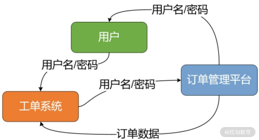
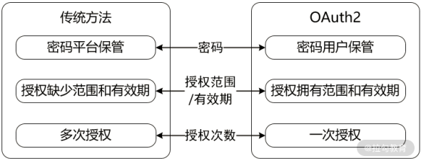
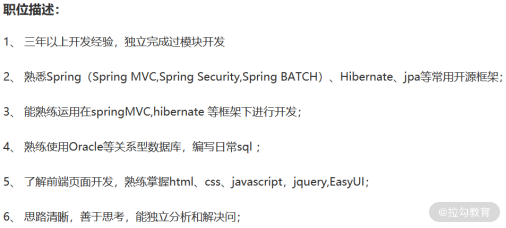

# 00 开篇词 Spring Security，为你的应用安全与职业之路保驾护航

你好，我是鉴湘，拉勾教育专栏《Spring Cloud 原理与实战》《Spring Boot 实战开发》《Spring 响应式编程实战》《ShardingSphere 核心原理精讲》的作者。

我拥有 10 年以上大型 Java EE 和分布式系统构建及优化经验，曾带领 100+ 人团队完成了基于 Spring 家族技术体系的亿级用户应用系统建设，对基于 Spring 框架进行系统开发和维护有着丰富的实践经验。

在从业生涯中，我带过不少项目，无论是传统的电商类系统，或者是互联网相关的智能终端平台，都需要考虑安全性问题。**任何一个安全漏洞，都可能给一个产品乃至整个公司带来无法挽回的损失**。

因此，作为系统的设计者和实现者，如何时刻确保系统具备高度的安全性，成了一个非常重要的问题。

说到安全性，你可能会想到加解密算法、HTTPS 协议等常见的技术体系，**但系统安全是一个综合性的主题，并非简单采用一些技术体系就能构建有效的解决方案**。

我们以一个分布式环境下的应用场景为例。假设你要开发一个工单系统，而生成工单所依赖的用户订单信息维护在第三方订单系统中。为了生成工单，就必须让工单系统读取订单系统中的用户订单信息。

那么问题来了，工单系统如何获得用户的授权呢？一般我们想到的方法是用户将自己在订单管理平台上用户名和密码告诉工单系统，然后工单系统通过用户名和密码登录到订单管理平台并读取用户的订单记录，整个过程如下图所示：

订单系统用户认证和授权交互示意图

上述方案看起来没有什么问题，但如果你仔细分析一下，就会发现这个流程在安全性上存在一些漏洞。

比如，一旦用户修改了订单管理平台的密码，工单系统就无法正常访问了。为此，我们**需要引入诸如 OAuth2 协议完成分布式环境下的认证和授权**。

我们通过一张图简单对比一下 OAuth2 协议与传统实现方案：

OAuth2 协议与传统实现方案的对比图

但是想要实现 OAuth2 协议并没有那么简单。OAuth2 协议涉及的技术体系非常复杂，需要综合考虑用户认证、密码加解密和存储、Token 生成和校验、分布式 Session 和公私钥管理，以及完成各个客户端的权限管理。这时就**需要引入专门的安全性开发框架**，而**Spring Security 就是这样一款开发框架**。

Spring Security 专门提供了 UAA（User Account and Authentication，用户账户和认证）服务，封装了 OAuth2 协议，用于管理用户账户、OAuth2 客户端以及用于鉴权的 Token。而 UAA 也只是 Spring Security 众多核心功能中的一部分。

### 你为什么需要学习这门课程？

Spring Security 是 Spring 家族中一款历史比较悠久的开发框架，针对 Web 应用程序提供了一系列强大的安全性功能体系。

事实上，对于 Web 应用程序而言，除了分布式环境下的认证和授权漏洞之外，常见的安全性问题还包括跨站点脚本攻击、跨站点请求伪造、敏感数据暴露、缺乏方法级访问控制等。针对这些安全性问题，我们需要全面设计并实现对应的安全性功能，而 Spring Security 已经为开发人员提供了相应的解决方案，包括：

- 用户信息管理；
- 敏感信息加解密；
- 用户认证；
- 权限控制；
- 跨站点请求伪造保护；
- 跨域支持；
- 全局安全方法；
- 单点登录；
- ……

同时，**在普遍倡导用户隐私和数据价值的当下，掌握各种安全性相关技术的开发人员和架构师也成了稀缺人才，越发受到行业的认可和重视**。

（职位信息来源：拉勾网）

对于开发人员而言，如何**使用各种技术体系解决安全性问题**是一大困惑。经验丰富的开发人员需要熟练使用 Spring Security 框架来应对业务发展的需求。例如，全面掌握 Spring Security 框架提供的认证、授权、方法级安全访问、OAuth2、JWT 等核心功能，构建自己对系统安全性设计的知识体系和解决方案。

而对于架构师而言，难点在于如何**基于框架提供的功能并结合具体的业务场景，对框架进行扩展和定制化开发**。这就需要他们对 Spring Security 中的用户认证和访问授权等核心功能的设计原理有充分的了解，能够从源码级别剖析框架的底层实现机制，进而满足更深层次的需求。

随着各种安全性问题的不断发生，可以说，**安全性技术是构建个人技术体系不可缺少的一个环节，对于提升你的职业门槛也是一个重要的加分项**。

### 这门课程是如何设计的？

任何技术体系的学习，都是一个边踩坑边前进的过程。我在从业生涯中，总结了一些使用 Spring Security 框架解决安全性问题时常见的、不可避免的痛点，大致可以分为以下几种。

- **看上去简单，实则复杂**：Spring Security 的一大特点是内置了很多基础功能，用起来很容易，让你觉得开发起来好像很快很简单，但实际上这些内置功能大多采用了默认实现机制，例如用户登录和登出、密码加解密等。它**将系统开发的复杂度隐藏得很深**，如果你不了解框架的核心内容，也就无法理解这些默认实现机制。因此，一旦在开发过程中出现问题，你会觉得一头雾水，定位问题和解决问题的难度也会加大。
- **扩展性强大，但不易掌握**：Spring Security 中提供的默认实现机制不一定能满足不同业务场景的需求，这就需要我们**通过框架开发扩展功能**。Spring Security 提供了面向认证、授权的开放式接口，也提供了过滤器等一系列扩展性功能。这些功能都很强大，但在使用过程中你会发现只有充分理解这些功能背后的设计原理，才能合理利用它们。盲目使用这些扩展性功能只会导致系统不稳定。
- **技术体系和组件众多**：Spring Security 提供了一大批功能组件，这些功能组件构成了庞大的技术体系。你会发现，好不容易学会了一个组件，**碰到新的组件还是需要重新学习**，导致学习效率很低，并且容易出错。同时，Spring Security 中的很多功能都是集成了市面上的一些开源组件和方案，如果你不了解这些组件和方案，在使用过程中很可能出现一些莫名其妙的问题，影响开发节奏。

基于以上问题，我根据自己多年的架构经验，以及对安全性、Spring Security 框架的理解和实践，总结了**一套由浅入深的学习路径，不仅可以带你掌握 Spring Security 框架的全局，还从实战角度出发，帮助你高效掌握基于 Spring Security 框架的系统安全性设计方法和开发技巧**。

本专栏分为以下四大模块，能够帮助你解决前面提到的开发上的痛点。

- **模块一：基础功能篇**。这部分我将介绍 Spring Security 的一些基础性功能，包括**认证、授权和加密**。这些功能是 Spring Security 框架的入口，可以说使用这个框架就离不开这些功能，而框架的其他功能也都依赖于这些基础特性，所以我不仅会介绍它们的使用方法，还将对原理进行展开。通过这一模块的学习，你可以在日常开发过程中完成对用户身份的认证、访问的授权以及集成加密机制，从而**为 Web 应用程序添加基础的安全性功能**。
- **模块二：高级主题篇**。这部分功能面向特定需求，用于**构建比较复杂的应用场景**，包括过滤器、跨站点请求伪造保护、跨域资源共享，以及针对非 Web 应用程序的全局方法安全机制。通过这一模块的学习，一方面，针对 Web 应用程序，你可以使用过滤器来定制化各种安全性策略，并集成跨站请求伪造保护和跨域访问等功能。另一方面，针对非 Web 类应用程序，你也可以使用 Spring Security 来完成方法级别的安全控制。
- **模块三：OAuth2 与微服务篇**。这部分内容关注微服务开发框架**Spring Cloud 与 Spring Security 之间的整合**，我们将对 OAuth2 协议和 JWT 全面展开讲解，并使用这些技术体系构建安全的微服务系统，以及单点登录系统。微服务是目前系统开发的主流技术体系，而微服务的安全性也是日常开发的一个重要主题。通过这一模块的学习，你可以掌握如何**为目前主流的微服务架构添加安全性**，并使用 OAuth2 协议和 JWT 实现对服务级别的授权访问。
- **模块四：框架扩展篇**。这部分内容是对 Spring Security 框架在应用上的一些扩展，包括在 Spring Security 中**引入全新的响应式编程技术**，以及如何对应用程序安全性进行测试的系统方法。通过这一模块的学习，你将掌握对 Spring Security 框架所提供的各项功能进行测试的系统方法。同时，随着 Spring 5 的发布也涌现出了响应式编程这种新型技术体系，新版本的 Spring Security 中也提供了对响应式编程的全面支持，本专栏对响应式 Spring Security 也做了系统介绍。

从学习的角度来讲，Spring Security 中的一些功能看上去比较简单，但用起来并非容易全面掌握，经常会因为某一些细小的配置导致整个功能无法使用，能发现问题但不容易找到原因。因此，**虽然 Spring Security 让你只花 20% 的时间就可以解决 80% 的问题，但是剩下 20% 的问题需要我们通过系统性的学习去弄懂**，而学习 Spring Security 是有一定的方法和套路的。这就需要有系统化的讲解过程，也是本专栏价值所在。

此外，各个 Spring Security 核心组件以及使用方式，我都会按照完整的案例分析给出详细的代码实现方案，方便你进行学习和改造。课程配套代码，你可以在[https://github.com/lagouEdAnna/SpringSecurity-jianxiang](https://github.com/lagouEdAnna/SpringSecurity-jianxiang?fileGuid=xxQTRXtVcqtHK6j8)进行下载。

### 讲师寄语

在现代互联网应用系统开发的过程中，安全性越来越受到重视。如何确保系统没有安全性漏洞是一大挑战，我们需要引入对应的技术体系和开发框架，以满足不断增长的安全性需求。面对这种困境，引入 Spring 家族生态中的重要组成部分——Spring Security 开源框架，可以称得上是一个绝佳选择。