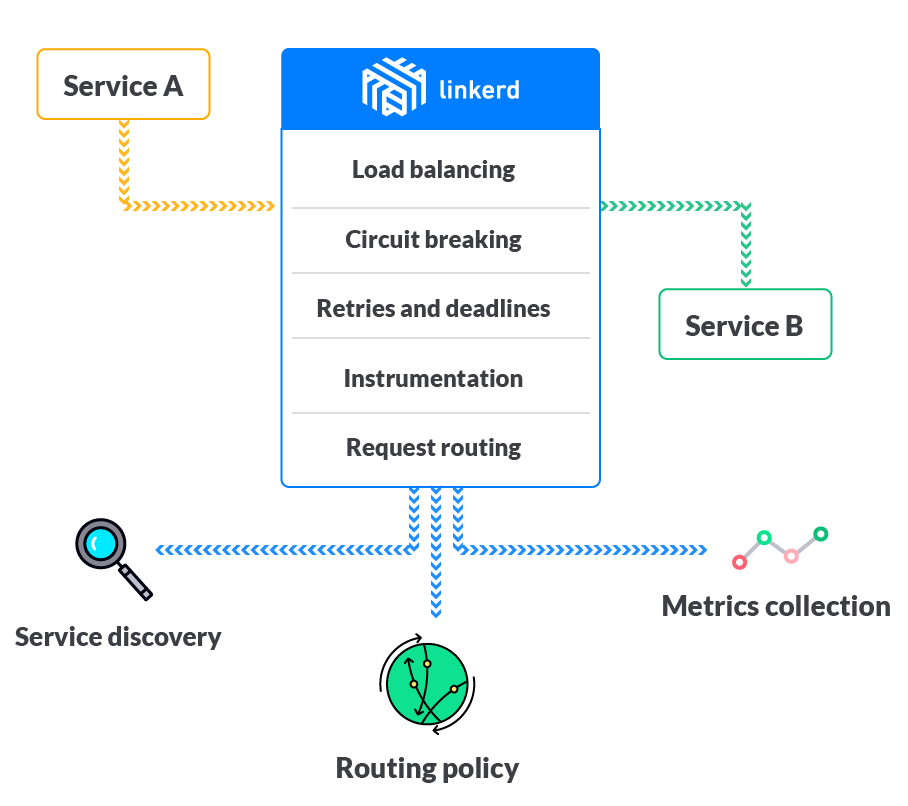
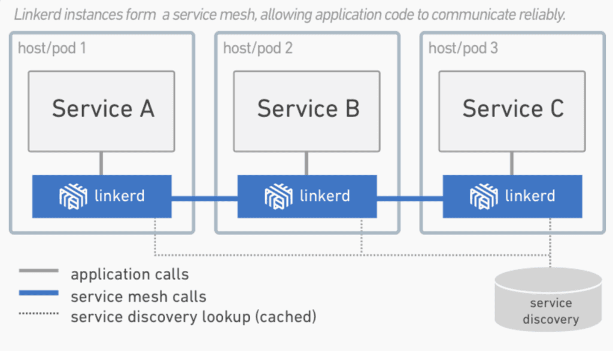
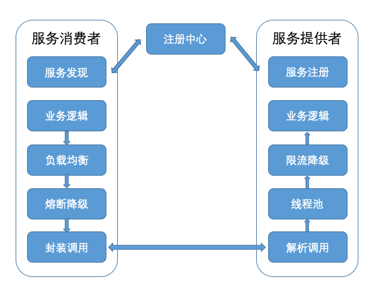
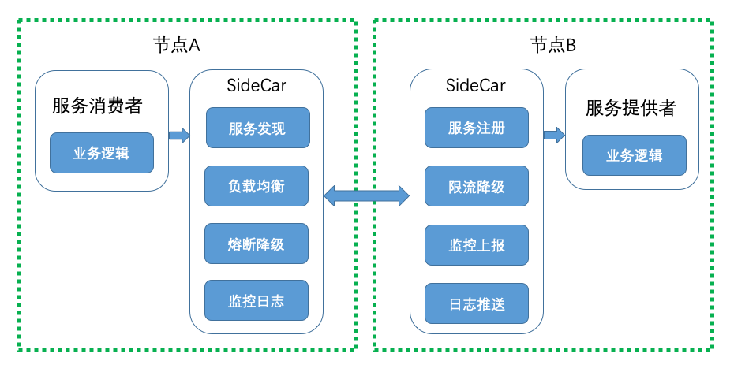
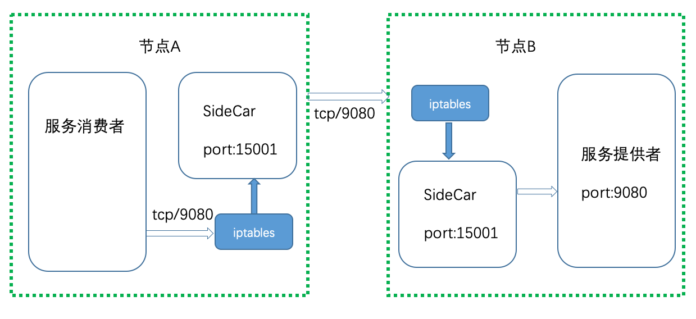
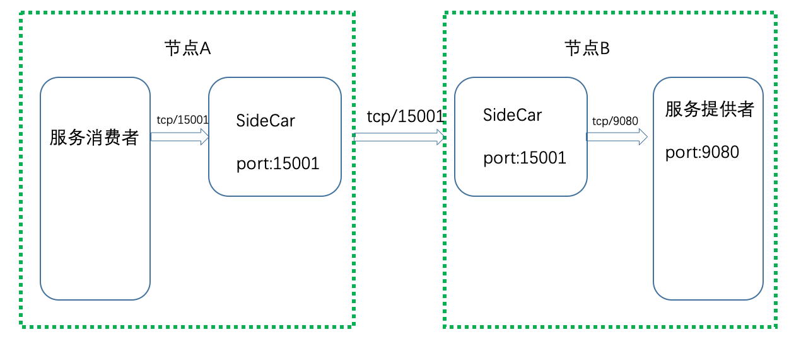

# 33 下一代微服务架构Service Mesh

今天我们将进入专栏最后一个模块，我会和你聊聊下一代微服务架构 Service Mesh。说到 Service Mesh，在如今的微服务领域可谓是无人不知、无人不晓，被很多人定义为下一代的微服务架构。那么究竟什么是 Service Mesh？Service Mesh 是如何实现的？今天我就来给你解答这些疑问。

## 什么是 Service Mesh？

Service Mesh 的概念最早是由 Buoyant 公司的 CEO William Morgan 在一篇[文章](https://blog.buoyant.io/2017/04/25/whats-a-service-mesh-and-why-do-i-need-one/)里提出，他给出的服务网格的定义是：

> A service mesh is a dedicated infrastructure layer for handling service-to-service communication. It’s responsible for the reliable delivery of requests through the complex topology of services that comprise a modern, cloud native application. In practice, the service mesh is typically implemented as an array of lightweight network proxies that are deployed alongside application code, without the application needing to be aware.

专栏里我就不解释教条的定义了，感兴趣的话你可以点击链接阅读原文，这里我来谈谈我对 Service Mesh 的理解。我认为是 Service Mesh 是一种新型的用于处理服务与服务之间通信的技术，尤其适用以云原生应用形式部署的服务，能够保证服务与服务之间调用的可靠性。在实际部署时，Service Mesh 通常以轻量级的网络代理的方式跟应用的代码部署在一起，从而以应用无感知的方式实现服务治理。

从我的理解来看，Service Mesh 以轻量级的网络代理的方式与应用的代码部署在一起，用于保证服务与服务之间调用的可靠性，这与传统的微服务架构有着本质的区别，在我看来这么做主要是出于两个原因。

\1. 跨语言服务调用的需要。在大多数公司内通常都存在多个业务团队，每个团队业务所采用的开发语言一般都不相同，以微博的业务为例，移动服务端的业务主要采用的是 PHP 语言开发，API 平台的业务主要采用的是 Java 语言开发，移动服务端调用 API 平台使用的是 HTTP 请求，如果要进行服务化，改成 RPC 调用，就需要一种既支持 PHP 语言又支持支持 Java 语言的的服务化框架。在专栏第 14 期我给你讲解了几种开源的服务化框架，它们要么与特定的语言绑定，比如 Dubbo 和 Spring Cloud 只支持 Java 语言，要么是跟语言无关，比如 gRPC 和 Thrift，得定义个 IDL 文件，然后根据这个 IDL 文件生成客户端和服务端各自语言的 SDK，并且服务框架的功能比如超时重试、负载均衡、服务发现等，都需要在各个语言的 SDK 中实现一遍，开发成本很高。

\2. 云原生应用服务治理的需要。在专栏前面，我给你讲解了微服务越来越多开始容器化，并使用 Kubernetes 类似的容器平台对服务进行管理，逐步朝云原生应用的方向进化。而传统的服务治理要求在业务代码里集成服务框架的 SDK，这显然与云原生应用的理念相悖，因此迫切需要一种对业务代码无侵入的适合云原生应用的服务治理方式。

在这种背景下，Buoyant 公司开发的第一代 Service Mesh 产品[L](https://linkerd.io/)[inkerd](https://linkerd.io/)应运而生。从下图中你可以看到，服务 A 要调用服务 B，经过 Linkerd 来代理转发，服务 A 和服务 B 的业务代码不需要关心服务框架功能的实现。为此 Linkerd 需要具备负载均衡、熔断、超时重试、监控统计以及服务路由等功能。这样的话，对于跨语言服务调用来说，即使服务消费者和服务提供者采用的语言不同，也不需要集成各自语言的 SDK。

（图片来源：https://linkerd.io/images/what_it_does@2x.png）

而对于云原生应用来说，可以在每个服务部署的实例上，都同等的部署一个 Linkerd 实例。比如下面这张图，服务 A 要想调用服务 B，首先调用本地的 Linkerd 实例，经过本地的 Linked 实例转发给服务 B 所在节点上的 Linkerd 实例，最后再由服务 B 本地的 Linkerd 实例把请求转发给服务 B。这样的话，所有的服务调用都得经过 Linkerd 进行代理转发，所有的 Linkerd 组合起来就像一个网格一样，这也是为什么我们把这项技术称为 Service Mesh，也就是“服务网格”的原因。

（图片来源：https://buoyant.io/wp-content/uploads/2017/04/linkerd-service-mesh-diagram-1024x587.png）

## Service Mesh 的实现原理

根据我的理解，Service Mesh 实现的关键就在于两点：一个是上面提到的轻量级的网络代理也叫 SideCar，它的作用就是转发服务之间的调用；一个是基于 SideCar 的服务治理也被叫作 Control Plane，它的作用是向 SideCar 发送各种指令，以完成各种服务治理功能。下面我就来详细讲解这两点是如何实现的。

1.SideCar

我们首先来看一下，在传统的微服务架构下服务调用的原理。你可以看下面这张图，服务消费者这边除了自身的业务逻辑实现外，还需要集成部分服务框架的逻辑，比如服务发现、负载均衡、熔断降级、封装调用等，而服务提供者这边除了实现服务的业务逻辑外，也要集成部分服务框架的逻辑，比如线程池、限流降级、服务注册等。

而在 Service Mesh 架构中，服务框架的功能都集中实现在 SideCar 里，并在每一个服务消费者和服务提供者的本地都部署一个 SideCar，服务消费者和服务提供者只管自己的业务实现，服务消费者向本地的 SideCar 发起请求，本地的 SideCar 根据请求的路径向注册中心查询，得到服务提供者的可用节点列表后，再根据负载均衡策略选择一个服务提供者节点，并向这个节点上的 SideCar 转发请求，服务提供者节点上的 SideCar 完成流量统计、限流等功能后，再把请求转发给本地部署的服务提供者进程，从而完成一次服务请求。整个流程你可以参考下面这张图。

我们可以把服务消费者节点上的 SideCar 叫作正向代理，服务提供者节点上的 SideCar 叫作反向代理，那么 Service Mesh 架构的关键点就在于服务消费者发出的请求如何通过正向代理转发以及服务提供者收到的请求如何通过反向代理转发。从我的经验来看，主要有两种实现方案。

- 基于 iptables 的网络拦截。这种方案请见下图，节点 A 上服务消费者发出的 TCP 请求都会被拦截，然后发送给正向代理监听的端口 15001，正向代理处理完成后再把请求转发到节点 B 的端口 9080。节点 B 端口 9080 上的所有请求都会被拦截发送给反向代理监听的端口 15001，反向代理处理完后再转发给本机上服务提供者监听的端口 9080。

- 采用协议转换的方式。这种方案请见下图，节点 A 上的服务消费者请求直接发给正向代理监听的端口 15001，正向代理处理完成后，再把请求转发到节点 B 上反向代理监听的端口 15001，反向代理处理完成后再发送给本机上的服务提供者监听的端口 9080。

可见，这两种方案最大的不同之处在于，一个是通过 iptables 网络拦截实现代理转发的，一个是靠直接把请求发送给代理来转发的。基于 iptables 网络拦截的方式，理论上会有一定的性能损耗，但它的优点是从网络层实现调用拦截，能做到完全的业务无感知，所以适合云原生应用。而直接把请求发送给代理的方式，要求代理层加入业务逻辑，才能把请求转发给对应的服务提供者监听的端口。

2.Control Plane

既然 SideCar 能实现服务之间的调用拦截功能，那么服务之间的所有流量都可以通过 SideCar 来转发，这样的话所有的 SideCar 就组成了一个服务网格，再通过一个统一的地方与各个 SideCar 交互，就能控制网格中流量的运转了，这个统一的地方就在 Sevice Mesh 中就被称为 Control Plane。如下图所示，Control Plane 的主要作用包括以下几个方面：

- 服务发现。服务提供者会通过 SideCar 注册到 Control Plane 的注册中心，这样的话服务消费者把请求发送给 SideCar 后，SideCar 就会查询 Control Plane 的注册中心来获取服务提供者节点列表。
- 负载均衡。SideCar 从 Control Plane 获取到服务提供者节点列表信息后，就需要按照一定的负载均衡算法从可用的节点列表中选取一个节点发起调用，可以通过 Control Plane 动态修改 SideCar 中的负载均衡配置。
- 请求路由。SideCar 从 Control Plane 获取的服务提供者节点列表，也可以通过 Control Plane 来动态改变，比如需要进行 A/B 测试、灰度发布或者流量切换时，就可以动态地改变请求路由。
- 故障处理。服务之间的调用如果出现故障，就需要加以控制，通常的手段有超时重试、熔断等，这些都可以在 SideCar 转发请求时，通过 Control Plane 动态配置。
- 安全认证。可以通过 Control Plane 控制一个服务可以被谁访问，以及访问哪些信息。
- 监控上报。所有 SideCar 转发的请求信息，都会发送到 Control Plane，再由 Control Plane 发送给监控系统，比如 Prometheus 等。
- 日志记录。所有 SideCar 转发的日志信息，也会发送到 Control Plane，再由 Control Plane 发送给日志系统，比如 Stackdriver 等。
- 配额控制。可以在 Control Plane 里给服务的每个调用方配置最大调用次数，在 SideCar 转发请求给某个服务时，会审计调用是否超出服务对应的次数限制。

## 总结

今天我给你讲解了什么是 Service Mesh，以及 Service Mesh 的实现原理。简单来说，Service Mesh 思想的孕育而生，一方面出于各大公司微服务技术的普及，增加了对跨语言服务调用的需求；另一方面得益于微服务容器化后，采用 Kubernetes 等云平台部署的云原生应用越来越多，服务治理的需求也越来越强烈。Service Mesh 通过 SideCar 代理转发请求，把服务框架的相关实现全部集中到 SideCar 中，并通过 Control Plane 控制 SideCar 来实现服务治理的各种功能，这种业务与框架功能解耦的思想恰好能够解决上面两个问题。

Service Mesh 在诞生不到两年的时间里取得令人瞩目的发展，在国内外都涌现出一批具有代表性的新产品，最著名的莫过于 Google、IBM 领导的 Istio，也是 Service Mesh 技术的代表之作，我会在下一期给你详细讲解。而国内在这一方面也不遑多让，秉承了 Service Mesh 的思想也走出了各自的实践之路，并且已经开始在线上的核心业务中大规模使用，比如微博的 Weibo Mesh、华为公有云 Service Mesh 以及蚂蚁金服的 SOFA Mesh 等。

## 思考题

Service Mesh 中 SideCar 的部署模式是在每个服务节点的本地，都同等部署一个 SideCar 实例，为什么不使用集中式的部署模式，让多个服务节点访问一个 SideCar 实例？

欢迎你在留言区写下自己的思考，与我一起讨论。