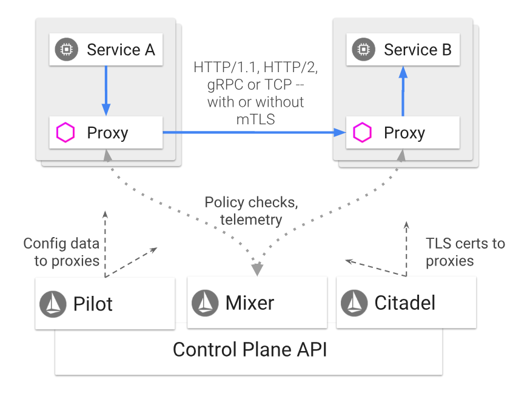
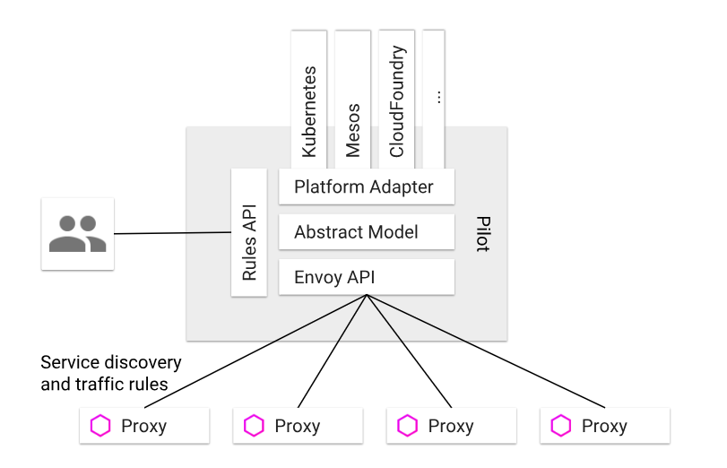
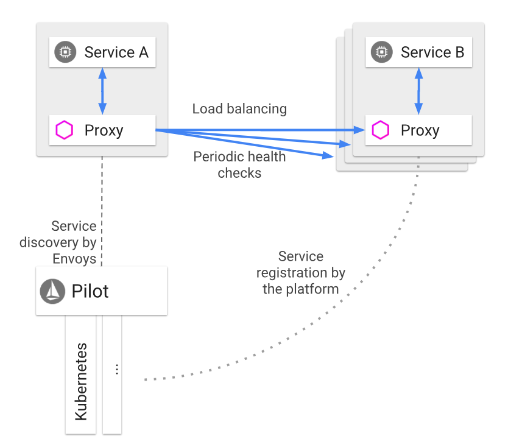
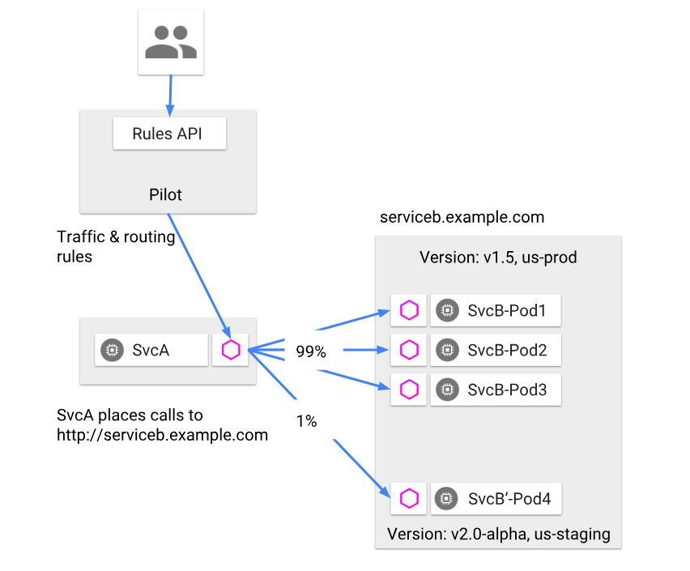
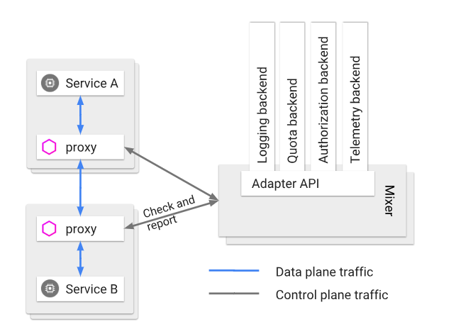
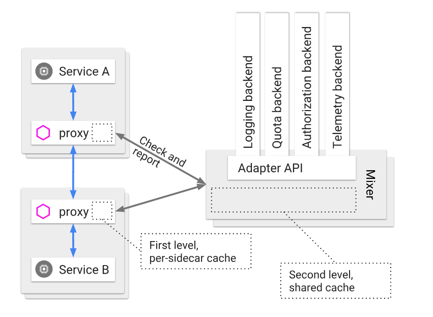
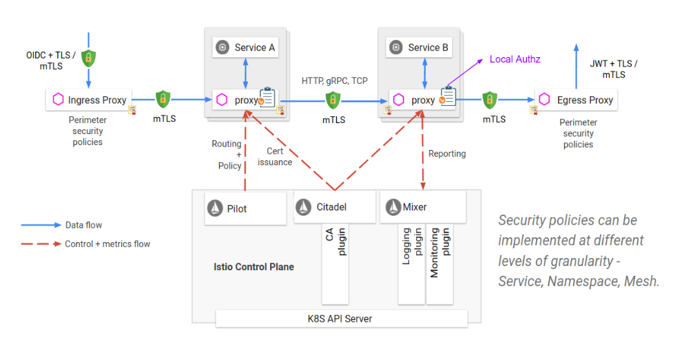

# 34 Istio：Service Mesh的代表产品

专栏上一期我们聊了 Service Mesh，并以 Linkerd 为例介绍了 Service Mesh 的架构。随着技术发展，现在来看 Linkerd 可以说是第一代 Service Mesh 产品，到了今天当我们再谈到 Service Mesh 时，往往第一个想到的是[Istio](https://istio.io/)。为什么我认为 Istio 可以称得上是 Service Mesh 的代表产品呢？在我看来主要有以下几个原因：

- 相比 Linkerd，Istio 引入了 Control Plane 的理念，通过 Control Plane 能带来强大的服务治理能力，可以称得上是 Linkerd 的进化，算是第二代的 Service Mesh 产品。
- Istio 默认的 SideCar 采用了[Envoy](https://www.envoyproxy.io/)，它是用 C++ 语言实现的，在性能和资源消耗上要比采用 Scala 语言实现的 Linkerd 小，这一点对于延迟敏感型和资源敏感型的服务来说，尤其重要。
- 有 Google 和 IBM 的背书，尤其是在微服务容器化的大趋势下，云原生应用越来越受欢迎，而 Google 开源的 Kubernetes 可以说已经成为云原生应用默认采用的容器平台，基于此 Google 可以将 Kubernetes 与 Istio 很自然的整合，打造成云原生应用默认的服务治理方案。

现在我们一起走进 Istio 的架构，看看它各部分的实现原理，希望能让你有所收获。

## Istio 整体架构

如下图所示，Istio 的架构可以说由两部分组成，分别是 Proxy 和 Control Plane。

- Proxy，就是前面提到的 SideCar，与应用程序部署在同一个主机上，应用程序之间的调用都通过 Proxy 来转发，目前支持 HTTP/1.1、HTTP/2、gRPC 以及 TCP 请求。
- Control Plane，与 Proxy 通信，来实现各种服务治理功能，包括三个基本组件：Pilot、Mixer 以及 Citadel。

（图片来源：https://istio.io/docs/concepts/what-is-istio/arch.svg）

下面我来详细分解 Istio 架构，看看每一个组件的作用和工作原理。

## Proxy

Istio 的 Proxy 采用的是 Envoy，Envoy 是跟上一期提到的 Linkerd 是同一代的产品，既要作为服务消费者端的正向代理，又要作为服务提供者端的反向代理，一般需要具备服务发现、服务注册、负载均衡、限流降级、超时熔断、动态路由、监控上报和日志推送等功能，它主要包含以下几个特性：

- 性能损耗低。因为采用了 C++ 语言实现，Envoy 能提供极高的吞吐量和极少的长尾延迟，而且对系统的 CPU 和内存资源占用也不大，所以跟业务进程部署在一起不会对业务进程造成影响。
- 可扩展性高。Envoy 提供了可插拔过滤器的能力，用户可以开发定制过滤器以满足自己特定的需求。
- 动态可配置。Envoy 对外提供了统一的 API，包括 CDS（集群发现服务）、RDS（路由发现服务）、LDS（监听器发现服务）、EDS（EndPoint 发现服务）、HDS（健康检查服务）、ADS（聚合发现服务）等。通过调用这些 API，可以实现相应配置的动态变更，而不需要重启 Envoy。

Envoy 是 Istio 中最基础的组件，所有其他组件的功能都是通过调用 Envoy 提供的 API，在请求经过 Envoy 转发时，由 Envoy 执行相关的控制逻辑来实现的。

## Pilot

Pilot 的作用是实现流量控制，它通过向 Envoy 下发各种指令来实现流量控制，它的架构如下图所示。从架构图里可以看出，Pilot 主要包含以下几个部分：

- Rules API，对外封装统一的 API，供服务的开发者或者运维人员调用，可以用于流量控制。
- Envoy API，对内封装统一的 API，供 Envoy 调用以获取注册信息、流量控制信息等。
- 抽象模型层，对服务的注册信息、流量控制规则等进行抽象，使其描述与平台无关。
- 平台适配层，用于适配各个平台如 Kubernetes、Mesos、Cloud Foundry 等，把平台特定的注册信息、资源信息等转换成抽象模型层定义的平台无关的描述。

（图片来源：https://istio.io/docs/concepts/traffic-management/PilotAdapters.svg）

那么具体来讲，Pilot 是如何实现流量管理功能的呢？

\1. 服务发现和负载均衡

就像下图所描述的那样，服务 B 也就是服务提供者注册到对应平台的注册中心中去，比如 Kubernetes 集群中的 Pod，启动时会注册到注册中心 etcd 中。然后服务 A 也就是服务消费者在调用服务 B 时，请求会被 Proxy 拦截，然后 Proxy 会调用 Pilot 查询可用的服务提供者节点，再以某种负载均衡算法选择一个节点发起调用。

除此之外，Proxy 还会定期检查缓存的服务提供者节点的健康状况，当某个节点连续多次健康检查失败就会被从 Proxy 从缓存的服务提供者节点列表中剔除。

（图片来源：https://istio.io/docs/concepts/traffic-management/LoadBalancing.svg）

\2. 请求路由

Pilot 可以对服务进行版本和环境的细分，服务 B 包含两个版本 v1.5 和 v2.0-alpha，其中 v1.5 是生产环境运行的版本，而 v2.0-alpha 是灰度环境运行的版本。当需要做 A/B 测试时，希望灰度服务 B 的 1% 流量运行 v2.0-alpha 版本，就可以通过调用 Pilot 提供的 Rules API，Pilot 就会向 Proxy 下发路由规则，Proxy 在转发请求时就按照给定的路由规则，把 1% 的流量转发给服务 B 的 v2.0-alpha 版本，99% 的流量转发给服务 B 的 v1.5 版本。

（图片来源：https://istio.io/docs/concepts/traffic-management/ServiceModel_Versions.svg）

\3. 超时重试

缺省状态下，Proxy 转发 HTTP 请求时的超时是 15s，可以通过调用 Pilot 提供的 Rules API 来修改路由规则，覆盖这个限制。比如下面这段路由规则，表达的意思是 ratings 服务的超时时间是 10s。

```
apiVersion: networking.istio.io/v1alpha3
kind: VirtualService
metadata:
  name: ratings
spec:
  hosts:
    - ratings
  http:
  - route:
    - destination:
        host: ratings
        subset: v1
    timeout: 10s
```

除此之外，还可以通过修改路由规则，来指定某些 HTTP 请求的超时重试次数，比如下面这段路由规则，表达的意思就是 ratings 服务的超时重试次数总共是 3 次，每一次的超时时间是 2s。

```
apiVersion: networking.istio.io/v1alpha3
kind: VirtualService
metadata:
  name: ratings
spec:
  hosts:
    - ratings
  http:
  - route:
    - destination:
        host: ratings
        subset: v1
    retries:
      attempts: 3
      perTryTimeout: 2s
```

\4. 故障注入

Istio 还提供了故障注入的功能，能在不杀死服务节点的情况下，通过修改路由规则，将特定的故障注入到网络中。它的原理是在 TCP 层制造数据包的延迟或者损坏，从而模拟服务超时和调用失败的场景，以此来观察应用是否健壮。比如下面这段路由规则的意思是对 v1 版本的 ratings 服务流量中的 10% 注入 5s 的延迟。

```
apiVersion: networking.istio.io/v1alpha3
kind: VirtualService
metadata:
  name: ratings
spec:
  hosts:
  - ratings
  http:
  - fault:
      delay:
        percent: 10
        fixedDelay: 5s
    route:
    - destination:
        host: ratings
        subset: v1
```

而下面这段路由规则意思是对 v1 版本的 ratings 服务流量中的 10% 注入 HTTP 400 的错误。

```
apiVersion: networking.istio.io/v1alpha3
kind: VirtualService
metadata:
  name: ratings
spec:
  hosts:
  - ratings
  http:
  - fault:
      abort:
        percent: 10
        httpStatus: 400
    route:
    - destination:
        host: ratings
        subset: v1
```

## Mixer

Mixer 的作用是实现策略控制和监控日志收集等功能，实现方式是每一次 Proxy 转发的请求都要调用 Mixer，它的架构请见下图。而且 Mixer 的实现是可扩展的，通过适配层来适配不同的后端平台，这样的话 Istio 的其他部分就不需要关心各个基础设施比如日志系统、监控系统的实现细节。

（图片来源：https://istio.io/docs/concepts/policies-and-telemetry/topology-without-cache.svg）

理论上每一次的服务调用 Proxy 都需要调用 Mixer，一方面检查调用的合法性，一方面要上报服务的监控信息和日志信息，所以这就要求 Mixer 必须是高可用和低延迟的，那么 Mixer 是如何做到的呢？下图是它的实现原理，从图中你可以看到 Mixer 实现了两级的缓存结构：

- Proxy 端的本地缓存。为了减少 Proxy 对 Mixer 的调用以尽量降低服务调用的延迟，在 Proxy 这一端会有一层本地缓存，但由于 Proxy 作为 SideCar 与每个服务实例部署在同一个节点上，所以不能对服务节点有太多的内存消耗，所以就限制了 Proxy 本地缓存的大小和命中率。
- Mixer 的本地缓存。Mixer 是独立运行的，所以可以在 Mixer 这一层使用大容量的本地缓存，从而减少对后端基础设施的调用，一方面可以减少延迟，另一方面也可以最大限度减少后端基础设施故障给服务调用带来的影响。

（图片来源：https://istio.io/docs/concepts/policies-and-telemetry/topology-with-cache.svg）

那么 Mixer 是如何实现策略控制和监控日志收集功能呢？

\1. 策略控制

Istio 支持两类的策略控制，一类是对服务的调用进行速率限制，一类是对服务的调用进行访问控制，它们都是通过在 Mixer 中配置规则来实现的。具体来讲，速率限制需要配置速率控制的 yaml 文件，每一次 Proxy 转发请求前都会先调用 Mixer，Mixer 就会根据这个 yaml 文件中的配置，来对调用进行速率限制。比如下面这段配置表达的意思是服务默认访问的速率限制是每秒 5000 次，除此之外还定义了两个特殊限制，第一个是 v3 版本的 reviews 服务请求 ratings 服务的速率限制是每 5 秒 1 次，第二个是其他服务请求 ratings 服务的速率限制是每 10 秒 5 次。

```
apiVersion: config.istio.io/v1alpha2
kind: memquota
metadata:
  name: handler
  namespace: istio-system
spec:
  quotas:
  - name: requestcount.quota.istio-system
    maxAmount: 5000
    validDuration: 1s
    overrides:
    - dimensions:
        destination: ratings
        source: reviews
        sourceVersion: v3
      maxAmount: 1
      validDuration: 5s
    - dimensions:
        destination: ratings
      maxAmount: 5
      validDuration: 10s
```

而访问控制需要配置访问控制的 yaml 文件，每一次 Proxy 转发请求前都会先调用 Mixer，Mixer 就会根据这个 yaml 文件中的配置，来对调用进行访问控制。比如下面这段配置表达的意思是 v3 版本的 reviews 服务调用 ratings 服务就会被拒绝。

```
apiVersion: "config.istio.io/v1alpha2"
kind: rule
metadata:
  name: denyreviewsv3
spec:
  match: destination.labels["app"] == "ratings" && source.labels["app"]=="reviews" && source.labels["version"] == "v3"
  actions:
  - handler: denyreviewsv3handler.denier
    instances: [ denyreviewsv3request.checknothing ]
```

\2. 监控和日志收集

跟策略控制的实现原理类似，Mixer 的监控、日志收集功能也是通过配置监控 yaml 文件来实现的，Proxy 发起的每一次服务调用都会先调用 Mixer，把监控信息发给 Mixer，Mixer 再根据配置的 yaml 文件来决定监控信息该发到哪。示例 yaml 文件可以参考这个[链接](https://istio.io/docs/tasks/telemetry/metrics-logs/)。

## Citadel

Citadel 的作用是保证服务之间访问的安全，它的工作原理见下图，可见实际的安全保障并不是 Citadel 独立完成的，而是需要 Proxy、Pilot 以及 Mixer 的配合，具体来讲，

- Citadel 里存储了密钥和证书。
- 通过 Pilot 把授权策略和安全命名信息分发给 Proxy。
- Proxy 与 Proxy 之间的调用使用双向 TLS 认证来保证服务调用的安全。
- 最后由 Mixer 来管理授权和审计。

（图片来源：https://istio.io/docs/concepts/security/architecture.svg）

## 总结

今天我给你详细讲解了 Istio 的架构及其基本组件 Proxy、Pilot、Mixer 以及 Citadel 的工作原理，从 Istio 的设计和实现原理可以看出，它是采用模块化设计，并且各个模块之间高度解耦，Proxy 专注于负责服务之间的通信，Pilot 专注于流量控制，Mixer 专注于策略控制以及监控日志功能，而 Citadel 专注于安全。正是这种高度模块化的设计，使得 Istio 的架构极具扩展性和适配性，如果你想加强流量控制方面的功能，可以在 Pilot 模块中定制开发自己的代码，而不需要修改其他模块；如果你想增加一种监控系统支持，可以在 Mixer 模块中添加对这个监控系统的适配器，就能接入 Istio。除此之外，虽然 Istio 由 Google 和 IBM 主导，但也没有完全与 Kubernetes 平台绑定，你也可以在 Mesos 或者 AWS 上运行 Istio，可见它的适配性极强，这也是 Istio 的强大之处，以至于它的竞争对手 Linkerd 也开始支持 Istio，作为可选的 Proxy 组件之一。

## 思考题

Mixer 的一个功能是实现服务调用的日志收集，假如某一个服务调用并发量很高，而每一次调用都经过 Proxy 代理请求 Mixer，再由 Mixer 调用后端的日志系统的话，整个链路的网络延迟就会对服务调用的性能影响很大，你有什么优化建议吗？

欢迎你在留言区写下自己的思考，与我一起讨论。

------

扩展阅读：

- Envoy 对外提供统一 API 的详细作用：https://github.com/envoyproxy/data-plane-api/blob/master/API_OVERVIEW.md.html
- 授权策略：https://istio.io/docs/concepts/security/#authentication-policies
- 安全命名信息：https://istio.io/docs/concepts/security/#secure-naming
- 双向 TLS 认证：https://istio.io/docs/tasks/security/mtls-migration/ .