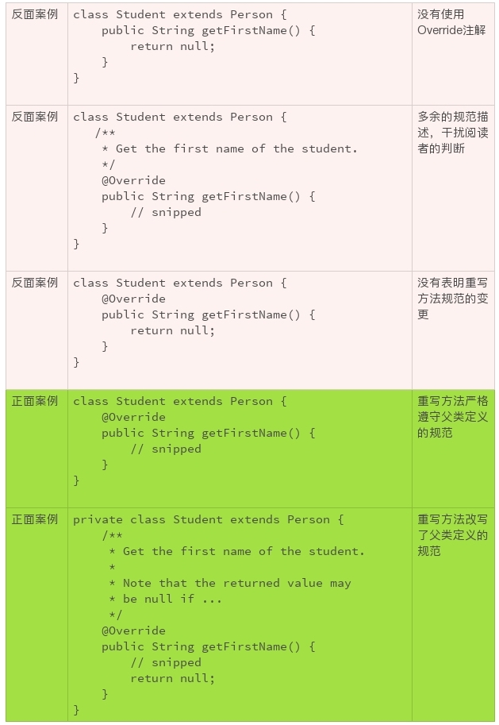

# 09怎么用好Java注解？

如果你使用面向对象的概念和技术有一段时间了，不知道你会不会有这样的困惑： 面向对象技术带来的麻烦，一点都不比它带来的好处少！

比如说，我们辛辛苦苦继承了一个类，重写了它的方法。过几天，这个类居然修改了它的接口，而且没人通知我们。然后，我们写的子类还可以美滋滋地编译，运行，就是总出错误，怎么调试都没发现这个子类的实现有什么不妥。直到有人说，父类变了！这时候，我们就想找杯咖啡暖暖手，一个人静静。

面向对象技术确实有它值得傲娇的地方。但是，只有把类似上面的小麻烦解决掉，它的使用才更合理。 比如说，父类做了修改，能不能立即就通知我？ 别等到问题出现了，我们还被蒙在鼓里。

Java 注解就可以帮助我们。

## 什么是 Java 注解

Java 注解是 Java 1.5 引入的一个工具，类似于给代码贴个标签，通过注解可以为代码添加标签信息。这些标签信息可以添加在字段、方法和类上。开发工具、部署工具或者运行类库，可以对这些标签信息进行特殊的处理，从而获得更丰富的功能。

经过十多年的发展，注解已经成了 Java 生态系统一个非常重要的技术。使用注解可以大幅度降低我们的开发强度，提高工作效率，减少潜在的错误。像 Java 类库一样，注解也有了越来越丰富的定义和规范，成了我们需要掌握的重要技术之一。

**我们这里只讨论编写规范的代码时，该怎么合理地使用注解，具体就是 Override、Deprecated、SuppressWarnings 这三个注解**。更详细的 Java 注解技术和规范，以及如何自定义注解，需要你参考相关的文档。

## 在声明继承关系中，Java 注解该如何使用？

在代码编写中，继承和重写是面向对象编程的两个重要的机制。这两个机制，在给我们带来便利的同时，也顺便带来了一些麻烦，这就需要我们用到注解了。

**第一个麻烦是，识别子类的方法是不是重写方法**。比如下面的例子，在一般情况下，对代码阅读者来说，最直觉的感受就是，getFirstName() 这个方法不是重写方法，父类 Person 没有定义这个方法。

```
class Student extends Person {
    // snipped
    public String getFirstName() {
        // snipped
    }
    // snipped
}
```

通常如果一个方法是重写方法，一定要使用 Override 注解，清楚地标明这个方法是重写的方法。 使用 Override 注解的另一个好处是，如果父类更改了方法，子类的编译就会出错。这样我们就能在第一时间获得通知，既可以及时地变更子类，也可以使父类的变更更加合理。

```
class Student extends Person {
    // snipped
    @Override
    public String getFirstName() {
        // snipped
    }
    // snipped
}
```

为什么要识别重写方法呢？这是因为继承的第二个麻烦。

**第二个麻烦是，重写方法可以不遵守父类方法的规范**。面向对象编程的机制，理想的状况是，父类定义了方法和规范，子类严格地遵守父类的定义。 比如 Person.getFirstName() 要求返回值是一个人的名，不包括姓氏部分，而且不可以是空值。但是子类 Student.getFirstName() 的实现完全有可能没有严格遵守这样的规范，不管是有意的，或者是无意的。 比如，返回了姓氏，或者返回了包括姓氏的姓名，或者可以返回了空值。

```
class Student extends Person {
    // snipped
    @Override
    public String getFirstName() {
        return null;
    }
    // snipped
}
```

编译器无法检查重写到底该怎么实现，保持重写方法的行为一致需要我们凭借经验、肉眼识别。一般来说，一个重写方法不应该改变父类定义的规范。如果的确需要改变，就要有充足的理由，以及面对潜在兼容问题的具体的解决办法。

比如上面的例子中，如果 Person.getFirstName() 不允许返回空值，应用程序可以很安心地使用返回值，而不需要检查空值。

```
boolean isAlice(Person person) {
  return person.getFirstName().equals("Alice");
}
```

但是，有了可以返回空值的 Studen.getFirstName() 的重写，上面的代码就可能抛出 NullPointerException。一段简单的、严格遵守规范的代码，就变得危机四伏。

既然需要肉眼的判断，第一步就是要识别出重写方法。 识别方法越简单越好。

所以，重写的方法，一定要加上 Override 注解。这个注解，既可以提醒代码的阅读者，也提醒代码的书写者，要谨慎对待该方法在父类定义的规范。

识别出重写方法后，第二步就要判断重写的方法和父类规范的定义有没有冲突和抵触。

虽然一般情况下，子类的重写方法不应该改变父类的规范。但是，编写代码处处充满了无奈和妥协。极少数情况下，除了变更方法的规范，我们可能别无选择。 一旦这种情况发生，一定要明确标明，并注明潜在的后果。

如果重写方法既没有改变父类规范，也没有其他情况需要重点说明，重写方法就不应该有规范描述部分的存在。这样，可以减少规范描述对于阅读者的误导。我们当然需要了解具体的规范，但是应该查找、阅读父类的规范描述。

继承和重写还有一些其他的麻烦，我们后面的章节接着再聊。

## 在废弃退役接口的情况下，如何使用注解？

一个软件，部署得越广泛，生命力越悠久，就越需要不断地改进、升级。而废弃不合理的设计，拥抱更新的思想，也是软件改进的一部分。

然而，软件接口的废弃，不是一件简单的事情。越是广泛使用的接口，它的废弃、退役越困难。

比如，下面的 String 构造方法，是 1994 年 Java 1.0 设计实现的方法。很快，人们发现了这个方法的局限性。在 1997 年发布的 Java 1.1 中，废弃了该构造方法以及其他相关的方法。到现在，已经废弃 20 多年了，但 Java 依然没有删除这些方法，因为 String 的使用太广泛了！

```
@Deprecated(since="1.1")
public String(byte ascii[], int hibyte) {
    this(ascii, hibyte, 0, ascii.length);
}
```

无论对于软件的维护者，还是软件的使用者，废弃的接口都是不值得让我们继续耗费精力的。

如果软件的维护者继续在废弃的接口上投入精力，意味着这个接口随着时间的推移，它的实现可能会存在各种各样的问题，包括严重的安全问题，就连使用者也要承担这些风险。而且还会有用户持续把它们运用到新的应用中去，这就违背了废弃接口的初衷。更多的使用者加入危险的游戏，也增加了删除废弃接口的难度。

这就要求我们做好两件事情。

**第一件事情是，如果接口的设计存在不合理性，或者新方法取代了旧方法，我们应该尽早地废弃该接口**。

及时止损！

做好这件事情，需要我们使用 Deprecated 注解，并且用一切可以使用的办法，广而告之。对于代码而言，要在声明中使用 Deprecated 注解；在规范描述中，说明废弃的原因以及替代的办法；对于有计划要删除的接口，要注明计划删除的版本号。

下面是两个可以参照的 Java 代码废弃接口的例子：

```
java/lang/String.java:

/**
 * Counts the number of stack frames in this thread. The thread must
 * be suspended.
 *
 * @return     the number of stack frames in this thread.
 * @throws     IllegalThreadStateException  if this thread is not
 *             suspended.
 * @deprecated The definition of this call depends on
 *             {@link #suspend}, which is deprecated.  Further,
 *             the results of this call were never well-defined.
 *             This method is subject to removal in a future
 *             version of Java SE.
 * @see        StackWalker
 */
@Deprecated(since="1.2", forRemoval=true)
public native int countStackFrames();
java.security.Certificate.java:

/**
 * <p>This is an interface of abstract methods for managing a
 * variety of identity certificates.
 *
 * ... snipped ...
 *
 * @deprecated This class is deprecated and subject to removal
 *     in a future version of Java SE. It has been replaced by
 *     {@code java.security.cert.Certificate} and related classes.
 * @see java.security.cert.Certificate
 */
@Deprecated(since="1.2", forRemoval=true)
public interface Certificate {
    // snipped
}
```

**第二件事情是，如果我们在现有的代码中使用了废弃的接口，要尽快转换、使用替换的方法**。等到废弃方法删除的时候，再去更改，就太晚了，**不要等到压力山大的时候才救火**。

如果一个接口被废弃，编译器会警告继续使用的代码。Java 提供了一个不推荐使用的注解，SuppressWarnings。这个注解告诉编译器，忽略特定的警告。警告是非常有价值的信息，忽略警告永远不是一个最好的选项。

再次强调，除非万不得已，不要使用 SuppressWarnings。如果万不得已来临，请参考下面的例子。

```
@SuppressWarnings("deprecation")
private boolean myMethodUseDeprecatedMethod() {
  // snipped
}
```

当然，这样的使用带来了一系列的后遗症。 由于，废弃的编译警告被无视，我们使用了废弃接口的事实就被淹没在代码的海洋里，再也进入不了我们的视野。不到废弃接口被删除的那一天，我们都意识不到我们的代码里使用了废弃的接口，我们的应用程序都要承担着废弃接口维护不足的种种风险，包括严重的安全风险。

后面我们还会谈到，不要轻易地更改现有的代码，即使这些代码很丑陋，散发着浓浓的腐臭味。但是，有一个例外，如果看到了使用 SuppressWarnings 的代码，我们要尽可能地想办法把相关的警告消除掉、把这个注解去掉，越快越好。

## 小结

Java 注解的功能很丰富，了解注解可以使得我们编码的工作更轻松。 这一次，希望我们记住三个基本的实践：

1. 重写的方法，总是使用；
2. 过时的接口，尽早废弃；
3. 废弃的接口，不要使用。

## 一起来动手

Java 的注解非常丰富，功能也很强大。借这个机会，我想让大家互相分享一下，你最经常使用的注解是什么？什么情况下使用这个注解？这个注解给你带来哪些便利？欢迎你把你的经验发布在评论区，我们一起来学习更多的注解，一起来进步。