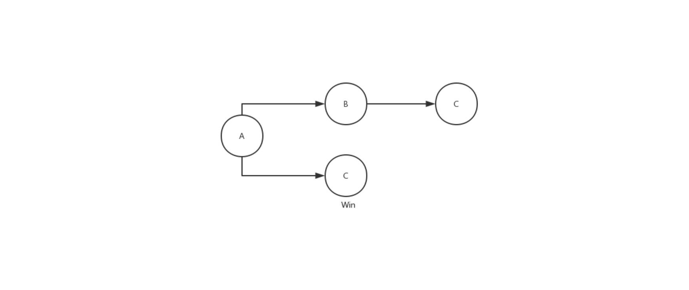
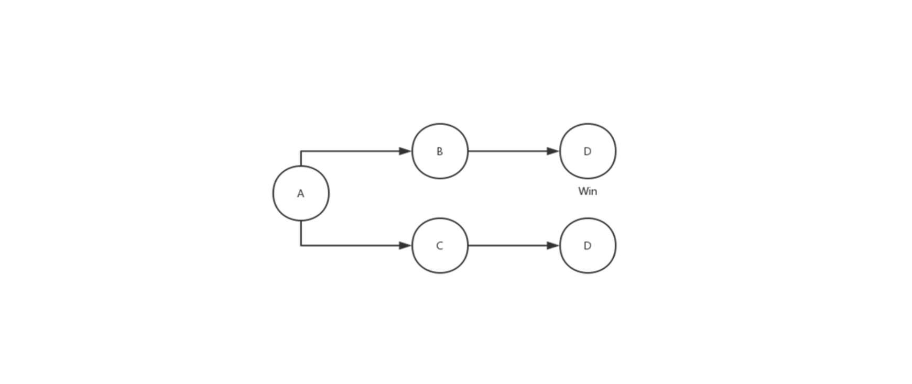

# 05 手把手教你依赖管理

软件工程是多人合作的结果，我们在开发软件的时候经常会使用一些别人编写好的，比较成熟的库。

比如，早期的前端开发用到了 jQuery 库，那么通常的做法是去官网下载一个最新版本的 jQuery，然后放在自己本地的项目中。对于简单的前端项目来说，这样可以简单粗暴地达到目的。

但当项目越来越庞大，除了 jQuery 之外，你还会依赖一些其他的第三方库。比如 Bootstrap 与 Chosen，这两个流行的前端库也都依赖 jQuery，如果这些第三方库依赖的 jQuery 版本一致还好，但大多数情况并没有这么乐观：

> 你的项目依赖的 jQuery 版本是 1.0.0 ，Bootstrap 依赖的版本是 1.1.0，而 Chosen 依赖的版本是 1.2.0，看上去都是小版本不一致，一开始并没有发现任何问题，但是如果到后期发现不兼容，可能就为时已晚了。

所以，你需要在确定依赖之前，就把整个系统的依赖全部梳理一遍，保证每个依赖都不会有冲突问题。

你可能会质疑，这个前端工程师一定是初级的，事先都不会确认 Bootstrap 和 Chosen 依赖的版本吗，直接选择依赖 jQuery 1.0.0 版本的不就行了？

这么说有一定道理，但是手工维护这些依赖是相当麻烦且容易出错的。随便找一个比较流行的开源软件，你都会发现它依赖了大量的第三方库，而这些第三方库又依赖着其他的第三方库，形成了一条十分复杂的依赖链。靠人工去解决这个依赖链一定会让你怀疑人生，因此你需要一些工具去管理项目的依赖。

## 你见过几种依赖管理工具？

其实，各大平台早已有一套自己的手段来解决上述的问题，仔细看看你常用的软件，你会发现其实工作当中已经充斥着各种各样的依赖管理工具，没有它们你将寸步难行。

> 操作系统的依赖管理工具，比如 CentOS 的 yum，Debian 的 apt，Arch 的 Packman，macOS 的 Homebrew； 编程语言的依赖管理工具，比如 Java 的 Maven， .Net 的 nuget，Node.js 的 npm，Golang 的 go get，Python 的 pip，Ruby 的 Gem 。

这些平台的解决思路都是将依赖放到共同的仓库，然后管理工具通过依赖描述文件去中央仓库获取相应的包。

一个典型的依赖管理工具通常会有以下几个特性：

1. 统一的命名规则，也可以说是坐标，在仓库中是唯一的，可以被准确定位到；
2. 统一的中心仓库可以存储管理依赖和元数据；
3. 统一的依赖配置描述文件；
4. 本地使用的客户端可以解析上述的文件以及拉取所需的依赖。

接下来我以 Maven 为例，跟你一起探究一下 Maven 会如何管理 Java 项目的依赖。

## Maven 如何管理依赖？

Maven 是 Java 生态系统里面一款非常强大的构建工具，其中一项非常重要的工作就是对项目依赖进行管理。

Maven 使用 XML 格式的文件进行依赖配置描述的方式，叫作 POM（Project Object Model ），以下就是一段简单的 pom.xml 文件片段：


在 POM 中，根元素 project 下的 dependencies 可以包含一个或多个 dependency 元素，以声明一个或者多个项目依赖。每个依赖可以包含的元素有：

1. groupId、artifactId、version： 依赖的基本坐标；
2. type： 依赖的类型，默认为 jar；
3. scope： 依赖的范围；
4. optional： 标记依赖是否可选；
5. exclusions： 用来排除传递性依赖；

要想用好 Maven 管理依赖，你必须理解每一项的含义，而新手通常傻傻分不清楚。举个例子，依赖范围这一项，Maven 在不同的时期会使用不同的 classpath ：

- 比如，junit 只有在测试的时候有用，那么将其设为 test scope 就可以；
- 再比如 ，servlet API 这个 jar 包只需要在编译的时候提供接口，但是实际在运行时会有对应的 servlet 容器提供，所以没必要打到 war 包中去，这时候只需要指定在 provided scope 就可以了。通过指定 provided scope 的方式可以让每个依赖各司其职，不用弄成“一锅粥”。

包管理工具还解决了依赖传递的问题，比如你的项目 A 依赖了 B，而 B 依赖了 C 和 D，那么在获取依赖的时候会把 B、C、D 都一起拉下来，这样可以节省大量的时间。

再让我们回到最开始的问题：依赖不一致该如何处理？通常，每个包管理工具都有一套自己的原则，Maven 的依赖仲裁原则如下。

**第一原则： 最短路径优先原则。** 比如，A 依赖了 B 和 C，而 B 也依赖了 C，那么 Maven 会使用 A 依赖的 C 的版本，因为它的路径是最短的。



**第二原则： 第一声明优先原则。** 比如，A 依赖了 B 和 C，B 和 C 分别依赖了 D，那么 Maven 会使用 B 依赖的 D 的版本，因为它是最先声明的。



**根据这两个原则，Maven 就可以确定一个项目所有依赖的列表，但它处理依赖的方式还是有些简单粗暴。有时 Maven 的决定结果并不是你想要的，所以我们在使用 Maven 的时候还是要多加小心。**

## Maven 最佳实践

接下来，我跟你分享下，我平时使用 Maven 时总结的一些经验。

1. 生产环境尽量不使用 SNAPSHOT 或者是带有范围的依赖版本，可以减少上线后的不确定性，我们必须保证，测试环境的包和生产环境是一致的。
2. 将 POM 分成多个层次的继承关系，比如携程的 POM 继承树一般是这样：

```
corp pom
	ctrip pom/qunar pom
		bu pom
			product pom
				project parent pom
					project sub module pom
```

这样做的好处是每一层都可以定义这一级别的依赖。 其中 ctrip pom/qunar pom 我们叫它为公司的 super-pom，每个项目必须直接或间接的继承其所在公司的 super-pom。这样做的好处是每一层都可以定义这一级别的依赖，便于各个层次的统一管理。

1. 在父模块多使用 dependencyManagement 来定义依赖，子模块在使用该依赖时，就可以不用指定依赖的版本，这样做可以使多个子模块的依赖版本高度统一，同时还能简化子模块配置。
2. 对于一组依赖的控制，可以使用 BOM（Bill of Materials） 进行版本定义。一般情况下，框架部门有一个统一的 BOM 来管理公共组件的版本，当用户引用了该 BOM 后，在使用框架提供的组件时无需指定版本。即使使用了多个组件，也不会有版本冲突的问题，因为框架部门的专家们已经在 BOM 中为各个组件配置了经过测试的稳定版本。 BOM 是一个非常有用的工具，因为面对大量依赖时，作为用户你不知道具体应该使用它们的哪些版本、这些版本之间是否有相互依赖、相互依赖是否有冲突，使用 BOM 就可以让用户规避这些细节问题了。
3. 对于版本相同的依赖使用 properties 定义，可以大大减少重复劳动，且易于改动。上面的 pom.xml 片段，就是使用了 properties 来定义两个一样的版本号的依赖。
4. 不要在在线编译环境中使用 mvn install 命令，否则会埋下很多意想不到并且非常难以排查的坑：该命令会将同项目中编译产生的 jar 包缓存在编译系统本地，覆盖 mvn 仓库中真正应该被引用的 jar 包。
5. 禁止变更了代码不改版本号就上传到中央仓库的行为。否则，会覆盖原有版本，使得一个版本出现二义性的问题。

归根结底，这些经验都是为了两件事：减少重复的配置代码，以及减少不确定的因素发生。

有时候，你会听到来自业务开发部门同事传来报障的声音：“为什么我本地可以编译通过，而你们编译系统编译通不过？”难道 Maven 在工作的时候还看脸？ 当然不是!

遇到这样的情况不要急，处理起来通常有如下“三板斧”：

1. 确认开发操作系统，Java 版本，Maven 版本。通常情况下操作系统对 Java 编译的影响是最小的，但是偶尔也会遇到一些比如分隔符（冒号与分号）之类的问题。Java 和 Maven 的版本应尽量与生产编译系统保持一致，以减少不必要的麻烦。
2. 如果确认了开发操作系统没问题，那么你可以把用户的项目拉到自己的本地，并且删除本地依赖的缓存，也就是删除 .m2 目录下的子目录，减少干扰，执行编译。若编译通不过，说明用户本地就有问题，让他也删掉自己本地的缓存找问题。如果可以编译通过，说明问题出在编译系统，进入第 3 步。
3. 使用 mvn dependency 命令对比生产编译系统与本地依赖树的区别，检查编译系统本地是否被缓存了错误的 jar 包，从而导致了编译失败。有时候这种错误会隐藏得比较深，非常难查，需要很大的耐心。

## 总结

今天，我跟你聊了聊依赖的问题。你可以从中：

1. 了解到依赖管理的复杂度是如何产生的；
2. 学习到依赖管理的一些常规思路；
3. 初步掌握通过 Maven 进行依赖管理的方式方法，及一些最佳实践。

同时我也与你一起分享了一些我的实际经验，希望能够对你在实际工作中有所帮助。

## 后续

理想是美好的，然而现实却很骨感，在实际过程中我们也遇到了一些问题，比如用户不遵守我们推荐的命名规则，或者不继承公司提供的 Super POM，或者框架组件升级而用户不愿意升级等等。

为了能够统一管理，我们在构建系统上增加了一些强制手段来做统一的约束，使用 Maven Enforcer 插件以及其他方式对构建过程实行大量检查，欲知详情，请听下回分解。