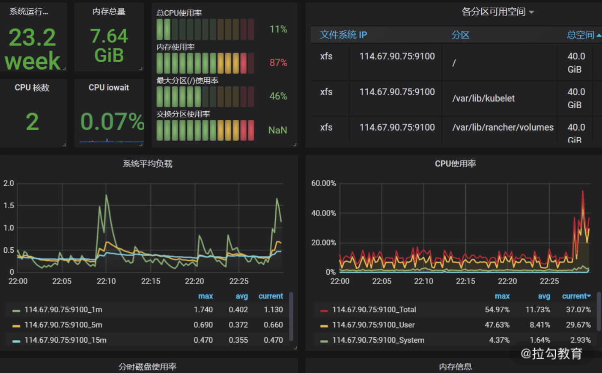
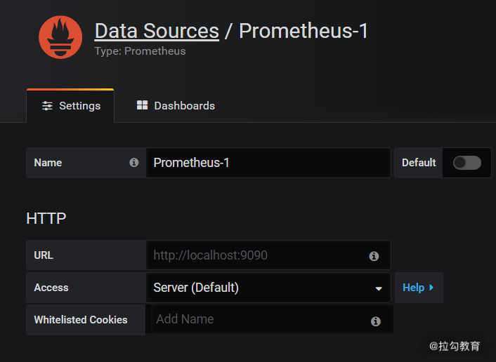
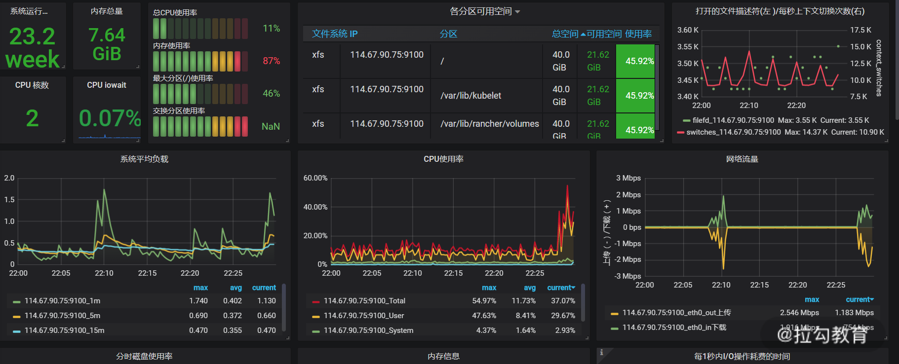
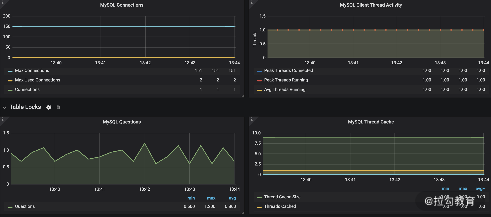

# 12 如何把可视化监控也做得酷炫？

前面两讲分别讲解了硬件监控、链路监控以及相关的报警机制。一些同学在学习硬件监控的过程中可以发现，命令行操作反馈迅速及时，指哪儿打哪儿，非常灵活便捷，但并不是所有同学都需要或者都有权限直接在服务器上进行操作。而且很多中大型互联网公司是大型的服务集群，通过命令行去发现每台服务器的问题并不现实，所以很多企业都会采用大屏的图形化监控。在页面上根据自己的需要进行条件筛选，这样不仅简单、清晰、直观，而且能够很方便地向团队成员传递监控的实时信息。

所以作为一位优秀的性能测试工程师，你不仅仅需要掌握命令行监控是如何操作的，也需要了解监控大屏是如何制作的，二者可以说是相互补充的。

这一讲我们就来讲解可视化监控，你可以认为它是一节实操课，需要提前准备好你的服务器环境（推荐 CentOS 7.0），跟着我的步骤一步步进行就可以完成酷炫的监控报表。

### 命令行和图形化界面展示对比

对于初学者而言，你可能并不能从上述文字中感受到命令行和图形化界面展示的区别，那么我用两张图来对比下。


图 1：命令行方式



图 2：可视化监控大屏

我想绝大部分还是更愿意看图 2 的可视化监控大屏，本讲的开头也说了命令行监控和可视化监控是一种互补的形式，这就代表两种方式各有千秋。可视化监控除了直观外，我认为还有如下两点优势。

**（1）信息高度集中**

可视化监控大屏一般会根据不同的机器提供不同的维度，比如图 2 就是其中一台机器的各类监控信息汇总，可以说信息多元且海量，我们并不能在同一时间将所有机器的具体信息都看到。而可视化方式可以通过时间维度去追溯历史数据，这相对于命令行基于碎片时间收集的信息要全面很多，很方便后续的复盘或者追踪。

**（2）加速信息传递效率**

**大屏的方式也是共享的方式**，可以更快速地把信息传递给项目其他成员，每位成员可以通过大屏的链接去访问，自由选择自己所需要的信息，而且可以通过展现出来的趋势预判会触发的阈值以达到提前发现风险的效果。

### Promethues + Exporter + Grafana

大屏的监控并不算新概念，可以说各类方案层出不穷，老牌的监控工具如 Zabbix、Nagios 等，但随着互联网的发展，越来越多高性能且展示酷炫的方案应运而生，其中以 **Promethues + Exporter + Grafana** 为主的通用方案受到普遍欢迎。

**首先来解释下 Promethues + Exporter + Grafana 这套组件的基本作用**。

- Prometheus：既然 Exporter 作为 agent，那必然有一套中心化的数据采集存储组件，这个组件就是 Promethues，它通过接收 Exporter 采集的数据，并按照一定的规则进行计算整合，通过 AlertManager 设置报警规则，达到触发条件后就发送报警信息。
- Exporter：用于采集服务器中的**监控数据**，比如对服务器基础性能进行监控的 node_exporter 插件，也可以理解为 agent。
- Grafana：用于数据的**渲染展现**，可以展示得非常酷炫，如果仔细阅读过《03 | 构建并执行 JMeter 脚本的正确姿势》，相信你对 Grafana 已经有了一定的了解。

我们再用下面这张图来总结下这个过程。


图 3：组件流程图

那可能有同学提问了，这套组件除了针对**硬件**进行监控，对于一些**中间件**或者**数据库**的监控也可以吗？

答案是肯定的，根据 Exporter 的不同，你可以监控不同的组件，这也是这套监控最灵活的部分，**不同的 Exprter 可以达到不同的监控目的和效果**。

接下来我就分别以**监控服务器硬件**和**数据库**这两个例子来讲述这套体系的搭建以及使用技巧。

### 如何打造硬件资源报表？

#### 第一步安装 node_exporter

通过对上文的学习，你应该知道关键部分是如何选择 Exporter，其中 node_exporter 就实现了对 Linux 操作系统中 CPU 使用、负载、磁盘空间、磁盘等待、网络传输等详尽数据的采集。

接着我就带你来看如何安装部署，比如你需要在 A、B、C 三台机器上同时监控，那必须都安装node_exporter 插件。我先以一台机器为例，带你安装下 node_exporter，使用 wget 直接下载就可以，如下所示：

```
wget -c https://github.com/prometheus/node_exporter/releases/download/v0.18.1/node_exporter-0.18.1.linux-amd64.tar.gz
```

然后解压如下命令：

```
tar zxvf node_exporter-0.18.1.linux-amd64.tar.gz
```

再进入相应的文件夹，使用后台启动方式开启服务：

```
nohup ./node_exporter &
```

当启动完成之后，可以用 ip:9100 的方式打开页面，如下所示，即认为 node_exporter 安装成功了。


图 4：node_exporter 安装示意图

我们点击 Metrics 可以查看具体的采集信息，部分展示内容如下所示：

```
# HELP node_cpu_seconds_total Seconds the cpus spent in each mode


# TYPE node_cpu_seconds_total counter


node_cpu_seconds_total{cpu="0",mode="idle"} 995721.03
```

- **HELP**是解释下面指标的含义，相当于协助文档；
- **TYPE**用于解释指标的数据类型；
- 下面的信息是具体的统计信息，比如 node_cpu_seconds_total{cpu="0",mode="idle"} 就是指从开机到现在的 cpu0 的空闲时间。

你可以自行安装下 node_exporter，就能看到 Metrics 中的海量数据了。

#### 第二步安装 Prometheus

Prometheus 作为**时间序列数据库**，提供本地存储和分布式存储，又支持多种数据大盘，而且性能优异，受到市场的欢迎。阿里云也全面接入了 Promethues 的生态，提供了更多开箱即用的组件。

**首先我们使用如下命令进行下载：**

```
wget -c https://github.com/prometheus/prometheus/releases/download/v2.15.1/prometheus-2.15.1.linux-amd64.tar.gz


tar zxvf prometheus-2.15.1.linux-amd64.tar.gz
```

然后进入解压文件夹 prometheus-2.15.1.linux-amd64，查看主要的配置文件 prometheus.yml。

该文件主要有四个核心节点，分别是 global、alerting、rule_files 和 scrape_configs。

- global：**全局配置**，比如每次数据收集的间隔、规则地扫描数据的间隔。
- alerting：**设置告警的插件**，在这里会设定 alertmanager 这个插件。
- rule_files：具体的**报警规则设置**，比如基于什么指标进行报警，类似于**触发器**。
- scrape_configs：**采集数据的对象**，job_name、target 以及 job_name 是配置主机的名称，target 是你安装的 Exporter 地址。

然后我们需要增加本地的监控配置，如下所示：

```
- job_name: 'cctester'


    static_configs:


    - targets: ['127.0.0.1:9100']
```

再启动 Prometheus：

```
nohup ./prometheus &
```

访问 http://ip:9090/targets，根据自己的实际情况填写 ip，出现如下截图表示安装成功。


图 5：Promethues 成功安装示意图

#### 第三步是安装 Grafana

这部分第 03 讲已经讲解过，我们就不再赘述，安装完成 Grafana 之后，添加 Prometheus 数据源，测试并保存即可。



图 6：Grafana 添加 Promethues 数据源

接着导入官方提供的**展示模板**就可以，[点击链接](https://grafana.com/dashboards/8919)。你可以自行选择相应的版本进行下载，也可以直接填写模板 ID，导入完成之后，便可以看到大屏了，示意图如下：



图 7：可视化大屏示意

到目前为止，一款基于 Linux 硬件监控的大屏就打造完成了。

### 如何可视化监控数据库？

通过以上的讲解，你可以思考下如果做 MySQL 的监控，哪些组件是可以通用的，需要改变的组件又有哪些。

能够思考清楚这些问题，我想你就可以基于这套组件打造出属于你自己的监控系统了。

对于监控来说，关键是面对不同的监控对象是怎么采集和怎么展示的，所以需要改变的是你的采集的 Export 和展示的模板，而**Promethues + Exporter + Grafana**这套组件的社区又非常丰富，所以我们可以快速实现这个需求。

下面我们下载基于 MySQL 监控的 Exporter，如下所示：

```
wget https://github.com/prometheus/mysqld_exporter/releases/download/v0.12.1/mysqld_exporter-0.12.1.linux-amd64.tar.gz
```

下载完成之后对如下命令进行解压：

```
tar zxvf mysqld_exporter-0.12.1.linux-amd64.tar.gz
```

对于 MySQL 的监控，还需要创建一个配置文件，比如我在解压后的文件夹下创建 my.cnf，来看看 my.cnf 有哪些内容：

```
[client]


user=root


password=123456


port=3306


host=127.0.0.1
```

可以看出 my.cnf 里的配置信息就是数据库的连接信息，你可以根据自己的实际部署情况进行配置，配置完成之后就可以启动了，启动命令如下：

```
nohup ./mysqld_exporter --config.my-cnf=my.cnf &
```

然后通过网页访问来验证是否部署成功，访问地址一般是 ip:9104，可以看到如下展示信息：


点击 Meteric 你也可以发现很多手机端 MySQL 监控信息的参数选项，部分信息如下：

```
# HELP mysql_global_variables_max_connections Generic gauge metric from SHOW GLOBAL VARIABLES.


# TYPE mysql_global_variables_max_connections gauge


mysql_global_variables_max_connections 151
```

这个配置表示了最大连接数的配置信息，如果能看到这一步信息也说明 mysqld_exporter 安装成功了，接着增加 promethues.yml 里的 MySQL 配置节点，示意如下：

```
  - job_name: 'mysql'


    static_configs:


    - targets: ['127.0.0.1:9104']
```

关于**Grafana 展示，** 选择 Grafana 的 MySQL 监控相关模板导入即可，[点击模板链接](https://grafana.com/grafana/dashboards/11323)。下载并导入后就可以了，MySQL 展示效果如下图所示。



图 8：mysql 可视化监控示意图

### 总结

这一讲主要讲述了**Promethues + Exporter + Grafana**的监控方案：

- 首先需要掌握的是每种组件核心的意义以及使用方法，而不能满足于机械地执行完成上述步骤；
- 然后我是以监控硬件服务器资源和 MySQL 监控来举例，分别代表了硬件层和服务层两个维度，通过这两个例子让你更直观地明白哪些组件是可以复用的，不同的监控目标是否有配套的社区可以给你提供帮助；
- 再者我更想传递的信息是这套监控体系不仅仅是适用于我举的示例，它更是一揽子解决方案，比如说监控 Redis、JVM 等，它同样也是适用的。通过这套方法完全可以解决可视化监控层面的大部分需求，希望你能够多多实践，扫除你们公司可能存在的监控“死角”。