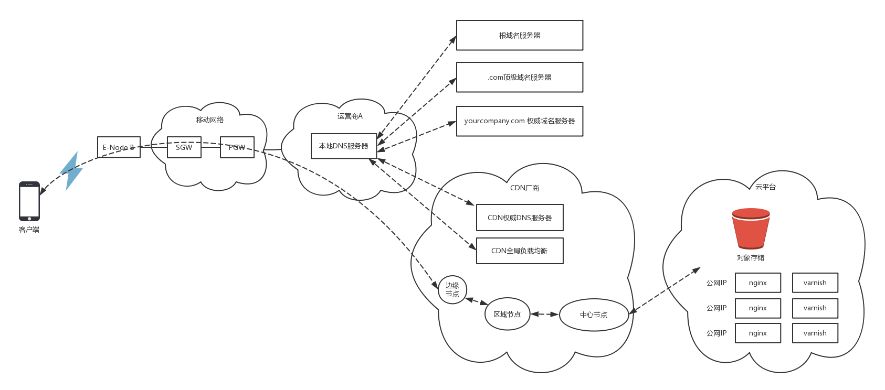

# 38 讲知识串讲：用双十一的故事串起碎片的网络协议（中）

上一节我们讲到，手机App经过了一个复杂的过程，终于拿到了电商网站的SLB的IP地址，是不是该下单了？

别忙，俗话说的好，买东西要货比三家。大部分客户在购物之前要看很多商品图片，比来比去，最后好不容易才下决心，点了下单按钮。下单按钮一按，就要开始建立连接。建立连接这个过程也挺复杂的，最终还要经过层层封装，才构建出一个完整的网络包。今天我们就来看这个过程。

## 4.购物之前看图片，静态资源CDN

客户想要在购物网站买一件东西的时候，一般是先去详情页看看图片，是不是想买的那一款。



我们部署电商应用的时候，一般会把静态资源保存在两个地方，一个是接入层nginx后面的varnish缓存里面，一般是静态页面；对于比较大的、不经常更新的静态图片，会保存在对象存储里面。这两个地方的静态资源都会配置CDN，将资源下发到边缘节点。

配置了CDN之后，权威DNS服务器上，会为静态资源设置一个CNAME别名，指向另外一个域名 [cdn.com](http://cdn.com/) ，返回给本地DNS服务器。

当本地DNS服务器拿到这个新的域名时，需要继续解析这个新的域名。这个时候，再访问的时候就不是原来的权威DNS服务器了，而是 [cdn.com](http://cdn.com/) 的权威DNS服务器。这是CDN自己的权威DNS服务器。

在这个服务器上，还是会设置一个CNAME，指向另外一个域名，也即CDN网络的全局负载均衡器。

本地DNS服务器去请求CDN的全局负载均衡器解析域名，全局负载均衡器会为用户选择一台合适的缓存服务器提供服务，将IP返回给客户端，客户端去访问这个边缘节点，下载资源。缓存服务器响应用户请求，将用户所需内容传送到用户终端。

如果这台缓存服务器上并没有用户想要的内容，那么这台服务器就要向它的上一级缓存服务器请求内容，直至追溯到网站的源服务器，将内容拉到本地。

## 5.看上宝贝点下单，双方开始建连接

当你浏览了很多图片，发现实在喜欢某个商品，于是决定下单购买。

电商网站会对下单的情况提供RESTful的下单接口，而对于下单这种需要保密的操作，需要通过HTTPS协议进行请求。

在所有这些操作之前，首先要做的事情是**建立连接**。


HTTPS协议是基于TCP协议的，因而要先**建立TCP的连接**。在这个例子中，TCP的连接是从手机上的App和负载均衡器SLB之间的。

尽管中间要经过很多的路由器和交换机，但是TCP的连接是端到端的。TCP这一层和更上层的HTTPS无法看到中间的包的过程。尽管建立连接的时候，所有的包都逃不过在这些路由器和交换机之间的转发，转发的细节我们放到那个下单请求的发送过程中详细解读，这里只看端到端的行为。

对于TCP连接来讲，需要通过三次握手建立连接，为了维护这个连接，双方都需要在TCP层维护一个连接的状态机。

一开始，客户端和服务端都处于CLOSED状态。服务端先是主动监听某个端口，处于LISTEN状态。然后客户端主动发起连接SYN，之后处于SYN-SENT状态。服务端收到发起的连接，返回SYN，并且ACK客户端的SYN，之后处于SYN-RCVD状态。

客户端收到服务端发送的SYN和ACK之后，发送ACK的ACK，之后处于ESTABLISHED状态。这是因为，它一发一收成功了。服务端收到ACK的ACK之后，处于ESTABLISHED状态，因为它的一发一收也成功了。

当TCP层的连接建立完毕之后，接下来轮到**HTTPS层建立连接**了，在HTTPS的交换过程中，TCP层始终处于ESTABLISHED。

对于HTTPS，客户端会发送Client Hello消息到服务器，用明文传输TLS版本信息、加密套件候选列表、压缩算法候选列表等信息。另外，还会有一个随机数，在协商对称密钥的时候使用。

然后，服务器会返回Server Hello消息，告诉客户端，服务器选择使用的协议版本、加密套件、压缩算法等。这也有一个随机数，用于后续的密钥协商。

然后，服务器会给你一个服务器端的证书，然后说：“Server Hello Done，我这里就这些信息了。”

客户端当然不相信这个证书，于是从自己信任的CA仓库中，拿CA的证书里面的公钥去解密电商网站的证书。如果能够成功，则说明电商网站是可信的。这个过程中，你可能会不断往上追溯CA、CA的CA、CA的CA的CA，反正直到一个授信的CA，就可以了。

证书验证完毕之后，觉得这个服务端是可信的，于是客户端计算产生随机数字Pre-master，发送Client Key Exchange，用证书中的公钥加密，再发送给服务器，服务器可以通过私钥解密出来。

接下来，无论是客户端还是服务器，都有了三个随机数，分别是：自己的、对端的，以及刚生成的Pre-Master随机数。通过这三个随机数，可以在客户端和服务器产生相同的对称密钥。

有了对称密钥，客户端就可以说：“Change Cipher Spec，咱们以后都采用协商的通信密钥和加密算法进行加密通信了。”

然后客户端发送一个Encrypted Handshake Message，将已经商定好的参数等，采用协商密钥进行加密，发送给服务器用于数据与握手验证。

同样，服务器也可以发送Change Cipher Spec，说：“没问题，咱们以后都采用协商的通信密钥和加密算法进行加密通信了”，并且也发送Encrypted Handshake Message的消息试试。

当双方握手结束之后，就可以通过对称密钥进行加密传输了。

真正的下单请求封装成网络包的发送过程，我们先放一放，我们来接着讲这个网络包的故事。

## 6.发送下单请求网络包，西行需要出网关

当客户端和服务端之间建立了连接后，接下来就要发送下单请求的网络包了。

在用户层发送的是HTTP的网络包，因为服务端提供的是RESTful API，因而HTTP层发送的就是一个请求。

```
POST /purchaseOrder HTTP/1.1
Host: www.geektime.com
Content-Type: application/json; charset=utf-8
Content-Length: nnn 
{
 "order": {
  "date": "2018-07-01",
  "className": "趣谈网络协议",
  "Author": "刘超",
  "price": "68"
 }
}
```

HTTP的报文大概分为三大部分。第一部分是**请求行**，第二部分是**请求的首部**，第三部分才是**请求的正文实体**。

在请求行中，URL就是 [www.geektime.com/purchaseOrder](https://www.geektime.com/purchaseOrder) ，版本为HTTP 1.1。

请求的类型叫作POST，它需要主动告诉服务端一些信息，而非获取。需要告诉服务端什么呢？一般会放在正文里面。正文可以有各种各样的格式，常见的格式是JSON。

请求行下面就是我们的首部字段。首部是key value，通过冒号分隔。

Content-Type是指正文的格式。例如，我们进行POST的请求，如果正文是JSON，那么我们就应该将这个值设置为JSON。

接下来是正文，这里是一个JSON字符串，里面通过文本的形式描述了，要买一个课程，作者是谁，多少钱。

这样，HTTP请求的报文格式就拼凑好了。接下来浏览器或者移动App会把它交给下一层传输层。

怎么交给传输层呢？也是用Socket进行程序设计。如果用的是浏览器，这些程序不需要你自己写，有人已经帮你写好了；如果在移动APP里面，一般会用一个HTTP的客户端工具来发送，并且帮你封装好。

HTTP协议是基于TCP协议的，所以它使用面向连接的方式发送请求，通过Stream二进制流的方式传给对方。当然，到了TCP层，它会把二进制流变成一个的报文段发送给服务器。

在TCP头里面，会有源端口号和目标端口号，目标端口号一般是服务端监听的端口号，源端口号在手机端，往往是随机分配一个端口号。这个端口号在客户端和服务端用于区分请求和返回，发给那个应用。

在IP头里面，都需要加上自己的地址（即源地址）和它想要去的地方（即目标地址）。当一个手机上线的时候，PGW会给这个手机分配一个IP地址，这就是源地址，而目标地址则是云平台的负载均衡器的外网IP地址。

在IP层，客户端需要查看目标地址和自己是否是在同一个局域网，计算是否是同一个网段，往往需要通过CIDR子网掩码来计算。

对于这个下单场景，目标IP和源IP不会在同一个网段，因而需要发送到默认的网关。一般通过DHCP分配IP地址的时候，同时配置默认网关的IP地址。

但是客户端不会直接使用默认网关的IP地址，而是发送ARP协议，来获取网关的MAC地址，然后将网关MAC作为目标MAC，自己的MAC作为源MAC，放入MAC头，发送出去。

一个完整的网络包的格式是这样的。


真不容易啊，本来以为上篇就发送下单包了，结果到中篇这个包还没发送出去，只是封装了一个如此长的网络包。别着急，你可以自己先预想一下，接下来该做什么了？