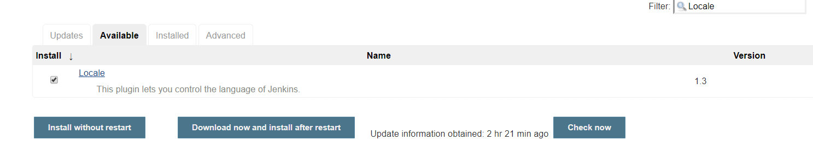

Jenkins 是一个开源软件项目，是基于 Java 开发的一种持续集成工具，用于监控持续重复的工作，旨在提供一个开放易用的软件平台，使软件的持续集成变成可能。


官方网站：<https://jenkins.io/> 

## Docker 安装


## Docker-compose安装

Jenkins 是一个简单易用的持续集成软件平台，我们依然采用 Docker 的方式部署，`docker-compose.yml` 配置文件如下：

```yaml
version: '3.1'
services:
  jenkins:
    restart: always
    image: jenkinsci/jenkins
    container_name: jenkins
    ports:
      - 4090:8080
      # 基于 JNLP 的 Jenkins 代理通过 TCP 端口 50000 与 Jenkins master 进行通信
      - 4091:50000
    environment:
      TZ: Asia/Shanghai
    volumes:
      - /data/docker/jenkins:/var/jenkins_home
```

访问jenkins地址 <http://192.168.56.100:4090> ，注意：第一次启动的时候正在加载jenkins大概会等待3-10分钟。


安装过程中会出现 Docker 数据卷 权限问题，用以下命令解决：

```bash
chown -R 1000 /usr/local/docker/jenkins/data
```

Jenkins 第一次启动时需要输入一个初始密码用以解锁安装流程，使用 `docker logs jenkins` 即可方便的查看到初始密码：

    Jenkins initial setup is required. An admin user has been created and a password generated.
    Please use the following password to proceed to installation:
    58b7075d4576491d860a902f250698d2
    This may also be found at: /var/jenkins_home/secrets/initialAdminPassword

或者进入容器查看：

```bash
docker exec -it jenkins /bin/bash 
cat /var/jenkins_home/secrets/initialAdminPassword
```

 

## 安装插件

插件是 Jenkins 的核心，其丰富的插件（截止到 `2018.10.29` 共有 `77350` 个插件）可以满足不同人群的不同需求


插件地址：<https://plugins.jenkins.io/>


**注意：** 除了默认勾选的插件外，一定要勾选 `Publish over SSH` 插件，这是我们实现持续交付的重点插件。


**开始安装了，根据网络情况，安装时间可能会比较长，请耐心等待**


**很多插件装不上怎么办？不要慌，记住这些插件的名字，咱们稍后可以手动安装**


安装成功之后，创建用户名和密码 admin/admin123 

## 配置 Jenkins


### 配置 JDK & Maven

上传 JDK 和 Maven 的 tar 包到服务器（容器数据卷目录）


**打开Jenkins的 主页面 > 系统管理 > Global Tool Configuration**：

- 安装 JDK（`JAVA_HOME` **的路径是宿主机目录，切记！**）


    /var/jenkins_home/jdk1.8.0_152


- 安装 Maven（`MAVEN_HOME` **的路径是宿主机目录，切记！**）


    /var/jenkins_home/apache-maven-3.5.3


- 设置Git的路径 

### 配置本地化

- 安装 `Locale` 插件



- `Manage Jenkins` -> `Configure System` -> `Locale`


- 本地化效果图

 

### 安装动态参数插件

该插件的主要目的是为了方便我们后面在做项目构建时可以按照版本进行构建（支持一键回滚哦）


 

### Jenkins配置构建远程服务器

- 交互式进入 Jenkins 容器


    docker exec -it jenkins /bin/bash

- 生成 SSH KEY


    ssh-keygen -f jenkins

- 查看公钥


    cat ~/.ssh/jenkins.pub

- 复制公钥到 GitLab

登录服务器192.168.56.100将Jenkins生成的公钥加入authorized\_keys

    vim  ~/.ssh/authorized_keys

- jenkins配置 Publish Over SSH

**进入Jenkins平台，点击 系统管理 -> 系统设置 -> 找到 Publish Over SSH 配置项**

    # 查看并拷贝jenkins的私钥
    cat ~/.ssh/jenkins

- `系统管理` -> `系统设置` -> `Publish over SSH`

**注：Jenkins SSH Key 这一栏默认会使用Jenkins管理员admin账户的密码，可以不填则设置为空密码**


在key一栏填入拷贝的jenkins的私钥。


SSH Server的hostname填 192.168.56.100，username填root


其中 `Remote Directory` 是指 Jenkins 可以在目标服务器操作的目录，填/usr/local/jenkins

- 测试是否能够正常通信

 

## 创建项目

1、创建test项目


**其它配置项先默认即可**


2、进入jenkins平台打开 系统管理 -> 管理插件 -> 可选插件，在右上角输入框中输入"gogs"来筛选插件：


3、gogs中仓库配置


创建一个test仓库，点击仓库设置，**点击 管理Web钩子 -> 添加Web钩子 -> 选择Gogs**，添加下面钩子：

    http://192.168.56.100:4090/gogs-webhook/?job=test

4、点击 推送测试，如 成功 会看到下推送记录


5、项目Git项相关配置：


**打开项目（test）配置页**，配置Git仓库


<http://192.168.56.100:3000/june/test>


6、建构触发器配置


7、构建项配置


**最核心的一步，选择"Send files or execute commands over SSH"**


8、推送自动构建测试


**Gogs上关联的仓库（test）master分支下push一条修改记录后，会发现jenkins上自动完成本地push的远程构建**


参考文章：


<https://www.jianshu.com/p/14e356cf8bb4>
