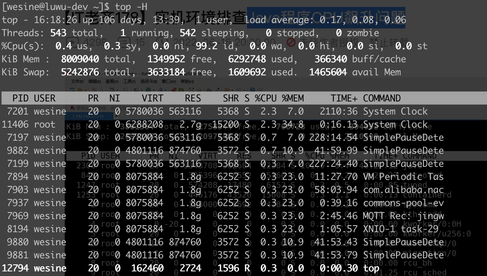
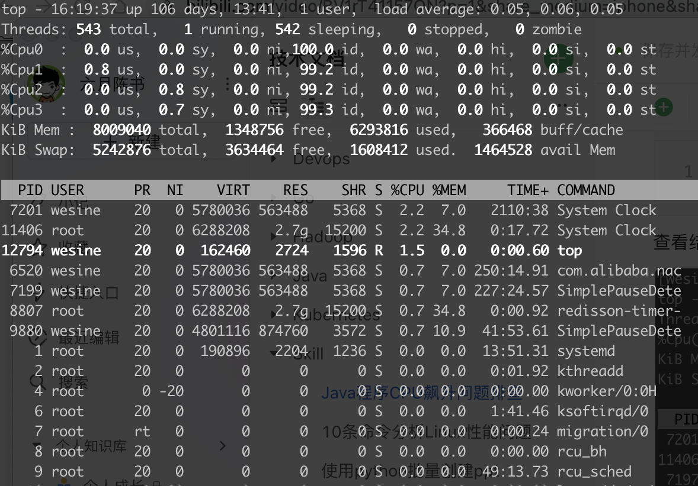

1、查看CPU运行情况


运行top命令：

```bash
top -H
```

查看结果：





输出中的“load average:”后面的三个数字，是系统在1分钟、5分钟和15分钟内的平均负载。表示负载随时间的变化情况。


它给出的只是一个较为高层的情况，往往需要借助其他工具进一步确认性能问题，有时候需要通过其他一些指标来了解CPU负载，例如vmstat或mpstat。

键盘上按下数字1：





查看java进程：

```bash
top -H|grep java
```

查到java进程pid为 9822

2、查看进程里线程信息

```bash
ps -mp 9822 -o THREAD,tid,time
```

显示结果如下：

```java
USER     %CPU PRI SCNT WCHAN  USER SYSTEM   TID     TIME
wesine    80.8   -    - -         -      -     - 02:32:25
wesine    80.0  19    - futex_    -      -  9822 00:00:00
wesine    0.0  19    - futex_    -      -  9824 00:00:10
wesine    0.0  19    - futex_    -      -  9825 00:00:00
wesine    0.0  19    - futex_    -      -  9826 00:00:00
```

可以看到线程9822占用cpu最高，打印出16进制值：

```bash
[wesine@luwu-dev ~]$ printf "%x\n" 9822
2699
```

3、使用jstack查看java进程

```bash
jstack 9822|grep 2699 -A100
```

然后查看该线程的状态和正在运行的代码，并去项目里检查对应的代码是否有问题。
