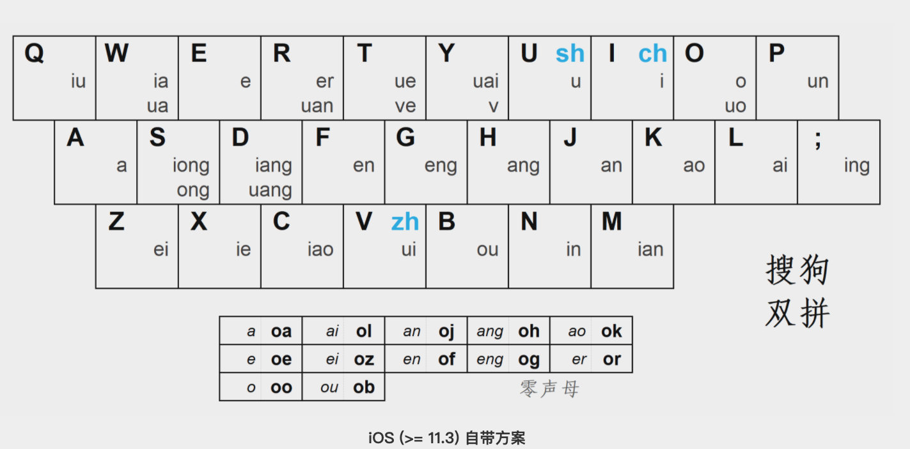

## 1、什么是双拼输入法

就是基于拼音使用两个按键对应声母和韵母输入一个汉字的输入法。

举例：

如果想打出 双 字

用全拼输入法为：Sh uang

用双拼输入法为： U d 

## 2、双拼规则

声母：

单声母：如 q、w、r、t 等，它们只有一个字符，直接与键盘上的按键相对应。

双声母：有3个，分别是 zh、ch、sh ，使用某个单韵母的键与之对应，如自然码 zh - v、ch - i、sh - u 。

没有声母：比如 爱（ai），由于双拼的原则是一定要用两个键输入一个字，不能把声母位置空出来，所以必须给这种类型的拼音单独考虑。一般有两种处理方法：第一种是微软双拼等采用的设一个韵母键（比如 o）做「零声母」键来补声母；第二种是自然码等采用的分情况考虑：1. 如果是单声母，如 啊（a），连输两边韵母（aa）。2. 如果是双声母，如 爱（ai），直接打拼音（ai）。3. 如果是两位以上的韵母，如 昂（ang），用韵母部分的第一个字符键补声母，第二个键按非单韵母转换（ah）。

韵母：

单韵母：如 a、o、e、i 等，与单声母的处理方式一样，直接与键盘上的按键相对应。

非单韵母：有很多种，但是由于它们不只由一个字符组成，所以都用单声母的键与之对应。

举个例子，「爱双拼」：

- 爱 ai —— 没有声母，韵母为非单韵母  。自然码采用「分情况考虑」，因为韵母为两位，所以直接打拼音（Ai）；微软双拼采用「单独设零声母键」，所以为（Ol）
- 双 shuang —— 声母为双声母，韵母为非单韵母，均需转换。自然码与微软双拼转换原则相同，均为（Ud）
- 拼 pin —— 声母为单声母，不用转换，韵母为非单韵母，需转换。自然码与微软双拼转换原则相同，均为（Pn） 

## 3、如何练习

键盘按键映射关系：

1、先记下按键布局

Q 	W 	E	R	T 	Y	U	I	O	P

A 	S 	D 	F	G	H	J	K	L	;

Z	X	C	V	B	N	M

2、记下按键映射关系

3、用中文代替映射关系记忆

秋	下	饿	儿	学	帅	书	吃	哦	群

啊	松	亮	嗯	更	刚	安	靠	来	零

为	谢	掉	追	欧	邻	面

4、在线练习

<https://api.ihint.me/shuang/>
